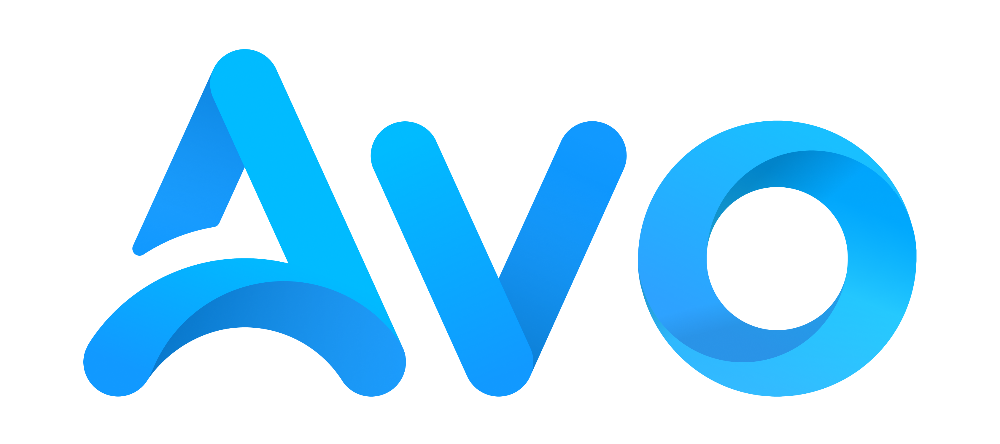

[](https://badge.fury.io/rb/avo)


[](https://codecov.io/gh/avo-hq/avo)
[](https://codeclimate.com/github/avo-hq/avo/maintainability)



**Configuration-based, no-maintenance, extendable Ruby on Rails admin**

Avo is a beautiful next-generation framework that empowers you, the developer, to create fantastic admin panels for your Ruby on Rails apps with the flexibility to fit your needs as you grow.

## Get started

✨ **Website**: [avohq.io](https://avohq.io)\
📚 **Documentation**: [docs.avohq.io](https://docs.avohq.io)\
🗺 **Roadmap**: [GitHub Roadmap](https://github.com/orgs/avo-hq/projects/3)\
🎸 **Demo app**: [Avodemo](https://avodemo.herokuapp.com/)\
🐤 **Twitter**: [avo_hq](https://twitter.com/avo_hq)\
💬 **Community chat**: [discord](https://discord.gg/pkTF6y8)\
🔧 **Issue tracker**: [GitHub issues](http://github.com/avo-hq/avo/issues)\
🎙 **Discussions and feature requests**: [GitHub issues](http://github.com/avo-hq/avo/discussions)

## Features

  - **Powered by Hotwire** - Rails ❤️  Hotwire
  - **Code driven configuration** - Configure your Rails dashboard entirely by writing Ruby code. [docs](https://docs.avohq.io/2.0/resources.html#defining-resources)
  - **Resource Management** - Create a CRUD interface for Active Record from one command. No more copy-pasting view and controller files around.
  - **Dashboard widgets and metrics** - Create metrics, charts, and custom cards amazingly fast. [docs](https://docs.avohq.io/2.0/dashboards.html)
  - **Resource Search** - Quickly run a search through one or more resources at once. [docs](https://docs.avohq.io/2.0/resources.html#filters)
  - **Associations enabled** - Link your models together with all types of associations (belongs_to, has_many, polymorphic, etc.). [docs](https://docs.avohq.io/2.0/associations.html)
  - **Fuzzy-searchable associations** - Do you have a ton of records and don't want to scroll through a big dropdown? Avo's got you covered. [docs](https://docs.avohq.io/2.0/associations.html#searchable-belongs-to)
  - **Active Storage support** - Amazingly easy, **one-line**, single or multi-file integration with **ActiveStorage**. [docs](https://docs.avohq.io/2.0/fields.html#file)
  - **Records Ordering** - Sorting records is a breeze. [docs](https://docs.avohq.io/2.0/resources.html#records-ordering)
  - **Grid view** - Beautiful card layout to showcase your content. [docs](https://docs.avohq.io/2.0/grid-view.html)
  - **Actions** - Run custom actions to one or more of your resources with as little as pressing a button 💪 &nbsp; [docs](https://docs.avohq.io/2.0/actions.html)
  - **Filters** - Write your own custom filters to quickly segment your data. [docs](https://docs.avohq.io/2.0/filters.html)
  - **Keeps your app clean** - You don't need to change your app to use Avo. Drop it in your existing app or add it to a new one and you're done 🙌 [docs](https://docs.avohq.io/2.0/installation.html)
  - **Custom fields**- No worries if we missed a field you need. Generate a custom field in a jiffy. [docs](https://docs.avohq.io/2.0/custom-fields.html)
  - **Custom tools** - Break out of the CRUD. Do you need to add a page with something completely new? You've got it! [docs](https://docs.avohq.io/2.0/custom-tools.html)
  - **Authorization** - Leverage Pundit policies to build a robust and scalable authorization system. [docs](https://docs.avohq.io/2.0/authorization.html)
  - **Localization** - Have it available in any language you need. [docs](https://docs.avohq.io/2.0/localization.html)
  - **No asset pipeline pollution** - Bring your own asset pipeline. [docs](https://docs.avohq.io/2.0/custom-asset-pipeline.html)
  - **Mobile interface** - Check your data on the go from any mobile device.

## Some of the things we're going focusing on next

Theming ⭐️  &nbsp;notifications ⭐️  &nbsp;Resource segmentation ⭐️  &nbsp;filterable fields ⭐️  &nbsp;inline editing ⭐️  &nbsp;multilingual records ⭐️  &nbsp;associations in tabs ⭐️  &nbsp;keyboard shortcuts ⭐️  &nbsp;track resource changes ⭐️  &nbsp;smart resource generation ⭐️  &nbsp;sidebar editor ⭐️  &nbsp;live resources ⭐️  &nbsp;tags field ⭐️  &nbsp;columns view ⭐️  &nbsp;list view ⭐️  &nbsp;custom action items ⭐️  &nbsp;command bar

For more up-to-date info check out our 🗺 [Roadmap](https://github.com/orgs/avo-hq/projects/3).

# Installation
Add this line to your application's `Gemfile`:

```ruby
gem 'avo'
```

And then execute:
```bash
$ bundle install
```

# Contributing

Please read [CONTRIBUTING.MD](./CONTRIBUTING.MD)

# Upgrade Guide

Please read the [UPGRADE_GUIDE.MD](https://docs.avohq.io/2.0/upgrade.html)

# ✨ Contributors

<a href="https://github.com/avo-hq/avo/graphs/contributors">
  
</a>
<!--  https://contrib.rocks -->


# Shoutouts

[Get a box of waffles and some of the best app monitoring from Appsignal](https://appsignal.com/r/93dbe69bfb) 🧇

[Get $100 in credits from Digital Ocean](https://www.digitalocean.com/?refcode=efc1fe881d74&utm_campaign=Referral_Invite&utm_medium=Referral_Program&utm_source=badge) 💸
