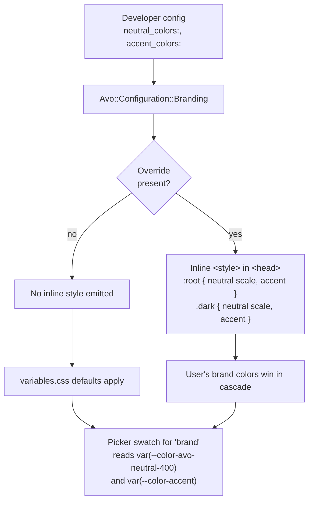

# Brand Color Overrides

## Problem Frame

Avo ships a fixed brand palette (the `:root` neutral scale + brand accent) and a set of named alternative themes (`slate`, `stone`, `blue`, `red`, …) that users can pick via the switcher. Today there is no first-class way for an Avo install to put **its own brand colors** in front of end users — the developer either has to fork the gem's CSS or rely on a half-supported `Hash` form on `neutral:` / `accent:` that conflates "default selection" with "color values".

This change gives developers a single, explicit way to override the brand neutral scale and the brand accent color **per install**, in Ruby, with Avo emitting the corresponding CSS. The `brand` entry in the picker then shows the developer's actual brand, not Avo's defaults.

This is **install-level branding**, not per-user theming. Per-user theme selection (slate vs stone vs the developer's brand) keeps working exactly as it does today.

## How It Fits Together

## Requirements

**Configuration API**

- R1. `Avo::Configuration::Branding` exposes two new keys: `neutral_colors:` and `accent_colors:`. Both default to `nil` (no override).
- R2. `neutral_colors:` accepts a Hash of the shape `{ light: { 25 => value, 50 => value, …, 950 => value }, dark: { 25 => …, …, 950 => … } }`. All 12 shades (`25, 50, 100, 200, 300, 400, 500, 600, 700, 800, 900, 950`) are required for both `light` and `dark`.
- R3. `accent_colors:` accepts a Hash of the shape `{ light: { color:, content:, foreground: }, dark: { color:, content:, foreground: } }`. All three tokens are required for both schemes.
- R4. Values are passed through verbatim as CSS values. Any string a CSS custom property accepts is allowed (`oklch(...)`, `#hex`, `rgb(...)`, `var(...)`, etc.). Avo does not parse or transform colors.
- R5. The two keys are independent — a user may set only `neutral_colors:`, only `accent_colors:`, both, or neither.

**CSS emission**

- R6. When at least one of `neutral_colors:` / `accent_colors:` is set, Avo renders an inline `<style nonce="…">` tag in `<head>` on every Avo page. When both are unset, no tag is rendered at all.
- R7. The emitted CSS sets the relevant custom properties on `:root` (light values) and `.dark` (dark values). When the user has not selected an alternate `.neutral-theme-*` / `.accent-theme-*` class on `<html>`, these `:root` values apply (replacing Avo's `variables.css` defaults for the brand). When the user has selected an alternate theme, that class beats `:root` on specificity and wins — same model that already governs Avo's built-in defaults vs. theme classes.
- R8. The inline tag uses the existing CSP nonce mechanism (same approach as `_color_theme_override.html.erb`).

**Picker integration**

- R9. The "Brand" neutral swatch in the picker reads its color from `var(--color-avo-neutral-400)` instead of the current hardcoded `oklch(62.68% 0 89.88)`. When the developer has overridden `neutral_colors:`, the swatch automatically reflects it.
- R10. The "Brand" accent swatch reads its color from `var(--color-accent)` instead of the current hardcoded `bg-content-secondary` + diagonal-stripe gradient. When `accent_colors:` is overridden, the swatch reflects the new accent. Both the popover swatch (`.color-scheme-switcher__accent-preview--brand`) and the navbar trigger badge (`.color-scheme-switcher__accent-badge-preview--brand`, looped from `_color_scheme_switcher.html.erb`) are updated.
- R11. The `brand` entry remains in `branding.neutrals` / `branding.accents` defaults regardless of whether overrides are configured (an unconfigured "brand" still shows Avo's default brand).

**Legacy cleanup**

- R12. The `Hash` form of `neutral:` and `accent:` (currently handled by `Branding#neutral_css_vars` / `#accent_css_vars`) is removed. `neutral:` and `accent:` accept Symbols only, and represent **default selection**, not color values.
- R13. `Branding#neutral_css_vars` and `Branding#accent_css_vars` are removed. Any partial that called them is updated to call the new emission helper.

**Validation**

- R14. `Avo::Configuration::Branding#initialize` raises a clear error when `neutral_colors:` or `accent_colors:` is configured but incomplete. The error names exactly which shades are missing per scheme and which schemes are missing entirely. Examples: `neutral_colors: :light missing shades [100, 200, 700]`; `accent_colors: missing scheme :dark`. "Complete" means all 12 neutral shades for both `:light` and `:dark`, or all three accent tokens (`color`, `content`, `foreground`) for both schemes.

## Surface-by-Surface Comparison

| Surface | Today | After |
| --- | --- | --- |
| Override values in Ruby | `neutral: { 25 => …, … }` (Hash form on selection key) | `neutral_colors: { light: {…}, dark: {…} }` |
| Override accent values in Ruby | `accent: { color:, content:, foreground: }` | `accent_colors: { light: {…}, dark: {…} }` |
| Default selection key | `neutral: :slate` (Symbol) **or** Hash | `neutral: :slate` (Symbol only) |
| CSS emission location | `Branding#neutral_css_vars` returns inline `:root` string (call site unclear) | Single helper renders `<style>` in `<head>`, only when override is set |
| Brand picker neutral swatch | Hardcoded `oklch(62.68% 0 89.88)` | `var(--color-avo-neutral-400)` |
| Brand picker accent swatch | Hardcoded grey + diagonal stripe gradient | `var(--color-accent)` |
| Per-user brand override | Not supported | Still not supported (install-level only) |

## Success Criteria

- A developer can drop `neutral_colors:` and `accent_colors:` into `config.branding`, reload the app, and see their brand colors applied across Avo's UI without writing a single line of CSS.
- The "Brand" entry in both pickers visually previews the configured brand (no manual swatch wiring needed).
- An Avo install that does **not** configure these keys ships zero extra inline CSS for branding (no regression in default-install page weight).
- Removing the legacy `Hash` form on `neutral:` / `accent:` produces a clear error or load-time failure message that points users to `neutral_colors:` / `accent_colors:`.

## Scope Boundaries

- **Not in scope:** registering arbitrary new named themes (e.g. user-defined `:sunset`). Only the `brand` slot is overridable in this iteration. Power users wanting more themes can still write their own `.neutral-theme-foo { ... }` CSS and add `"foo"` to `neutrals:`, but Avo does not generate that CSS for them.
- **Not in scope:** per-user brand overrides. Brand colors are install-level config; per-user selection still picks among the configured `neutrals:` / `accents:` list.
- **Not in scope:** color derivation from a single anchor (no "give me one hex, derive 12 shades" feature). The developer provides the full scale.
- **Not in scope:** runtime branding edits via the UI (no admin-side color picker writing to a database). The override is initializer-only.
- **Not in scope:** changing how non-brand themes (`slate`, `stone`, `blue`, …) are defined. Those remain plain CSS classes in `variables.css`.

## Key Decisions

- **`neutral_colors` / `accent_colors` as separate keys** — rejected reusing the `Hash` form of `neutral:` / `accent:` because it conflates "what is selected" with "what brand is". Separate keys make intent obvious and let the legacy form go away cleanly.
- **Full 12-shade × light/dark required** — rejected single-mode and anchor-derivation options. Avo doesn't try to be clever; the developer ships a complete, deliberate palette.
- **Inline `<style>` only when override is present** — rejected always-on inline emission and rejected boot-time stylesheet generation. Default installs stay zero-cost; overrides skip asset-pipeline complexity.
- **Brand swatch auto-reflects override** — rejected keeping fixed swatches. The picker should be honest about what "brand" means in a given install.
- **Clean break on legacy `Hash` form** — rejected deprecation warnings and silent-keep-both because this is "Branding 2.0" and there is no production audience yet for the current feature branch.

## Dependencies / Assumptions

- The existing `_color_theme_override.html.erb` partial chain (FOUC script in `<head>`) is the right place to render the new inline `<style>`. The new emission can sit beside or inside it.
- CSP nonce is already wired through that partial.
- The `brand` token is the implicit `:root` / `.dark` defaults today (no `.neutral-theme-brand` / `.accent-theme-brand` class is added to `<html>`). Overriding via `:root` and `.dark` is therefore the correct cascade target.
- Variable references (`var(--color-avo-neutral-400)`) used in picker swatches resolve correctly in light and dark mode without further CSS plumbing.

## Outstanding Questions

### Resolve Before Planning

(none)

### Deferred to Planning

- ~~Validation behavior on incomplete data~~ — **Resolved:** raise at boot from `Branding#initialize` with a message naming missing shades/schemes (R14).
- [Affects R6, R7][Technical] Where exactly should the inline `<style>` tag be rendered — extend `_color_theme_override.html.erb`, add a sibling partial, or render from a helper called in the layout? Need to confirm the partial is in `<head>` and runs early enough to win cascade on first paint.
- [Affects R12, R13][Technical] Migrate the concrete call sites of `Branding#neutral_css_vars` / `#accent_css_vars`. A grep against the current branch finds: `app/views/avo/partials/_branding.html.erb` (lines 5-6, both light + dark variants of both methods) and `spec/lib/avo/configuration/branding_spec.rb` (dedicated `describe '#neutral_css_vars'` / `describe '#accent_css_vars'` blocks, ~lines 95-244). Plan must update or replace `_branding.html.erb` with the new emission helper and rewrite the spec blocks against the new API.
- [Affects R9, R10][Needs research] Verify that swapping the brand picker swatches to `var(--color-avo-neutral-400)` / `var(--color-accent)` looks visually correct across all built-in dark/light combinations and doesn't accidentally make the swatch disappear into the popover background for certain palettes. May need a subtle border or contrast guard.

## Next Steps

→ `/ce:plan` for structured implementation planning
