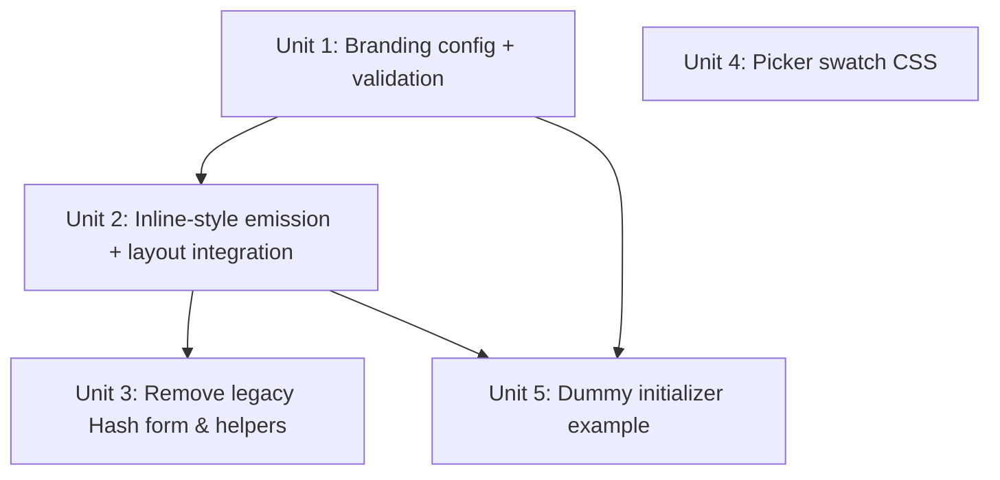

# feat: Brand Color Overrides

## Overview

Give Avo developers a single, explicit way to override the brand neutral scale and brand accent in Ruby. The developer ships a complete 12-shade × light/dark neutral palette and a complete 3-token × light/dark accent palette via two new `Avo::Configuration::Branding` keys: `neutral_colors:` and `accent_colors:`. When set, Avo emits an inline `<style>` tag in `<head>` that overrides the brand's CSS custom properties on `:root` and `.dark`. The picker's "Brand" swatches are switched from hardcoded values to CSS variables so they reflect the configured brand. The legacy Hash form on `neutral:` / `accent:` (handled by `Branding#neutral_css_vars` / `#accent_css_vars`) is removed wholesale — this is "Branding 2.0" on a feature branch with no production audience yet (see origin: `docs/brainstorms/2026-05-06-brand-color-overrides-requirements.md`).

## Problem Frame

Today there is no first-class way for an Avo install to put its brand colors in front of users. Developers either fork the gem's CSS or rely on a half-supported Hash form on `neutral:` / `accent:` that conflates "default selection" (which theme is picked) with "color values" (what brand looks like). This plan implements the resolved design from the upstream brainstorm: separate keys for color values, install-level only, full-shape input required, raise on invalid configuration, picker swatches reflect the configured brand.

## Requirements Trace

- R1. New keys `neutral_colors:` / `accent_colors:` on `Avo::Configuration::Branding`, both default `nil` → Unit 1
- R2. `neutral_colors:` accepts `{ light: { 25..950 }, dark: { 25..950 } }`, all 12 shades × 2 schemes required → Unit 1
- R3. `accent_colors:` accepts `{ light: { color:, content:, foreground: }, dark: { ... } }`, all three tokens × 2 schemes required → Unit 1
- R4. Values passed through verbatim (no parsing, no transformation) → Unit 1, Unit 2
- R5. Keys are independent — only neutral, only accent, both, or neither → Unit 1
- R6. Inline `<style nonce>` in `<head>` only when at least one key is set; default installs ship zero extra inline CSS → Unit 2
- R7. Emitted CSS targets `:root` (light) and `.dark` (dark); `.neutral-theme-*` classes beat `:root` on specificity, so per-user theme selection keeps working → Unit 2
- R8. CSP nonce reused via `content_security_policy_nonce`, matching `_branding.html.erb` and `_color_theme_override.html.erb` patterns → Unit 2
- R9. Brand neutral swatch reads `var(--color-avo-neutral-400)` instead of hardcoded oklch → Unit 4
- R10. Brand accent popover swatch and navbar trigger badge both read `var(--color-accent)` → Unit 4
- R11. `brand` remains in `branding.neutrals` / `branding.accents` defaults whether or not overrides are set → no code change required (already true)
- R12. Hash form on `neutral:` / `accent:` removed; both accept Symbols only → Unit 1, Unit 3
- R13. `Branding#neutral_css_vars` and `Branding#accent_css_vars` removed; callers updated → Unit 2 (caller migration), Unit 3 (method removal)
- R14. `Branding#initialize` raises a clear `ArgumentError` when `neutral_colors:` / `accent_colors:` is incomplete; message names exactly which shades or schemes are missing → Unit 1

## Scope Boundaries

- Not registering arbitrary user-defined named themes (only the brand slot is overridable here)
- Not per-user brand overrides (install-level only)
- Not deriving palettes from a single anchor color
- Not changing how non-brand themes (`slate`, `stone`, `blue`, …) are defined
- Not adding a runtime UI for editing brand colors
- Not adding a Lookbook preview for the color scheme switcher (it's a partial, not a ViewComponent — out of scope)

## Context & Research

### Relevant Code and Patterns

- `lib/avo/configuration/branding.rb` — plain Ruby class, manual `attr_reader` (no `prop_initializer`), `DEFAULTS = {...}.freeze` merged in `initialize(options = {})`. New keys follow the same pattern.
- `lib/avo/configuration.rb:260-266` — lazy memoized accessor for `Avo.configuration.branding`. No change needed there.
- `lib/avo/configuration.rb:91-99` — established convention for config validation: `raise ArgumentError, "..."`. Use the same for the new validation.
- `lib/avo/avo.rb:29-76` — namespace for custom error classes (e.g. `MissingResourceError`). No `Avo::ConfigurationError` exists today; sticking with `ArgumentError` keeps consistency with the rest of `Avo::Configuration`.
- `app/views/avo/partials/_branding.html.erb` — the only production caller of `Branding#neutral_css_vars` / `#accent_css_vars` (lines 5-6). Renders inline `<style nonce>` plus favicon `<link>` tags.
- `app/views/layouts/avo/application.html.erb:16` — current render position of `_branding`. This is **before** the stylesheet links (lines 18, 20). Render position should move to after `stylesheet_link_tag "avo/application"` (or fold the new emission into `_color_theme_override.html.erb` at line 30, which is just before `</head>`) so the inline override is parsed after the application stylesheet — guaranteeing cascade win on equal-specificity `:root` / `.dark` declarations.
- `app/views/avo/partials/_color_theme_override.html.erb` — already in the right `<head>` position; uses `content_security_policy_nonce`. Reasonable host for the new emission.
- `app/views/avo/partials/_color_scheme_switcher.html.erb` — picker partial, two surfaces touch the brand: line 31 (neutral popover swatch) and lines 52-54 (navbar trigger badge loop), plus line 64-68 (accent popover swatch).
- `app/assets/stylesheets/css/components/color_scheme_switcher.css` — three brand-specific rules to update: lines 79-81 (`.color-scheme-switcher__theme-preview--brand`), 145-148 (`.color-scheme-switcher__accent-preview--brand`), 166-169 (`.color-scheme-switcher__accent-badge-preview--brand`).
- `app/assets/stylesheets/css/variables.css:1-71` — canonical brand defaults. Light at `:root` (lines 1-54), dark at `.dark` (lines 56-71). Override targets are exactly these selectors.
- `spec/lib/avo/configuration/branding_spec.rb` — RSpec pattern: `subject(:branding) { described_class.new(options) }`, `let(:options) { {} }`, nested `context` blocks. Existing `describe "#neutral_css_vars"` (lines 95-134) and `describe "#accent_css_vars"` (lines 198-246) blocks delete; existing `#neutral_css_class` / `#accent_css_class` blocks (lines 73-93, 136-156) need tightening since Hash on `neutral:` / `accent:` is now invalid input.
- `spec/dummy/config/initializers/avo.rb` — dummy app's branding config. Good place for a real `neutral_colors:` / `accent_colors:` example for manual QA.
- `app/views/avo/partials/_javascript.html.erb:26-27` — emits `branding.neutral` / `branding.accent` to JS via `b.neutral_css_class` (returns `nil` when input is a Hash today). After R12 these methods continue working (Symbol input only); the JS controller already tolerates `null`.
- `safelist.txt` — Tailwind purge safelist. Not affected: CSS variable references aren't subject to purge.

### Institutional Learnings

`docs/solutions/` exists under `/Users/adrian/work/avocado/docs/solutions/` (parent workspace, not gem-local) and contains only `best-practices/configurable-keyboard-shortcuts-avo.md` — the documented "frozen DEFAULTS + merge-on-read" pattern that `Branding` already follows. No prior learnings cover branding, theming, CSS-variable emission, or CSP-nonce + inline `<style>`. This plan establishes precedent; a `docs/solutions/` entry should follow once the feature lands.

## Key Technical Decisions

- **Add new keys via the existing `Branding` accessor pattern, not `prop_initializer`** — `Branding` is hand-rolled and the plan should match. Adding `attr_reader :neutral_colors, :accent_colors` and assigning in `initialize` keeps the file consistent.
- **Validation raises `ArgumentError` from `Branding#initialize`** — matches the established pattern in `lib/avo/configuration.rb` (`container_width=` etc.). No new error class needed.
- **Emit at `:root` and `.dark`, rely on standard cascade** — `.neutral-theme-*` class selectors naturally beat `:root` on specificity, so user-selected themes keep winning. No need for `@layer` wrapping or higher-specificity selectors. Confirmed against `variables.css` which already uses this pattern for built-in defaults.
- **Move (or relocate) the inline `<style>` to render after `stylesheet_link_tag "avo/application"`** — guarantees the inline overrides win on equal-specificity declarations. The cleanest place is alongside `_color_theme_override.html.erb` at line 30 of the layout (just before `</head>`), or via a new `_brand_overrides.html.erb` partial rendered there.
- **Pass color values through verbatim** — per R4. No parsing, no transformation, no escaping. Values come from a Ruby initializer (developer-controlled trust boundary). If escaping becomes a hardening priority later, it's a follow-up — not blocking this plan.
- **Picker swatches read `var(--color-avo-neutral-400)` and `var(--color-accent)`** — accepted tradeoff: when a user is on a non-brand theme like slate, the "Brand" swatch in the dropdown reflects slate's 400, not the configured brand. Not engineered around (would require either dedicated `--brand-*` preview vars or `.neutral-theme-brand` classes — both add complexity for a non-critical UX). Documented in the requirements doc.
- **Spec strategy**: unit specs in `spec/lib/avo/configuration/branding_spec.rb` for accessors, validation, and emission helper output. No system spec — the layout-level emission is best verified by a request spec asserting the rendered body contains the inline `<style>` tag.

## Open Questions

### Resolved During Planning

- **Validation policy** — Resolved: raise `ArgumentError` at `Branding#initialize` with a message naming exactly which shades or schemes are missing.
- **Inline `<style>` location** — Resolved: render after the application stylesheet, ideally alongside `_color_theme_override.html.erb` (which already sits at line 30 of the layout).
- **Legacy Hash form callers** — Resolved via repo research: only `_branding.html.erb` lines 5-6 (production) and `branding_spec.rb` lines 95-134 / 198-246 (specs) call `neutral_css_vars` / `accent_css_vars`.
- **Custom error class vs `ArgumentError`** — Resolved: `ArgumentError`, matching the rest of `Avo::Configuration`.
- **Picker swatch design** — Resolved: read CSS variables; accept the swatch quirk while a non-brand theme is active.

### Deferred to Implementation

- Exact method signature for the emission helper on `Branding` (e.g. `brand_css_overrides`, `brand_css(scheme:)`, separate readers per scheme). Pick during Unit 1 once the emitting partial in Unit 2 settles its render shape.
- Whether to fold favicon emission (`_branding.html.erb` lines 10-19) into a separate partial during the refactor or keep them together. Cosmetic; pick during Unit 2.
- Whether to defensively escape `;`, `{`, `}`, `<` characters in emitted CSS values. Acceptable v1 default is no escaping (developer-controlled config). Revisit only if a real injection vector surfaces.

## High-Level Technical Design

> *This illustrates the intended approach and is directional guidance for review, not implementation specification. The implementing agent should treat it as context, not code to reproduce.*

```
config.branding = {
  neutral_colors: { light: { 25..950 }, dark: { 25..950 } },
  accent_colors:  { light: { color:, content:, foreground: }, dark: { ... } }
}
        │
        ▼
Avo::Configuration::Branding#initialize
  ├─ assigns @neutral_colors, @accent_colors
  └─ validates each (raises ArgumentError listing
     missing shades / missing schemes if incomplete)
        │
        ▼
Branding#brand_css_overrides  →  CSS string or nil
        │
        ▼
_brand_overrides.html.erb   (rendered in layout <head>,
                             AFTER application.css link)
  └─ emits <style nonce="…">
       :root { --color-avo-neutral-25..950: …;
               --color-accent: …;
               --color-accent-content: …;
               --color-accent-foreground: …; }
       .dark { same shape, dark values }
     </style>
        │
        ▼
Cascade resolves at runtime:
  - No theme class on <html>  →  :root values apply (the brand)
  - .neutral-theme-slate      →  slate beats :root by specificity
  - .accent-theme-blue        →  blue beats :root by specificity

Picker swatches read CSS variables:
  .color-scheme-switcher__theme-preview--brand
    { background: var(--color-avo-neutral-400); }
  .color-scheme-switcher__accent-preview--brand,
  .color-scheme-switcher__accent-badge-preview--brand
    { background: var(--color-accent); }
```

## Implementation Units



- [ ] **Unit 1: Add `neutral_colors:` / `accent_colors:` to Branding with validation**

**Goal:** Extend `Avo::Configuration::Branding` with the two new keys, validate completeness at boot, and add an emission helper that returns the CSS override string (or `nil` when no override is configured).

**Requirements:** R1, R2, R3, R4, R5, R14

**Dependencies:** None

**Files:**
- Modify: `lib/avo/configuration/branding.rb`
- Test: `spec/lib/avo/configuration/branding_spec.rb`

**Approach:**
- Add two `attr_reader` symbols: `:neutral_colors`, `:accent_colors`. Default `nil` in `DEFAULTS` is implicit (no entry needed; the merge will leave them `nil`). Assign `@neutral_colors = config[:neutral_colors]` and `@accent_colors = config[:accent_colors]` after the existing merge.
- Add private validators `validate_neutral_colors!` and `validate_accent_colors!`, called from `initialize` only when the corresponding key is non-nil. Each validator checks: `:light` and `:dark` keys present; for neutrals, every shade in `[25, 50, 100, 200, 300, 400, 500, 600, 700, 800, 900, 950]` present and non-nil for both schemes; for accents, every token in `[:color, :content, :foreground]` present and non-nil for both schemes. Raise `ArgumentError` with a message listing which shades/tokens are missing, per scheme. Use a single `ArgumentError` per call (concatenate findings into one message rather than raising twice).
- Add `brand_css_overrides` (final name to be picked during implementation) returning a String of CSS (`:root { ... } .dark { ... }`) when at least one of `@neutral_colors` / `@accent_colors` is set, or `nil` when both are unset. The string concatenates whichever sections apply (neutral block, accent block) per scheme. Each declaration is `--color-avo-neutral-<shade>: <value>;` or `--color-accent[-content|-foreground]: <value>;`. No escaping (per R4).
- Tighten `neutral` / `accent` to Symbols only: not by adding type checks (those happen in Unit 3 when we remove `neutral_css_vars` / `accent_css_vars`), but by ensuring this unit doesn't introduce new code that tolerates Hash inputs. Do not change `neutral_css_class` / `accent_css_class` here — those still work for Symbol inputs.

**Patterns to follow:**
- `lib/avo/configuration.rb:91-99` for `ArgumentError` style.
- Existing `Branding#initialize` structure (`lib/avo/configuration/branding.rb:38-58`) for assignment ordering.
- `spec/lib/avo/configuration/branding_spec.rb` `subject(:branding) { described_class.new(options) }` pattern for new specs.

**Test scenarios:**
- Happy path: `branding = described_class.new(neutral_colors: <complete light+dark hash>, accent_colors: <complete light+dark hash>)` — accessors return the input verbatim; `brand_css_overrides` returns a String containing every shade and token across `:root` and `.dark` selectors.
- Happy path: only `neutral_colors:` set — `accent_colors` is `nil`; `brand_css_overrides` includes neutral declarations and skips accent declarations.
- Happy path: only `accent_colors:` set — symmetric to the previous.
- Happy path: neither set — both accessors are `nil`; `brand_css_overrides` returns `nil`.
- Error path: `neutral_colors: { light: { 25 => "x", 50 => "y" } }` — raises `ArgumentError`. Message names the missing shades `[100, 200, 300, 400, 500, 600, 700, 800, 900, 950]` in `:light` and the entire missing `:dark` scheme.
- Error path: `neutral_colors: { light: <complete>, dark: <complete missing only :700> }` — raises `ArgumentError` naming `[700]` missing in `:dark`.
- Error path: `accent_colors: { light: { color: "x", content: "y" }, dark: <complete> }` — raises `ArgumentError` naming `[:foreground]` missing in `:light`.
- Error path: `accent_colors: { light: <complete> }` — raises `ArgumentError` naming `:dark` missing entirely.
- Edge case: shade values that are `nil` (`{ 25 => nil, ... }`) treated as missing for the purpose of validation. Same for accent tokens.
- Edge case: `neutral_colors:` provided as something other than a Hash (e.g. an array, a String) — raises `ArgumentError` with a clear shape error.
- Integration: a complete config produces a CSS string that includes both `:root { ... }` and `.dark { ... }` blocks containing the right `--color-avo-neutral-*` / `--color-accent*` declarations in source order. Assert against the substring shape, not exact whitespace.

**Verification:**
- `branding_spec.rb` passes against the new accessors, validators, and emitter.
- `Avo.configuration.branding` continues to work for installs that set neither key (no behavioral change for default users).

---

- [ ] **Unit 2: Emit inline `<style>` in `<head>` and migrate the existing partial**

**Goal:** Render the brand override CSS in the layout `<head>` after the application stylesheet, only when `Branding#brand_css_overrides` returns a non-nil string. Migrate `_branding.html.erb` to call the new helper instead of `neutral_css_vars` / `accent_css_vars`. Preserve favicon link tags.

**Requirements:** R6, R7, R8, R13 (caller migration)

**Dependencies:** Unit 1

**Files:**
- Modify: `app/views/avo/partials/_branding.html.erb` (replace the inline-`<style>` block; keep favicon `<link>` tags)
- Modify: `app/views/layouts/avo/application.html.erb` (relocate where the brand `<style>` is rendered, or render a new sibling partial alongside `_color_theme_override.html.erb`)
- Optionally Create: `app/views/avo/partials/_brand_overrides.html.erb` if folding into `_color_theme_override.html.erb` is awkward. Decide during implementation.
- Test: `spec/system/avo/branding_spec.rb` or `spec/requests/avo/branding_spec.rb` (request spec preferred — see Approach)

**Approach:**
- Replace the legacy emission in `_branding.html.erb`: drop the `content_tag(:style, ...)` block that calls `b.neutral_css_vars` / `b.accent_css_vars`. The favicon link tags (lines 10-19) stay where they are.
- Add a new partial (e.g. `_brand_overrides.html.erb`) that renders `<style nonce="<%= content_security_policy_nonce %>"><%= overrides %></style>` only when `Avo.configuration.branding.brand_css_overrides` is non-nil. Keep the partial small and single-purpose.
- Update the layout to render the new partial in the late-`<head>` position — adjacent to `_color_theme_override.html.erb` at line 30. Keep `_branding` rendering at its current line 16 for the favicon links.
- Use `content_tag(:style, css_string, nonce: content_security_policy_nonce)` to match `_branding.html.erb`'s existing nonce idiom rather than concatenating string literals.
- The CSS string from `brand_css_overrides` is already escaped from a syntactic standpoint (it's emitted from controlled Ruby data, not user-rendered HTML). No `html_safe` guard needed beyond what `content_tag` does by default for `<style>` content; verify behavior in spec.

**Patterns to follow:**
- `app/views/avo/partials/_color_theme_override.html.erb` for the late-`<head>` partial shape and CSP nonce idiom.
- `app/views/avo/partials/_branding.html.erb`'s existing `content_tag(:style, ...)` form for the emission.

**Test scenarios:**
- Integration: an Avo page request when `neutral_colors:` and `accent_colors:` are both unset — response body contains zero `<style>` tags emitted by the brand-override partial. Default install ships no extra inline branding CSS.
- Integration: an Avo page request when `neutral_colors:` is set — response body contains a `<style nonce="...">` tag with `:root { --color-avo-neutral-25: ...` and `.dark { --color-avo-neutral-25: ...` declarations.
- Integration: an Avo page request when `accent_colors:` is set — response body contains the accent declarations on `:root` and `.dark`.
- Integration: when both keys are set — response body contains both neutral and accent declarations, in a single `<style>` tag.
- Integration: the favicon `<link>` tags from `_branding.html.erb` are still present in the response body (favicon emission preserved through the refactor).
- Edge case: a request with CSP enforced — the rendered `<style>` carries the nonce attribute. Spec asserts the `nonce` attribute is present and non-empty.

**Verification:**
- A dummy-app boot with `neutral_colors:` / `accent_colors:` set in `spec/dummy/config/initializers/avo.rb` (Unit 5) shows the override applied on the page.
- A dummy-app boot with no overrides set has no inline brand `<style>` in `<head>`.
- Switching between built-in themes (slate, stone, brand) via the picker still works — `.neutral-theme-slate` overrides the inline `:root` declarations as expected.

---

- [ ] **Unit 3: Remove legacy `neutral_css_vars` / `accent_css_vars` and tighten Symbol-only inputs**

**Goal:** Delete the two methods from `Branding`, update the existing `#neutral_css_class` / `#accent_css_class` to assume Symbol input (no Hash branch), and remove or rewrite the dependent specs.

**Requirements:** R12, R13

**Dependencies:** Unit 2 (must land first so the only production caller has migrated)

**Files:**
- Modify: `lib/avo/configuration/branding.rb` (delete `neutral_css_vars`, `accent_css_vars`; update `neutral_css_class`, `accent_css_class` to drop the `is_a?(Symbol)` branch and either return `neutral.to_s` directly or raise on non-Symbol input — pick during implementation)
- Modify: `spec/lib/avo/configuration/branding_spec.rb` (remove `describe "#neutral_css_vars"` block at lines 95-134, remove `describe "#accent_css_vars"` block at lines 198-246, update `#neutral_css_class` / `#accent_css_class` blocks at lines 73-93 / 136-156 — drop `context "when neutral is a Hash"` cases or invert them to assert raises)

**Approach:**
- Delete `neutral_css_vars` and `accent_css_vars` entirely. No fallback, no deprecation warning.
- For `neutral_css_class` / `accent_css_class`: simplest evolution is `neutral.to_s` (works for Symbols and `nil`). If the call site doesn't tolerate `nil`, leave a guard. Decide based on call sites surfaced in research (`_javascript.html.erb:26-27` already tolerates `null`, so `nil` is fine).
- If a developer passes a Hash on `neutral:` / `accent:` after this lands, the new behavior is silent: the value is stored but `neutral_css_class` / `accent_css_class` will return `"{:25=>...}"` (a stringified Hash). This is the natural Ruby outcome and produces an obviously-wrong CSS class — easy to spot. Alternatively, raise from `Branding#initialize` if `neutral`/`accent` is anything other than a Symbol or `nil`. Decide during implementation; raising is safer and aligns with R12's strict reading.

**Patterns to follow:**
- `Branding#initialize`'s existing `Array(config[:neutrals]).map(&:to_s).freeze` (line 44-45) pattern for normalization, if the resolution lands on coercion rather than raising.

**Test scenarios:**
- Happy path: `Branding.new(neutral: :slate)` — `neutral_css_class` returns `"slate"`.
- Happy path: `Branding.new(neutral: nil)` — `neutral_css_class` returns `nil` (or empty string — confirm the call site).
- Error path (if raising): `Branding.new(neutral: { 25 => "x" })` — raises `ArgumentError` with a message pointing the user to `neutral_colors:`.
- Error path (if not raising): `Branding.new(neutral: { 25 => "x" })` — `neutral_css_class` returns a clearly-broken string; document the chosen behavior in the spec.
- Verification: removing `neutral_css_vars` from the codebase doesn't break any other call site (grep confirms zero callers post-Unit-2).

**Verification:**
- `branding_spec.rb` is green and contains no references to the removed methods.
- `grep -r "neutral_css_vars\|accent_css_vars"` from the gem root returns zero hits.

---

- [ ] **Unit 4: Update picker swatch CSS to read CSS variables**

**Goal:** Switch the three "brand" swatch CSS rules from hardcoded values to `var(...)` references so they reflect the configured brand when the user is on the brand theme.

**Requirements:** R9, R10

**Dependencies:** None (purely CSS; can land independently of Units 1-3)

**Files:**
- Modify: `app/assets/stylesheets/css/components/color_scheme_switcher.css` (lines 79-81, 145-148, 166-169)

**Approach:**
- Line 79-81 (`.color-scheme-switcher__theme-preview--brand`): replace the hardcoded `background: oklch(62.68% 0.0000 89.88);` with `background: var(--color-avo-neutral-400);`.
- Line 145-148 (`.color-scheme-switcher__accent-preview--brand`): drop the `@apply bg-content-secondary;` and the `linear-gradient(...)` background-image declaration. Replace with `background: var(--color-accent);`. Keep any sizing / shape rules untouched.
- Line 166-169 (`.color-scheme-switcher__accent-badge-preview--brand`): same swap as the popover swatch — replace stripe gradient with `background: var(--color-accent);`.
- No new tokens, no class additions to `<html>`, no JS controller changes.

**Patterns to follow:**
- Existing built-in swatch rules in the same file (e.g. `--slate { @apply bg-slate-400 }` at line 83) for visual baseline; the brand variants now use `var()` instead of Tailwind classes because the brand has no fixed Tailwind name.

**Test scenarios:**
- Manual visual verification: with no overrides configured, the brand neutral swatch shows oklch(62.68% 0 89.88) (the default `--color-avo-neutral-400` value from `variables.css:8`) — i.e., the same color it shows today.
- Manual visual verification: with `neutral_colors:` configured, the brand neutral swatch shows the configured `--color-avo-neutral-400` value.
- Manual visual verification: with `accent_colors:` configured, both the popover and navbar trigger badge brand-accent swatches show the configured `--color-accent`.
- Manual visual verification: switching the user's selected theme to slate makes the brand swatch show slate's 400 (documented quirk; not engineered around).
- Test expectation: none — pure CSS with no behavioral assertion beyond visual verification. Add a screenshot to the PR description if the team wants a regression baseline.

**Verification:**
- Loading the dummy app, opening the picker, and toggling between brand and a non-brand theme produces visually-correct swatches in all four states (configured-or-not × brand-active-or-not).

---

- [ ] **Unit 5: Add a working `neutral_colors:` / `accent_colors:` example to the dummy initializer**

**Goal:** Provide a real, complete brand override in `spec/dummy/config/initializers/avo.rb` so the feature can be smoke-tested manually by anyone running the dummy app.

**Requirements:** Supports manual QA of R1-R10 end-to-end.

**Dependencies:** Unit 1, Unit 2

**Files:**
- Modify: `spec/dummy/config/initializers/avo.rb` (the existing `config.branding = { ... }` block at lines 65-89)

**Approach:**
- Add both `neutral_colors:` and `accent_colors:` to the dummy's `config.branding` block. Use a clearly-distinguishable palette (e.g. a warm-toned neutral and a saturated accent) so a developer running the dummy can immediately see the override applied vs. Avo's defaults.
- Comment lines with the structure so future contributors can see the expected shape inline.
- Make sure the dummy's existing `neutrals: %w[brand mist olive]` / `accents: %w[red orange pink rose]` arrays still include `brand` (they do — `brand` is implicit via R11).

**Patterns to follow:**
- Existing dummy initializer style (commented examples, inline annotations).

**Test scenarios:**
- Test expectation: none — fixture data, no behavioral assertion. Validation specs in Unit 1 cover correctness; this unit is for manual smoke-testing.

**Verification:**
- Boot the dummy app: brand colors visible in the UI; switching to a non-brand theme reverts to that theme's palette; switching back to brand returns to the dummy's configured override.

## System-Wide Impact

- **Interaction graph:** New emission partial in `<head>`. Existing `_branding.html.erb` continues to emit favicon links. JS controller (`color_scheme_switcher_controller.js`) is unchanged — it operates on classes, not vars. `_javascript.html.erb` continues to emit `branding.neutral` / `.accent` to JS via `*_css_class`, which still work for Symbol inputs.
- **Error propagation:** `Branding#initialize` raises `ArgumentError` at boot when validation fails. The Rails app fails to start with a stack trace pointing at the offending key — desired behavior per R14.
- **State lifecycle risks:** None for runtime state. The override is initializer-only. No DB migrations, no per-request mutation, no caching.
- **API surface parity:** Public API of `Branding` gains two new attr_readers. Loses two methods (`neutral_css_vars`, `accent_css_vars`) and tightens accepted types on `neutral` / `accent`. This is a breaking change for anyone using the legacy Hash form — accepted per the brainstorm decision.
- **Integration coverage:** Layout-level `<style>` emission verified by request specs in Unit 2. Picker swatch behavior verified by manual visual testing in Unit 4 (CSS-only; full system spec is overkill).
- **Unchanged invariants:** `branding.neutrals` / `branding.accents` arrays unchanged — `brand` still listed. Picker controls (`color_scheme_switcher_controller.js`, switcher partial structure) unchanged. Per-user theme selection (cookies / database) unchanged. Built-in named themes (`slate`, `stone`, `blue`, …) and their CSS classes unchanged.

## Risks & Dependencies

| Risk | Mitigation |
|------|------------|
| Cascade ordering: inline `<style>` rendered before stylesheets could lose to later-loaded `variables.css` declarations | Render the new partial after `stylesheet_link_tag "avo/application"` (alongside `_color_theme_override.html.erb`). Verified position in Unit 2. |
| Removing `neutral_css_vars` / `accent_css_vars` is a breaking change | Accepted per origin doc ("Branding 2.0", no production audience yet). Audit completed: only `_branding.html.erb` and `branding_spec.rb` reference these. |
| CSS injection via verbatim values in `:root` / `.dark` | Documented constraint: developer-controlled trust boundary. Defer escaping. Re-evaluate if config sources expand to ENV / multi-tenant settings. |
| The "Brand" swatch in the picker shows the active theme's color when a user is on a non-brand theme | Accepted UX tradeoff documented in origin doc. Engineering around it adds tokens or classes for marginal UX improvement on a dropdown affordance. |
| Tailwind v4 layer interactions on the inline `<style>` (raised by feasibility review) | Verified empirically against existing `.neutral-theme-*` rules in `variables.css` — they're plain class selectors, not layered, so cascade behaves predictably. Re-verify in Unit 2 with the request spec. If a layer issue surfaces, wrap the inline `<style>` content in `@layer components` to match (cheap fix). |
| Validation produces a confusing error message when a developer mixes Hash on `neutral:` and a value on `neutral_colors:` | Unit 3 raises on Hash on `neutral:` with a message pointing at `neutral_colors:`. Catches the intended migration path. |

## Documentation / Operational Notes

- Update Avo docs at `/Users/adrian/work/avocado/docs/4.0/branding.md` (or wherever branding docs live in the VitePress site) once this lands. Doc page should cover: the two new keys, the full-shape input requirement, the Symbol-only contract on `neutral:` / `accent:`, and the validation behavior. Out of scope for this plan; tracked as a follow-up.
- Consider a `docs/solutions/` entry under the parent workspace once the feature is in production: "Pattern for emitting CSP-nonce-protected inline `<style>` from Ruby config in Avo". Greenfield pattern per learnings research.
- No rollout flag, no migration. Initializer-only config, install-level.

## Sources & References

- **Origin document:** [docs/brainstorms/2026-05-06-brand-color-overrides-requirements.md](../brainstorms/2026-05-06-brand-color-overrides-requirements.md)
- Configuration class: `lib/avo/configuration/branding.rb`
- Existing emission caller: `app/views/avo/partials/_branding.html.erb`
- Late-`<head>` partial reference: `app/views/avo/partials/_color_theme_override.html.erb`
- Picker partial: `app/views/avo/partials/_color_scheme_switcher.html.erb`
- Picker CSS: `app/assets/stylesheets/css/components/color_scheme_switcher.css`
- Brand defaults: `app/assets/stylesheets/css/variables.css`
- Specs: `spec/lib/avo/configuration/branding_spec.rb`
- Dummy initializer: `spec/dummy/config/initializers/avo.rb`
