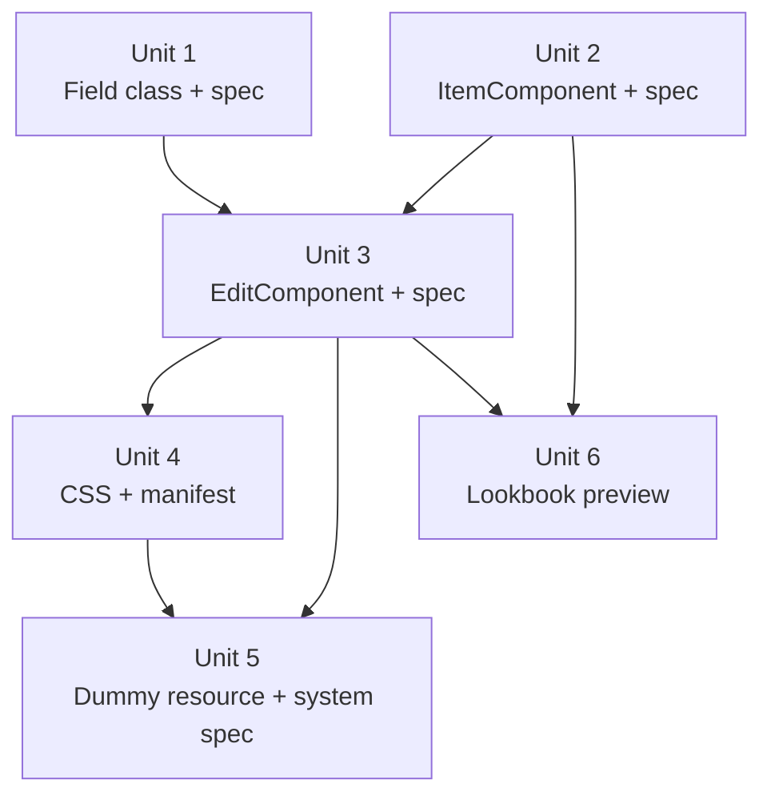

# feat: Checkbox list field

## Overview

Add a new Avo field type, `checkbox_list`, that renders an inline scrollable vertical checkbox list as an alternative to `select_field` with `multiple: true`. v1 targets short option sets (~5–20 items), Edit/New views only, and stores the value as an array of IDs that drops into Rails collection setters like `addon_ids=`.

## Problem Frame

The existing multi-select story hides options behind a dropdown and a click-to-add loop. For short option sets the user already knows the full list and just wants to tick what applies. The new field shows everything at once, scrolls when needed, and submits the selected IDs as an array. Visual target is the rich item row used by Pro's `GlobalSearch::Resources::ItemComponent`, but v1 ships only the bare minimum (title) and grows from there. (see origin: `docs/brainstorms/2026-05-22-checkbox-list-field-requirements.md`)

## Requirements Trace

- **R1** — Field type registered as `checkbox_list`, usable as `field :addon_ids, as: :checkbox_list`.
- **R2** — `options:` kwarg accepts an Array or a Proc/callable, evaluated via `Avo::ExecutionContext`. Returns array of hashes with explicit keys `[{ id:, title: }, ...]`. Result memoized per form render.
- **R3** — Only `id` and `title` read in v1; extra keys (`avatar_url`, `image_format`, `description`, `badge`) tolerated without error and ignored until v2.
- **R4** — Block must be cheap and side-effect-free because v2's Show will re-run it.
- **R5** — Native a11y: each row is a `<label>` wrapping the checkbox + content; the group is announced via a `role="group"` container with `aria-labelledby` pointing at `field_wrapper`'s existing field label. No `<fieldset>`/`<legend>` (would double-label with the wrapper). No Stimulus for selection. Native tab order.
- **R6** — Fixed default height showing ~6 typical-height rows via a `--checkbox-list-max-height` CSS custom property (default `22rem`); container scrolls vertically; long titles wrap. Host apps can override the variable; no Ruby-side configuration knob in v1.
- **R7** — Submits an array of strings under `field_name[]`; persistence is the caller's responsibility (canonical case: `addon_ids` on `has_many through:`).
- **R8** — Stored IDs reflected as pre-checked rows; on validation failure re-renders from submitted params (not stored value) so the user does not lose in-progress selections.
- **R9** — Display order = block return order. No internal sorting.
- **R10** — Deselect-all submits an empty array, not omitted param. Achieved by composing on `f.collection_check_boxes`, which emits the hidden empty-array marker natively; `to_permitted_param` declares the param as an array; `fill_field` strips blanks before assignment.
- **R11** — ID comparison normalizes both sides to string before checking membership.
- **R12** — Edge data states: empty options → empty-state message; single option → one row at natural height; long titles → wrap with row-height growth.
- **R13 (resolved during plan review)** — *Originally:* stored IDs missing from current options were preserved through round-trip via hidden inputs. *Resolved:* dropped after plan-review surfaced an ID-injection surface. Stored IDs missing from current options are silently stripped on save. Matches `select_field + multiple:`'s existing behavior. Callers responsible for keeping options blocks stable.

**Success criteria (from origin):** swap a `select_field + multiple: true` for `checkbox_list`, point at `addon_ids`, round-trip works on Edit/New including deselect-all. Stays usable up to ~20 options. API extends to richer per-row content in v2 without breaking v1 callers.

## Scope Boundaries

- Edit / New rendering only. No Show, Index, Filter, or Action-form support.
- Title-only display. Avatar, description, badge keys tolerated in the options block but unrendered.
- No typeahead, server-side search, "load more", infinite scroll.
- No Pro `GlobalSearch::Resources::ItemComponent` reuse and no prop-name parity goal. v1 ships a small OSS ItemComponent designed for v1's needs; v2 visual expansion will design its own shape independently.
- Multi-select only. No single-select / radio mode.
- No "Select all" / "Clear all" affordances.
- Field does not validate submitted IDs against the options set, and does not preserve stored IDs that are no longer in the options array — they are stripped on next save. Callers needing stability should keep their `options:` block stable across the record's lifetime.

## Context & Research

### Relevant Code and Patterns

**Field registration is automatic.** `lib/avo/fields/field_manager.rb` (`FieldManager#init_fields`) discovers anything ending in `Field` via `Avo::Fields::BaseField.descendants` (uses `ActiveSupport::DescendantsTracker`). No registry edit needed — creating `lib/avo/fields/checkbox_list_field.rb` exposes `as: :checkbox_list` automatically.

**Closest existing field — `Avo::Fields::BooleanGroupField`.** Its edit component is the template to mirror.
- `lib/avo/fields/boolean_group_field.rb:20-22` — `to_permitted_param` returning `[{"#{id}": []}]`.
- `lib/avo/fields/boolean_group_field.rb:24-39` — `fill_field` stripping blank sentinel values.
- `app/components/avo/fields/boolean_group_field/edit_component.rb:7-21` — `@form_scope` capture in `initialize` plus `checked?(id)` that reads `params[@form_scope][@field.id.to_s]` first and falls back to `@field.value` (validation-failure rehydration).
- `app/components/avo/fields/boolean_group_field/edit_component.html.erb:1-24` — `field_wrapper(**field_wrapper_args) do ... end` wrapping, `each` loop rendering `<label>`-wrapped `f.check_box ..., multiple: true, ..., id, ""` (the trailing `""` is the hidden-marker checked-value pair).

**Adjacent fields — `select_field`, `tags_field`.**
- `lib/avo/fields/select_field.rb:85-87, 89-95` — conditional `to_permitted_param` for the `multiple:` case + `fill_field` blank rejection. Use as the secondary pattern reference if the boolean_group exact shape doesn't fit.
- `lib/avo/fields/select_field.rb:99-107`, `lib/avo/fields/boolean_group_field.rb:10-18` — pattern for wrapping a callable kwarg through `Avo::ExecutionContext.new(target: @options, record:, resource:, view:, field: self).handle`.
- `app/components/avo/fields/tags_field/tag_component.{rb,html.erb}` — closest precedent for a per-row sub-component rendered in a loop from the parent edit template; subclasses `Avo::BaseComponent` with `prop` declarations.

**Visual reference (Pro) — DO NOT import.**
- `/Users/adrian/work/avocado/gems/avo-pro/app/components/avo/pro/global_search/resources/item_component.{rb,html.erb}` — props are `item[:image_url]`, `item[:image_format]` (`circle`/`rounded`/`square`), `item[:title]`, `item[:description]`, `item[:link]`. v1's OSS `ItemComponent` must mirror these prop names exactly to make v2 extraction mechanical, even though only `title` is rendered in v1.

**CSS — Tailwind v4 + BEMCSS.**
- Manifest: `app/assets/stylesheets/application.css`. Component imports live inside the `@layer components { ... }` block (lines ~108–246), grouped with `ui/*` entries (lines ~134–147). Add `@import "./css/components/ui/checkbox_list.css";` there.
- Existing UI4 BEM examples to mirror: `app/assets/stylesheets/css/components/ui/checkbox.css`, `app/assets/stylesheets/css/components/ui/radio.css`, `app/assets/stylesheets/css/components/ui/dropdown_card.css`.
- `agents.md` rules: prefer `@apply`; use `size-*` over width/height when equal; use `start`/`end` instead of `left`/`right` for RTL; tailwind breakpoint prefixes over media queries.

**Lookbook previews.**
- Directory: `spec/dummy/test/components/previews/u_i/`.
- Reference: `u_i/file_upload_input_component_preview.rb` + `u_i/file_upload_input_component_preview/default.html.erb`.
- Convention from `agents.md`: every preview has a `default` view with variations.
- Note: there is no existing field-level edit-mode preview convention; this plan establishes the first one and aligns it with the UI-component preview shape.

**Tests.**
- Field unit reference: `spec/lib/avo/fields/badge_field_spec.rb` (`type: :model`, `described_class.new(:status)`, stub value via `allow(field).to receive(:value)`).
- System reference: `spec/system/avo/group_2/boolean_group_field_spec.rb` (`type: :system`; uses Capybara `check` / `uncheck` / `save`; asserts via `have_checked_field`). Place new system spec under `spec/system/avo/group_2/` (CI shards on group_N directories).
- Component reference: `spec/components/avo/fields/common/boolean_check_component_spec.rb`.

**ExecutionContext.**
- `lib/avo/execution_context.rb:68-70` — `target.respond_to?(:call) ? instance_exec(&target) : target`.
- `BaseField#execute_context` shorthand at `lib/avo/fields/base_field.rb:247-257`.

### Institutional Learnings

`docs/solutions/` does not exist in this repo. No prior learnings to apply.

### External References

Not used. Local patterns are sufficient.

## Key Technical Decisions

- **Compose on `f.collection_check_boxes` rather than emit raw `<input>` elements.** Rails handles the hidden empty-array marker, the `field_name[]` bracket grammar (correct for nested `fields_for` contexts too), and per-input naming. ItemComponent becomes a thin visual wrapper that consumes the builder's `value`, `text`, and `name`. Removes an entire class of strong-params / nested-form bugs and shrinks Unit 2/3 significantly compared to the raw-`<input>` design.
- **Mirror `boolean_group_field` for the field-level form plumbing.** `to_permitted_param`, `fill_field` blank rejection, and the `checked?` validation-failure rehydration pattern carry over cleanly. The shape (`[{ "#{id}": [] }]`, `value.reject(&:blank?)`) is identical.
- **`options:` evaluation goes through `Avo::ExecutionContext` and is memoized on the field instance per render.** Memoization is reset in `hydrate` so list-page edit contexts that reuse the field across records don't return stale data. Cousin fields don't memoize because their callers only call `options` once per render; checkbox_list calls it from both the EditComponent's main render loop and the pre-check membership calculation, so explicit memoization is cheap insurance.
- **Hash-only options shape.** Decided in the brainstorm. Field reads `[:id]` and `[:title]` only; extra keys silently passed through but unread in v1.
- **Group label via `role="group"` + `aria-labelledby` pointing at `field_wrapper`'s label.** Avoids the double-label problem that `<fieldset>` + `<legend>` would create inside `field_wrapper`. Same a11y outcome (screen readers announce the group caption when focus enters), zero duplication. Matches `boolean_group_field`'s approach of relying on the wrapper for the field label.
- **`<label>`-wrapped rows give native click delegation, screen-reader association, and focus management for free; no Stimulus for selection.** Stimulus is reserved for purely visual concerns if any arise during implementation (none expected for v1).
- **CSS max-height exposed as `--checkbox-list-max-height` CSS custom property (default `22rem`).** Host apps can override per-resource if their typography breaks the heuristic; no Ruby-side field-config knob in v1. Revisit when v2 rows grow to avatar-height.
- **ID comparison normalizes to string at the membership boundary.** Stored values can be ints (`addon_ids`), strings (params, JSON columns), or UUIDs; options-hash `id` can be any of those. Coerce both sides to string immediately before `.include?`. The submitted values stay as strings (Rails default); the model handles type coercion at the association setter.
- **Stored IDs missing from current options are stripped on save, not preserved.** The earlier brainstorm decision to preserve orphans via hidden inputs was reversed during plan review — combined with R14 (no ID validation), it created an unconstrained ID-injection surface. The stripped-on-save behavior matches `select_field + multiple:` and accepts the brainstorm's earlier "silent data loss" concern as the lesser evil.
- **No Pro `GlobalSearch::Resources::ItemComponent` prop-name parity goal.** ItemComponent's v1 props are whatever v1 needs (`id`, `title`, `name`, `checked`, optional `input_html_id`). v2 visual expansion (avatar, description, badge) will design its own prop shape when it ships; a v2 extraction find-and-replace is the same cost either way. Removes the brittle "drift only caught at v2 landing time" risk.

## Open Questions

### Resolved During Planning

- **CSS technique for "~6 rows then scroll"** → Fixed `max-height` exposed as a `--checkbox-list-max-height` CSS custom property (default `22rem`). Host apps can override.
- **Group label semantics** → `role="group"` + `aria-labelledby` pointing at `field_wrapper`'s field label (resolved during plan review). No `<fieldset>`/`<legend>`.
- **Orphan stored IDs** → Dropped from v1 scope (resolved during plan review). Stored IDs not in current options are stripped on save. R13 is recorded but explicitly reversed in Requirements Trace.
- **Strong-params bracket grammar (incl. nested forms)** → `f.collection_check_boxes` computes input names through the form builder, so nested-form contexts (`fields_for`) work without per-form-scope special-casing.
- **`collection_check_boxes` vs raw inputs** → Compose on `collection_check_boxes` (resolved during plan review). See Key Technical Decisions for rationale.
- **Pro prop-name parity** → No parity goal (resolved during plan review). ItemComponent declares only what v1 needs.

### Deferred to Implementation

- Exact `max-height` value — start at `22rem`, adjust by eye against the dummy app's typical font metrics.
- Empty-state copy — start with `"No options available"` but let the dummy-app preview drive the final wording.
- Whether the `prop` declaration on `ItemComponent` should default `image_url`/`image_format`/`description` to `nil` or omit them entirely per `PropInitializer::Properties` convention — match whatever the project's existing `prop`-using components do (see `app/components/avo/fields/common/boolean_check_component.rb` for the `prop :name, default: nil` form).

## High-Level Technical Design

> *This illustrates the intended approach and is directional guidance for review, not implementation specification. The implementing agent should treat it as context, not code to reproduce.*

**DSL surface (caller side)**

```ruby
field :addon_ids,
  as: :checkbox_list,
  options: -> {
    Addon.all.map { |a| { id: a.id, title: a.name } }
  }

# v2-shaped block (already supported by the v1 hash contract;
# extra keys are tolerated and ignored until v2):
field :addon_ids,
  as: :checkbox_list,
  options: -> {
    Addon.all.map do |a|
      {
        id: a.id,
        title: a.name,
        description: a.summary,
        image_url: a.icon_url,
        image_format: "circle"
      }
    end
  }
```

**Internal data flow on edit render**

```text
EditComponent
  ├── reads @field.options                       (field is already hydrated)
  │     └── Field memoizes -> ExecutionContext.handle -> Array<Hash>
  ├── computes stored_ids = effective_value_for_checked_state.map(&:to_s)
  │     where effective_value reads params first, falls back to @field.value
  └── renders inside field_wrapper:
        <div class="checkbox-list"
             role="group"
             aria-labelledby="{ field_wrapper's label id }">
          <%= f.collection_check_boxes(@field.id, @options,
                                       ->(opt) { opt[:id] },
                                       ->(opt) { opt[:title] }) do |b| %>
            { render ItemComponent.new(
                id: b.value, title: b.text, name: b.name,
                checked: stored_ids.include?(b.value.to_s),
                input_html_id: b.object_id  # for visible focus ring
            ) }
          <% end %>
          { if @options.empty?: render empty-state message }
        </div>
```

`collection_check_boxes` automatically emits the hidden empty-array marker as its first output (a `<input type="hidden" value="">` with the array-shaped name), and uses the form builder's nested-form-aware naming, so the wire format is correct in both top-level and `fields_for`-nested contexts.

**Submission shape (wire)**

```text
field_name[] = ""        # hidden marker, emitted by collection_check_boxes
field_name[] = "1"       # checked option
field_name[] = "7"       # checked option

# Stored ID 42 was not in the current options, so no row was rendered
# and no input was emitted. After fill_field strips blank: ["1", "7"].
# On save, the association is reset to [1, 7]; 42 is dropped.
# Rails associated setter (addon_ids=) coerces strings to integers.
```

## Implementation Units



- [ ] **Unit 1: Field class `Avo::Fields::CheckboxListField`**

**Goal:** Define the field class with the `options:` kwarg contract, form-plumbing methods, and ID normalization helper. (R1, R2, R3, R4, R7, R10, R11)

**Requirements:** R1, R2, R3, R4, R7, R10, R11

**Dependencies:** None — first unit.

**Files:**
- Create: `lib/avo/fields/checkbox_list_field.rb`
- Test: `spec/lib/avo/fields/checkbox_list_field_spec.rb`

**Approach:**
- Subclass `Avo::Fields::BaseField`. `initialize(id, **args, &block)` calls `super`, captures `@options` raw from `args[:options]`, asserts presence.
- Expose public method `options` (no arguments) that runs the raw `@options` through `execute_context(target: @options).handle` — mirror `lib/avo/fields/boolean_group_field.rb:10-18` exactly. The field is already hydrated with `record`, `resource`, `view`, so the kwargs are not needed; `execute_context` reads them off the field. Memoize per field instance per render via a `@memoized_options` ivar; override `hydrate` to reset `@memoized_options = nil` so a list-page edit context that reuses the field across records doesn't return stale data (see `tags_field.rb#hydrate` resetting `@field_value`).
- Implement `to_permitted_param` returning `[{ "#{id}": [] }]` (mirror `lib/avo/fields/boolean_group_field.rb:20-22`).
- Implement `fill_field(record, key, value, params)` that calls `value.reject(&:blank?)` before assignment, mirroring the blank-sentinel strip in `lib/avo/fields/select_field.rb:89-95`. Pass through to `super` with the cleaned array.
- Expose public method `normalize_id(value)` returning `value.to_s` when value is non-nil, and `nil` when value is `nil`. Used by both the field and EditComponent for membership checks. The nil-passthrough avoids accidentally treating `nil` as the string `""` during membership comparisons.

**Patterns to follow:**
- `lib/avo/fields/boolean_group_field.rb` (the closest analog — copy the shape, swap in the array contract)
- `lib/avo/fields/select_field.rb:85-95, 99-107` (conditional permitted-param + ExecutionContext)
- `lib/avo/fields/tags_field.rb#hydrate` for the memoization-reset pattern

**Test scenarios:**
- Happy path: `Avo::Fields::CheckboxListField.new(:addon_ids, options: -> { [{ id: 1, title: "A" }] })` instantiates without error; `field.options` returns `[{ id: 1, title: "A" }]` after hydration.
- Happy path: passing an Array literal (not a Proc) returns the same array via the `execute_context` wrapper.
- Happy path: passing a Proc that reads `record` returns the result of the proc evaluated against the field's hydrated record.
- Happy path (memoization): two consecutive `field.options` calls invoke the proc exactly once; spy on the proc using a counting closure.
- Happy path (memoization reset): after `field.hydrate(record: other_record, resource:, view:, user:)`, the proc is invoked again on the next `options` call.
- Happy path: `to_permitted_param` returns `[{ "addon_ids": [] }]`.
- Edge case: `fill_field` with `["", "1", "3"]` strips the blank sentinel and passes `["1", "3"]` to super.
- Edge case: `fill_field` with `[""]` (deselect-all) passes `[]` to super (does not omit assignment).
- Edge case: `normalize_id(1)` and `normalize_id("1")` both return `"1"`; `normalize_id(nil)` returns `nil`.
- Error path: instantiating without `options:` raises a clear error (`ArgumentError` or Avo's standard missing-arg shape).
- Error path: an `options:` Proc that raises propagates the error to the caller (no silent rescue in the field).

**Verification:** Unit spec passes; `field.options(...)` memoizes; `to_permitted_param` and `fill_field` outputs match the cousin-field shapes; field is automatically discovered by `Avo::Fields::FieldManager` without registry edits (verify by `Avo::Fields::BaseField.descendants.include?(Avo::Fields::CheckboxListField)`).

---

- [ ] **Unit 2: `Avo::Fields::CheckboxListField::ItemComponent`**

**Goal:** A small ViewComponent rendering one `<label>`-wrapped checkbox row with the option's `title`. Receives `name` and `value` already computed by `f.collection_check_boxes`' builder in Unit 3; ItemComponent owns only the visual wrapping and class names. (R5)

**Requirements:** R5

**Dependencies:** None. (Unit 3 renders this component from inside the `collection_check_boxes` block.)

**Files:**
- Create: `app/components/avo/fields/checkbox_list_field/item_component.rb`
- Create: `app/components/avo/fields/checkbox_list_field/item_component.html.erb`
- Test: `spec/components/avo/fields/checkbox_list_field/item_component_spec.rb`

**Approach:**
- Subclass `Avo::BaseComponent` (`PropInitializer::Properties` style — see `app/components/avo/base_component.rb:4`). Props: `id` (required — the option's id-as-string used as the checkbox value), `title` (required), `name` (required — the form field name already built by the form builder, e.g. `bundle[addon_ids][]`), `checked` (required, bool), `input_html_id` (optional — for any explicit `for=` association or focus management).
- Template renders `<label class="checkbox-list__row">` wrapping `<input type="checkbox" name="<name>" value="<id>" checked=<checked>>` and `<span class="checkbox-list__row-title"><%= title %></span>`.
- Use BEMCSS class names: `.checkbox-list__row`, `.checkbox-list__row-title`. CSS lives in Unit 4.
- Do not declare v2-shaped props (`image_url`, `image_format`, `description`, `badge`). v2 will design its own prop shape; v1 stays minimal.

**Patterns to follow:**
- `app/components/avo/fields/tags_field/tag_component.{rb,html.erb}` (per-row sub-component shape)
- `app/components/avo/fields/common/boolean_check_component.rb` for `prop ... default:` defaults

**Test scenarios:**
- Happy path: renders with `id: "1", title: "Premium", name: "bundle[addon_ids][]", checked: false` and produces `<label>` containing `<input type="checkbox" value="1">` (unchecked) and the title.
- Happy path: `checked: true` renders the input with `checked` attribute set.
- Happy path: `title` content is HTML-escaped (pass `"<script>"` and assert no raw `<script>` tag in output).
- Edge case: input `name` is rendered verbatim (no bracket transformation by the component) — Unit 3 / Rails handles the bracket grammar; ItemComponent is a passthrough.
- Test expectation excludes: a11y attributes beyond what the `<label>` element provides — the `role="group"` + `aria-labelledby` wrapping is verified at the EditComponent + system test level.

**Verification:** Component spec passes; rendered HTML uses semantic `<label>` wrapping; the checkbox is fully toggled by clicking anywhere within the rendered row.

---

- [ ] **Unit 3: `Avo::Fields::CheckboxListField::EditComponent`**

**Goal:** Orchestrate the field's edit-view rendering — `role="group"` container, scroll container, per-option `ItemComponent`s rendered via `f.collection_check_boxes`, empty-state message. (R5, R6, R7, R8, R10, R11, R12)

**Requirements:** R5, R6, R7, R8, R10, R11, R12

**Dependencies:** Unit 1 (field class for `@field.options`), Unit 2 (`ItemComponent` for per-row rendering).

**Files:**
- Create: `app/components/avo/fields/checkbox_list_field/edit_component.rb`
- Create: `app/components/avo/fields/checkbox_list_field/edit_component.html.erb`
- Test: `spec/components/avo/fields/checkbox_list_field/edit_component_spec.rb`

**Approach:**
- Subclass `Avo::Fields::EditComponent`. In `initialize(...)` capture `@form_scope = @form.object_name` so `checked?` can read submitted params. Mirror `boolean_group_field/edit_component.rb:7-12`.
- Define `checked?(id)` reading `params[@form_scope][@field.id.to_s]` first (validation-failure path) and falling back to `Array(@field.value)` — array-membership variant of `boolean_group_field/edit_component.rb:14-21`. Use `@field.normalize_id` on both sides.
- Compute the effective stored set once (in `after_initialize`):
  - `@options = @field.options` (single call; memoized by the field; field is already hydrated)
  - `@stored_ids = effective_value.map { |v| @field.normalize_id(v) }` where `effective_value` returns the params array if present, else `Array(@field.value)`.
- Determine the wrapper label's DOM id so `aria-labelledby` can reference it. The cleanest path is `field_wrapper` exposes (or can be made to expose) the id of the `<label>` it emits. If the existing helper does not expose this, generate a stable id (e.g. `"#{@form_scope}_#{@field.id}_label"`) and pass it through `field_wrapper_args` so `field_wrapper` uses it. Confirm the exact mechanism during implementation; this is the only piece of glue Unit 3 needs from the wrapper.
- Template structure (inside `field_wrapper(**field_wrapper_args) do`):
  - Open a `<div class="checkbox-list" role="group" aria-labelledby="<wrapper_label_id>">` scroll container.
  - Call `f.collection_check_boxes(@field.id, @options, ->(opt) { opt[:id] }, ->(opt) { opt[:title] })` with a block that yields a builder `b`.
  - Inside the block: `<%= render Avo::Fields::CheckboxListField::ItemComponent.new(id: b.value.to_s, title: b.text, name: b.name, checked: checked?(b.object[:id])) %>`. Rails' builder gives `b.name` already including the bracket grammar (correct in nested-form contexts).
  - If `@options.empty?` → render the empty-state message *inside* the scroll container (so the empty state has the same shell as the populated state).
  - Close the container.

**Patterns to follow:**
- `app/components/avo/fields/boolean_group_field/edit_component.rb` and `.html.erb` (for `field_wrapper`, `@form_scope` capture, and `checked?` shape)
- Rails `f.collection_check_boxes` with block (standard Rails API; mirror any existing repo usage if present)

**Test scenarios:**
- Happy path (group label): the rendered container has `role="group"` and `aria-labelledby` pointing at the wrapper's label element id.
- Happy path: with 3 options and `@field.value = []`, all 3 rows render unchecked plus the hidden empty-array marker `collection_check_boxes` emits.
- Happy path: with 3 options and `@field.value = [1, 3]`, rows for `1` and `3` render checked; row for `2` unchecked.
- Happy path (string vs int normalization, R11): with options ids `[1, 2, 3]` (integers) and `@field.value = ["1", "3"]` (strings), rows `1` and `3` render checked.
- Happy path (validation-failure rehydration, R8): when `params[@form_scope][@field.id.to_s] == ["2"]` is present, only row `2` renders checked even if `@field.value = [1, 3]`.
- Edge case (R12, empty options): with `options: -> { [] }`, no rows render; empty-state message renders inside the container.
- Edge case (R12, single option): with one option, one row renders at natural height (DOM assertion: exactly one `.checkbox-list__row`).
- Integration: exactly one hidden empty-array marker is emitted (the one `collection_check_boxes` adds); the EditComponent does not add a second one.
- Integration: the input `name` produced by `b.name` includes the form scope + field id + `[]` (e.g. `bundle[addon_ids][]`) for a top-level form. (Nested-form correctness is verified end-to-end in Unit 5.)
- Test expectation excludes: visual scrollbar / max-height styling — those are CSS verified in Unit 4 and the system test.

**Verification:** Component spec passes; rendered DOM matches the data-flow sketch in High-Level Technical Design; `@field.options` is called once per render (assert via spy on the field's memoization).

---

- [ ] **Unit 4: CSS and manifest wire-up**

**Goal:** BEM block `.checkbox-list` styling — fixed scroll container, row layout, focus-visible states, RTL-friendly. Wire into the application stylesheet manifest. (R5, R6, R12)

**Requirements:** R5, R6, R12

**Dependencies:** Unit 3 (so the class names exist in the DOM the CSS targets).

**Files:**
- Create: `app/assets/stylesheets/css/components/ui/checkbox_list.css`
- Modify: `app/assets/stylesheets/application.css` (add `@import "./css/components/ui/checkbox_list.css";` inside `@layer components`, grouped with other `ui/*` imports around lines 134–147)

**Approach:**
- BEM block: `.checkbox-list` (scroll container), `.checkbox-list__row` (label/row), `.checkbox-list__row-title` (title text), `.checkbox-list__empty` (empty state). Fieldset/legend kept un-classed or with a thin `.checkbox-list-fieldset` block.
- Container: expose `--checkbox-list-max-height` as a CSS custom property on `.checkbox-list` (default `22rem` — chosen to surface ~6 typical-height rows under the dummy app's default typography). Host apps can override this without forking. `overflow-y: auto`; rounded border to make the scroll affordance obvious before the user scrolls.
- Row: flex layout with checkbox on the leading side and title on the trailing side; full-row clickable via the native `<label>`; min-height to keep touch targets ≥44px on coarse pointers (`@media (pointer: coarse)`).
- Focus-visible ring on the row (`:focus-within` on `.checkbox-list__row` or `:focus-visible` on the input — pick whatever the existing UI4 checkbox.css does and mirror).
- Use `@apply` for Tailwind utilities where they map cleanly; raw CSS for media queries and `:focus-within`. Use `start`/`end` instead of `left`/`right` for RTL.
- Empty state: muted text, centered vertically in the container.

**Patterns to follow:**
- `app/assets/stylesheets/css/components/ui/checkbox.css` (existing UI4 BEM checkbox styling)
- `app/assets/stylesheets/css/components/ui/dropdown_card.css` (existing scroll-container pattern, if applicable)
- `agents.md` CSS rules: prefer `@apply`, use `size-*` when equal, RTL via `start`/`end`, Tailwind breakpoint prefixes over raw media queries

**Test scenarios:**
- Test expectation: none — CSS-only unit, validated visually via the Lookbook preview (Unit 6) and behaviorally via the system test (Unit 5).

**Verification:** Container scrolls when content exceeds `max-height`; checkbox + title align on a single row; row meets ≥44px touch height; focus-visible ring appears on keyboard focus; RTL layout swaps leading/trailing correctly when `dir="rtl"` is set on a parent.

---

- [ ] **Unit 5: Dummy-app resource wire-up + system spec**

**Goal:** Use the field on a concrete dummy-app resource so the system test can exercise the full round-trip: render, check, deselect-all, validation-failure rehydration, orphan ID preservation. (R7, R8, R10, R11, R13)

**Requirements:** R7, R8, R10, R11, R13

**Dependencies:** Units 1, 2, 3, 4.

**Files:**
- Modify: `spec/dummy/app/avo/resources/team.rb` (or equivalent) to add the field. Team is the chosen target because the model has `has_many :team_members, through: :memberships`, so `team.team_member_ids = [...]` works out of the box, and the dummy app already has factories/fixtures for it.
- Modify (if needed): the Team Avo resource file to register the field on Edit/New only (`only_on: [:edit, :new]` or equivalent) so existing Show/Index specs that assert on Team's form are not affected.
- Test: `spec/system/avo/group_2/checkbox_list_field_spec.rb`
- **Before merging:** audit `spec/system/avo/**/*team*_spec.rb` for assertions about Team's Edit form DOM (field counts, tab order, "first input is X") and update or scope those assertions if needed.

**Fallback:** If auditing Team's existing coverage reveals more breakage than this plan budgets, fall back to a fresh dummy resource (`spec/dummy/app/avo/resources/sandbox.rb` + `spec/dummy/db/migrate/...add_sandbox.rb` + `spec/dummy/app/models/sandbox.rb` with a `has_many through:` of its own). Decide this in the first hour of the unit, not mid-implementation.

**Approach:**
- Add a `checkbox_list` field declaration to the chosen resource. Use a static-array `options:` Proc in the dummy so the test does not depend on DB data unrelated to the field under test.
- System spec covers the round-trip + each behavioral requirement that can only be proven in a browser context.

**Patterns to follow:**
- `spec/system/avo/group_2/boolean_group_field_spec.rb` — exact pattern for `type: :system`, Capybara `check`/`uncheck`/`save`, assertions via `have_checked_field`
- Choose a CI shard — `spec/system/avo/group_2/` is the existing home for field system specs

**Test scenarios:**
- Happy path: visit Edit, check 2 of 5 options, save, re-visit Edit → the 2 are pre-checked (`have_checked_field` x2, `have_unchecked_field` x3). The persisted association on the model reflects the checked IDs.
- Happy path (deselect-all, R10): start with `[1, 3]` stored, uncheck both, save → record's association is empty (the `has_many through:` join rows are removed). Re-visit Edit → all rows unchecked.
- Happy path (controller round-trip through the association setter): assert that the controller's params arrive as `{"team" => {"team_member_ids" => ["", "1", "3"]}}` (or equivalent), are filtered through `fill_field` to `["1", "3"]`, and `team.team_member_ids = ["1", "3"]` is invoked. This is the layer boolean_group's component spec cannot reach — it covers the controller → strong-params → field plumbing seam.
- Happy path (int/string normalization, R11): with integer-id options and integer-stored values, pre-check works on initial render (no extra coercion needed in the test — the field handles it).
- Happy path (validation-failure rehydration, R8): trigger a validation error on a sibling required field while checking new options on this field, observe that the checkboxes survive the re-render reflecting the *attempted* state, not the persisted state.
- Edge case (orphan strip on save, R13 reversed): seed the record's association with an ID that is no longer in the options array; visit Edit; the orphan is not visible as a row and no hidden input preserves it; saving with the visible rows checked/unchecked persists only the visible set — the orphan is dropped.
- Edge case (empty options, R12): point the resource at an `options:` block returning `[]`; visit Edit; the empty-state message renders; saving leaves the association empty.
- A11y assertion: the field's group label is announced via `role="group"` + `aria-labelledby`; tabbing from a preceding form field lands on the first checkbox.
- Integration: clicking anywhere in a row's `<label>` toggles the checkbox (no double-fire from any JS).

**Verification:** System spec passes in the group_2 shard; manual sanity check via `bin/rails s` confirms the field renders and round-trips on the dummy resource.

---

- [ ] **Unit 6: Lookbook preview**

**Goal:** A Lookbook preview that exercises `ItemComponent` and a stub `EditComponent` rendering for each meaningful state, so future visual changes have a regression surface. (R12)

**Requirements:** R12 (edge data states)

**Dependencies:** Units 2, 3.

**Files:**
- Create: `spec/dummy/test/components/previews/u_i/checkbox_list_field_component_preview.rb`
- Create: `spec/dummy/test/components/previews/u_i/checkbox_list_field_component_preview/default.html.erb`
- Additional variation templates as needed (e.g. `empty.html.erb`, `single.html.erb`, `long_titles.html.erb`)

**Approach:**
- Subclass `ViewComponent::Preview` with `layout "component_preview"`. Define `default` plus variation methods (`empty`, `single_option`, `many_options`, `long_titles`, `with_orphan`).
- For previews that need an EditComponent context (form scope, params, field instance), instantiate the minimum required Avo wiring or render only the `ItemComponent` if instantiating EditComponent requires more scaffolding than the preview warrants.
- Use the agents.md convention: `default` always present plus variations.

**Patterns to follow:**
- `spec/dummy/test/components/previews/u_i/file_upload_input_component_preview.rb` (closest preview pattern)
- `spec/dummy/test/components/previews/u_i/dropdown_card_component_preview.rb`

**Test scenarios:**
- Test expectation: none — Lookbook previews are visual surfaces, not behavioral tests. Component-level behavior is covered by Unit 2 and Unit 3 specs.

**Verification:** `bin/rails s` (or whatever launches the dummy app) opens Lookbook; every variation renders without error; the visual matches the brainstorm's edge-state requirements (R12).

## System-Wide Impact

- **Interaction graph:** New field plugs into `Avo::Fields::FieldManager` automatically via `BaseField.descendants`. No other field's behavior changes. Touches `application.css` (new `@import`) — invalidates the asset fingerprint but does not affect existing component styles.
- **Error propagation:** Field-level errors (model validation) re-render the edit form; `checked?` reads from `params` instead of `@field.value` so submitted-but-rejected state survives the round-trip. An `options:` block that raises propagates the error — caller's responsibility.
- **State lifecycle risks:** Per-render memoization of `@field.options` resets on `hydrate` so the cached value never crosses request boundaries. The orphan-strip behavior means options-block changes that no longer return a previously-stored ID will silently drop that ID on the next save — Unit 5 has an explicit scenario to make this visible (and chosen, not surprising).
- **API surface parity:** No parity surface — this is a new field type, not a change to an existing one. v2 work (Show, Index, richer per-row content) will design its own additions; v1 callers continue to work without modification.
- **Integration coverage:** The full Rails-form-helper plumbing (`collection_check_boxes` marker, `to_permitted_param`, `fill_field`, association setter, validation-failure rehydration, controller round-trip through `has_many through:`) is exercised end-to-end in Unit 5's system spec — unit/component specs alone cannot prove the round-trip across the controller/strong-params boundary.
- **Unchanged invariants:** `select_field`, `boolean_group_field`, `tags_field`, and `radio_field` are untouched. The field-manager discovery mechanism is untouched. Pro's `GlobalSearch::Resources::ItemComponent` is not referenced at runtime — the OSS `ItemComponent` is independent.

## Risks & Dependencies

| Risk | Mitigation |
|------|------------|
| Variable row height (long titles, v2 avatars) breaks the "~6 rows" target | v1 exposes `--checkbox-list-max-height` as a CSS variable so host apps can adjust per-typography without forking; v2 will reassess when avatar-height rows arrive. |
| Developer writes an expensive `options:` block hitting a slow API on every form render | Field memoizes per render; R4 documents that the block must be cheap and side-effect-free. Caller responsibility for inter-request caching. |
| `collection_check_boxes` block doesn't expose enough builder context for a custom-component wrapper | The builder yields `value`, `text`, `name`, and `object`, which is what ItemComponent needs. Verified by the Rails API documentation; Unit 3's spec asserts the rendered DOM. If a real gap surfaces during implementation, fall back to constructing input names via `@form.field_name(@field.id, multiple: true)` and a manual options loop. |
| Memoization-reset on `hydrate` is forgotten by future contributors, causing stale options across records | Unit 1 spec includes an explicit "after hydrate, proc is invoked again" scenario. A future contributor adding another memoized ivar would have to also break that scenario to ship — the test catches it. |
| Orphan strip surprises a user who expected stored IDs to remain selected | Behavior matches `select_field + multiple:`'s existing default; Unit 5's explicit scenario plus a note in the eventual field docs make the contract visible. Callers needing stability keep their `options:` blocks stable. |

## Documentation / Operational Notes

- Field documentation lives in the Avo docs site; add a `checkbox_list` page modeled on the existing `select` and `boolean_group` pages. Out of scope for this plan to author the docs prose — flag for follow-up after the field merges.
- No migration. No feature flag. No rollout coordination — additive new field type with no impact on existing resources.

## Sources & References

- **Origin document:** [docs/brainstorms/2026-05-22-checkbox-list-field-requirements.md](../brainstorms/2026-05-22-checkbox-list-field-requirements.md)
- Closest pattern: `app/components/avo/fields/boolean_group_field/edit_component.{rb,html.erb}` + `lib/avo/fields/boolean_group_field.rb`
- Per-row sub-component pattern: `app/components/avo/fields/tags_field/tag_component.{rb,html.erb}`
- Rails `collection_check_boxes` API: <https://api.rubyonrails.org/classes/ActionView/Helpers/FormOptionsHelper.html#method-i-collection_check_boxes>
- Form-plumbing helpers: `lib/avo/fields/select_field.rb:85-95, 99-107`
- ExecutionContext: `lib/avo/execution_context.rb:68-70`
- Field discovery: `lib/avo/fields/field_manager.rb` (`init_fields`)
- CSS manifest: `app/assets/stylesheets/application.css` (`@layer components` block, `ui/*` group)
- Lookbook preview pattern: `spec/dummy/test/components/previews/u_i/file_upload_input_component_preview.{rb,/}`
- Test patterns: `spec/lib/avo/fields/badge_field_spec.rb`, `spec/system/avo/group_2/boolean_group_field_spec.rb`, `spec/components/avo/fields/common/boolean_check_component_spec.rb`
- Project conventions: `/Users/adrian/conductor/workspaces/avo/port-louis/agents.md`
