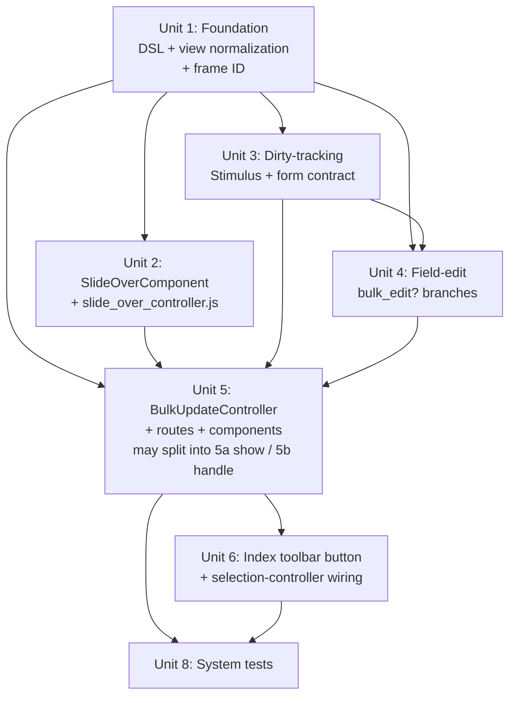

# Add per-resource bulk update

## Overview

Add an opt-in, per-resource "Bulk update" flow to Avo. When at least two rows are selected on an index page, a button appears in the existing actions toolbar. Clicking it opens a side slide-out containing the resource's editable fields, with per-field status notices ("All N share <value>" or "3 different values: a, b, c") and a live change summary above Submit. The user dirty-edits only the fields they want to change, submits, and the server writes the changes best-effort per authorized record. Defense-in-depth: per-record `update?` re-check at write time, server-side permitted-params allowlist derived from the resource's DSL, framework audit event regardless of override. v1 is sync-only with a hard cap (default 500); async deferred to v1.1.

## Problem Frame

Avo admin users frequently need to apply the same change to many records (move 50 tickets to `stage = success`, reassign 200 customers to a new account manager). Today the only built-in path is to write a custom `Avo::BaseAction` per use case, which is heavy ceremony for "edit a few fields on the selected records" and pushes routine ops work onto developers. (See origin: `docs/brainstorms/2026-05-28-bulk-update-requirements.md`.)

## Requirements Trace

All 18 requirements from the origin doc are addressed:

- R1, R2, R3, R4 (Activation & Configuration): Unit 1, Unit 6
- R5, R6, R7, R8, R9 (Slide-out UX): Unit 2, Unit 5
- R10, R11, R12 (Write Semantics): Unit 3, Unit 4, Unit 5
- R13, R17 (Authorization & Request Integrity): Unit 5
- R18 (Audit): Unit 5 (instrumentation). Subscriber scaffolding deferred to v1.x.
- R14, R15 (Scale): Unit 5 (sync cap enforcement)

Success criteria traced: one-line DSL for the default-case enable (`self.bulk_update = { enabled: true }`; R1, Unit 1) with five optional power-user knobs on the same hash; multi-record workflow at usable latency (R2 + R5 + R10, Units 2-6 — wall-clock budget pinned in Unit 8 as "open-to-flash under 5s on CI for 50 records"); count-only authz filter (R13, Unit 5); per-record failure list (R11, Unit 5); tamper-proof submit (R13 + R17, Unit 5); per-submission audit event (R18, Unit 5).

## Scope Boundaries

Carried from the origin doc (no changes in planning):

- No bulk-clear-to-NULL in v1
- No bulk update at N<2 (button hidden)
- No queued / async dispatch in v1 (deferred to v1.1). The "select all matching filter" 5,000-record case in particular is out of scope; users who select-all-matching against a filter returning more than the cap (default 500) will see a cap-exceeded error and must narrow the selection. Per-resource `bulk_update[:max_records]` lets resources with known-small filtered sets raise the cap.
- No `has_many` / `has_many through` / HABTM / nested `has_one`
- No multi-resource bulk update
- No dedicated history/diff view
- No undo / presets / dry-run
- No keyboard shortcuts (a11y still expected)
- No separate `bulk_update?` policy method (v1 reuses per-record `update?`)

Additional v1 scope decisions resolved during planning:

- No persistent server snapshot of authorized IDs (the POST carries the IDs filtered at open time; the server re-runs `update?` per record on submit)
- No live-update of slide-out contents when index selection changes behind it (the slide-out is detached once opened)
- No log-level value capture in the audit event (keys only, to avoid PII leak)

## Context & Research

### Relevant Code and Patterns

Established conventions to follow:

- **Per-resource DSL pattern**: `class_attribute` block in `lib/avo/resources/base.rb` (lines 55-110). Hash-shaped config precedent: `self.search` (line 58, accessors at 271-282). Concern pattern: `lib/avo/concerns/has_controls.rb`. For bulk update use the concern shape.
- **`class_attribute` Hash-default footgun**: Declare without a default and normalize `nil` to `{}` in the reader. Default `{}` causes subclass mutations to leak into the parent. Precedent: `class_attribute :grid_view, default: nil` at `lib/avo/resources/base.rb:70`.
- **Action flow as template**: `app/controllers/avo/actions_controller.rb`. before_action chain (`set_resource_name`, `set_resource`, `set_query`, `set_record`, `set_action`, `verify_authorization`), `set_query` (lines 68-76), encrypted index query decryption (lines 208-216), POST shape (`fields[avo_resource_ids]`, `fields[avo_selected_all]`, `fields[avo_index_query]`).
- **Action view + ModalComponent**: `app/views/avo/actions/show.html.erb` shows the `turbo_frame_tag Avo::MODAL_FRAME_ID` wrapper, field iteration via `field.component_for_view(@view).new(...)`, hidden inputs for selection state.
- **Encrypted index query**: encrypted in `app/components/avo/view_types/table_component.rb:32` via `Avo::Services::EncryptionService.encrypt(message: @query, purpose: :select_all, serializer: Marshal)`; decrypted in `actions_controller.rb:208-211`. Bulk update uses the same `:select_all` purpose.
- **ViewComponent + Stimulus**: Components subclass `Avo::BaseComponent`, use ViewComponent slots, co-locate `.html.erb`. Stimulus controllers at `app/javascript/js/controllers/<name>_controller.js`. Wiring via `data-controller`, `data-{ctrl}-target`, `data-action`, `data-{ctrl}-<value>-value`.
- **Modal pattern**: `app/components/avo/modal_component.{rb,html.erb}` + `app/javascript/js/controllers/base_modal_controller.js`. `turbo_stream.avo_close_modal` helper at `app/helpers/avo/turbo_stream_actions_helper.rb:13-17`. `Avo::MODAL_FRAME_ID` declared in `lib/avo.rb`.
- **Field edit contract**: `app/components/avo/fields/edit_component.rb` (constructor at line 16, hardcoded `@view = ViewInquirer.new("edit")` at line 24). Prefill control: `lib/avo/fields/base_field.rb#value` (lines 219-245), `should_fill_with_default_value?` (lines 379-389).
- **`Avo::ViewInquirer`**: `lib/avo/view_inquirer.rb`. `FORM_VIEWS = %w[new edit create update]`. Plan adds `MULTI_FORM_VIEWS = %w[bulk_edit]`, broadens `form?` to include both, adds `bulk?` predicate. `single?` stays as-is so prefill via `on_create?` stays off.
- **Controller params `cast_nullable`**: `app/controllers/avo/base_controller.rb:319-340`. Walks permitted params, replaces blank-in-null_values values with `nil` for nullable fields. Called inside `fill_record` (`base_application_controller.rb:191`). Bulk-update path skips this; only dirty keys reach `fill_record`.
- **`permitted_params` derivation**: `base_controller.rb:306-313` collects from `@resource.get_field_definitions.select(&:updatable).map(&:to_permitted_param)`. Bulk update subset uses the same set, intersected with the bulk-update DSL allowlist.
- **`fill_record`**: `lib/avo/resources/base.rb:569-594`. Iterates permitted params, calls `field.fill_field(record, key, value, params)`.
- **Authorization shim**: `lib/avo/services/authorization_service.rb` (OSS shim; real client in avo-pro). Per-record check: `@authorization.set_record(record).authorize_action(:update, raise_exception: false)`. Pattern from `app/controllers/avo/base_application_controller.rb:216-220`.
- **Selection state JS**: `app/javascript/js/controllers/item_selector_controller.js` (per-row state, `data-selected-resources` attribute on table-level holder, `enableResourceActions` / `disableResourceActions` toggles at lines 76-98). `item_select_all_controller.js` (header checkbox, "select all matching" overlay, `updateLinks(param)` mutating `[data-actions-picker-target=resourceAction]` hrefs at lines 100-125). `actions_picker_controller.js` gates clicks on disabled actions.
- **Routes**: `config/routes/dynamic_routes.rb`. Per-resource scope. Add bulk_update routes BEFORE the `resources` call to avoid `:id` collision (mirrors Actions routes at lines 14-17).
- **Canonical system test**: `spec/system/avo/group_3/actions_spec.rb`. Capybara + Cuprite, `include_context "has_admin_user"`, `login_as(admin, scope: :user)`. Dummy actions live at `spec/dummy/app/avo/actions/release_fish.rb`.

### Institutional Learnings

From `docs/plans/2026-05-05-001-feat-table-view-row-options-plan.md`:

- **Hash class_attribute footgun** confirmed; mirror `grid_view`'s no-default + normalize-in-reader pattern.
- **`ActiveSupport::Notifications` is the Avo audit/instrumentation surface** with `"avo.<feature>.<event>"` naming convention (precedent: `"avo.row_options.evaluate"`). Resolves R18's "AS::Notifications, logger, or both" question toward AS::Notifications with an optional logger subscriber.
- **`Avo::ExecutionContext` is the canonical wrapper** for evaluating user-supplied DSL blocks. R12's `handle_bulk_update` override should be a `class_attribute` lambda invoked through `ExecutionContext`, like `find_record_method`.

From `agents.md` and active memory:

- ModalComponent footer needs a definite height to pin (body scrolls). Apply the same to `SlideOverComponent` from day one.
- Forms no longer auto-wrap a main panel after the layout refactor; the slide-out form must handle its own panel layout.
- Customizable CSS vars go in `variables.css`, not `@theme` (Tailwind tree-shaking risk).
- No em-dashes in copy or docs.
- Tabler icons via `helpers.svg "tabler/outline/<name>"` in view components; bare `svg` in Lookbook previews.
- Every new component ships with a Lookbook preview including a `default` view with variations.
- BEMCSS for component classes; new CSS in `src/input.css`.
- `partial:` keyword for renders.
- `hidden` HTML attribute (not class) for visibility.
- Use `toggleHidden` helper for toggling.
- Avo 4 primary palette removed; use accent / tertiary / neutral tokens for slide-out chrome.

### External References

Not used. Local Avo patterns are dense enough on every dimension this plan touches.

## Key Technical Decisions

| Decision | Rationale |
|---|---|
| **New `Avo::SlideOverComponent`, not an extension of `ModalComponent`** | Action flow's modal lifecycle is tightly bound to `Avo::MODAL_FRAME_ID` and `turbo_stream.avo_close_modal`. A separate frame ID (`Avo::SLIDE_OVER_FRAME_ID`) and parallel `turbo_stream.avo_close_slide_over` keeps bulk update independent of existing modal flows. Reuse `base_modal_controller.js` by subclassing into `slide_over_controller.js`. **Rejected alternative**: parameterize `ModalComponent` with `anchor: :right` + a second frame constant. Rejected because the modal's Stimulus close path assumes a single backdrop, the discard dialog needs to nest inside the slide-out frame, and slide-out + modal must never share a focus trap. Accepted cost: a parallel `avo_close_slide_over` turbo-stream action and a new Stimulus controller. **Body-class isolation**: SlideOver uses its OWN body class (`body.slide-over-open`), NOT the existing `body.modal-open` toggled by `base_modal_controller.js:42-48`. The `slide_over_controller` overrides `addModalOpen()` / `removeModalOpen()` to toggle the new class. The "never simultaneously open" invariant is enforced by checking for the other controller's body class on `connect`: if `document.body.classList.contains('modal-open')` is true on slide-over connect, the slide-over does NOT open and logs a console warning; same check applies in reverse for the modal controller. |
| **No persistent server snapshot of authorized IDs** | The POST carries `resource_ids` (the subset authorized at open time); the submit endpoint re-runs per-record `update?` and `policy_scope`. Closes authorization TOCTOU and client ID-tampering without session storage or a new table. **Acknowledged gaps in v1**: (1) no idempotency token, so the same POST replayed re-runs writes against still-authorized records (last-write-wins is the documented behavior); (2) per-field "All N share X" notices (R7) are computed at GET time and are **advisory**, not contractual - underlying values may shift between open and submit (mitigation: the audit event payload reflects what was actually submitted, not what was shown). A per-submission nonce in the encrypted payload is reserved for v1.1 if replay becomes a real concern. |
| **Dirty-tracking via shared Stimulus controller + per-field-type contract** | Each field-edit wrapper captures its initial blank baseline on connect and dispatches a `bulk-update:field-changed` event on trusted user input. The form Stimulus controller collects dirty keys; only dirty keys serialize on submit. Regression-to-clean: current value compared to baseline, key removed if equal. |
| **`bulk_update` declared via a concern (`Avo::Concerns::HasBulkUpdate`), not directly in `Avo::Resources::Base`** | Mirrors `lib/avo/concerns/has_controls.rb`. Keeps `Resources::Base` lean and the bulk-update surface discoverable. |
| **`class_attribute :bulk_update` declared without default; reader normalizes `nil` to `{}`** | Avoids the Hash-default subclass-leak footgun. Mirrors `grid_view`. |
| **R12 override via `class_attribute` lambda, invoked through `Avo::ExecutionContext`** | Sibling to `find_record_method`. Avoids method-name collision with user-defined resource methods. **Footgun guard**: `Avo::ExecutionContext` initializes accessors only when `target.respond_to?(:call)`. A user assigning a `Symbol` (e.g., `handle_bulk_update: :my_method` - natural by analogy to other DSLs that accept Symbols) would silently return the Symbol from `.handle` and do NOTHING with no error. The bulk-update reader therefore validates the assigned value: only `Proc` / lambda / `Method` objects are accepted; anything else raises `ArgumentError` at the call site with a clear message. Documented in the DSL guide. (Planning Open Question: relocate this guard to `Avo::ExecutionContext` itself so every DSL lambda override benefits; see Open Questions.) |
| **Override receives already-authz-re-checked records AND must return a typed result hash** | The R18 "audit fires regardless of override" floor depends on the framework knowing what the override did. The override therefore: (a) receives `records:` already filtered by per-record `update?` at write time (the framework runs the authz re-check BEFORE invoking the override - the override cannot accidentally skip it); (b) MUST return `{ updated_ids: Array<id>, failed: Array<{id:, reason:, message?:}> }`. The framework validates the returned shape via `ArgumentError` if missing or malformed, then emits the standard audit payload using the returned values. Overrides that need their own audit events emit additional notifications inside the lambda; the framework's `"avo.bulk_update.submit"` still fires once with the override's reported outcomes. Documented in the DSL guide with a one-line example. |
| **Framework audit event via `ActiveSupport::Notifications` named `"avo.bulk_update.submit"`** | Established Avo instrumentation convention. Fires regardless of override. Payload carries actor ID, resource class name, updated IDs, failed records with reason codes, attempted attribute KEYS (not values, to avoid PII). **Acknowledged downstream cost**: subscribers wanting before/after values (paper_trail bridges, external diff pipelines) must read post-write records themselves; the framework does not preserve pre-write values. A future opt-in `bulk_update_audit_values: true` knob is reserved for v1.x once a concrete subscriber demands it. |
| **POST carries dirty keys only; server allowlist enforces independently** | Defense-in-depth. Client UI submits only dirty keys; server derives the allowlist from `bulk_update[:fields]` + `:except` + R4 auto-exclusions and drops everything else. Both gates must agree for a write to land. |
| **Server-side blank-skip; `cast_nullable` not invoked on the bulk-update path** | `cast_nullable` is a private helper on `BaseController` (`app/controllers/avo/base_controller.rb:319-340`) called BEFORE `fill_record` at `base_application_controller.rb:191`. `fill_record` itself does not call it. The bulk-update controller therefore simply does NOT call the `cast_nullable` helper before `fill_record` (mirrors today's separation). **Real defense**: an explicit "drop blank values from `filtered_params` before `fill_record`" step in the bulk controller. This closes BOTH (a) the JS-fails-to-disable-input case where `priority: ""` arrives in the POST and (b) ActiveRecord's own type-casting of `""` to `nil` for `:date` / `:integer` / `:decimal` / `:boolean` columns, which `cast_nullable: false` would NOT have prevented anyway. Blank-skip is the necessary AND sufficient floor; no `fill_record` signature change is needed. |
| **N=1 bulk-update button hidden, vs Actions which enable at N>=1** | Accepted divergence from Actions toolbar behavior. At N=1 the standard `:edit` form is the better affordance: prefill works, the presence-rule semantic mismatch disappears, and the per-field mixed-values UI is meaningless. The minor toolbar-state inconsistency with Actions (Actions stay enabled at N=1, bulk update does not) is accepted in exchange for not exposing a dual-semantics edit surface for the same single record. |
| **`max_records` resolution order: resource DSL > global config > hard-coded default (500)** | Explicit precedence avoids ambiguity. `bulk_update[:max_records]` on the resource wins. If unset, `Avo.configuration.bulk_update_max_records` is consulted. If unset there too, fall back to a hard-coded 500. The same pattern applies to `bulk_update_sample_threshold` for R7 sampling. |
| **Submit disables the form until the response lands** | `bulk_update_form_controller`'s submit handler sets `submit-in-flight` state immediately on first submit: disables the Submit button, disables all field inputs, swaps the button copy to "Updating...". Cmd/Ctrl+Enter or repeat-click is blocked by the disabled state. On partial-failure response, inputs are re-enabled so the user can edit and retry; on full-success response, the slide-out closes via `turbo_stream.avo_close_slide_over`. Prevents the double-submit class of bugs (Cmd+Enter double-press, slow connection causing the user to click again) and gives the user a clear in-flight signal. |
| **Per-row Turbo Stream replace is capped to currently-visible rows** | A 500-record bulk update would otherwise produce 500 `turbo_stream.replace` fragments in the response body (multi-MB payload, 500 morph operations in the browser). The handle path inspects the current page's visible row IDs (passed back via a hidden input on the slide-out form, populated client-side at open) and emits `turbo_stream.replace` ONLY for updated records on the current page. Off-page updated records are reflected when the user paginates or refreshes; a follow-up `turbo_stream.flash` summary line says "47 records updated; 42 are on other pages and will refresh when navigated." Bounds the response size to ~page_size fragments regardless of batch size. |
| **`bulk_update` reader returns a dup; never expose the raw hash for in-place mutation** | The Hash class_attribute footgun (subclass `<<` leaking to parent) is closed by reading via `dig` only and by `.dup`-ing returned arrays. `lib/avo/concerns/has_bulk_update.rb` readers explicitly return frozen or duplicated values. Mirrors the `has_controls.rb` posture. |
| **Concurrent edits surface as per-record failures via optimistic locking** | If the model has `lock_version`, `ActiveRecord::StaleObjectError` is caught and reported with reason `concurrent_modification`. Without `lock_version`, last-write-wins (documented). No new locking infrastructure. |
| **Sync hard cap default: 500 records** | Trades the "select all matching filter" headline use case against Rack/Puma timeout risk. Configurable per-resource via `bulk_update[:max_records]` and globally via `Avo.configuration.bulk_update_max_records`. |
| **Mixed-values sample threshold: 5 distinct values** | Below threshold show sample-list ("3 different values: success, in_progress, blocked"); at/above show count-only ("12 different values"). Configurable globally; per-resource override deferred. |
| **Below 640px viewport the slide-out becomes a bottom sheet** | Standard mobile pattern; side anchoring is too cramped on phones. BEMCSS media query handles the rotation. |
| **Esc / click-outside / X with dirty form opens an in-component "Discard changes?" dialog** | Matches slide-out aesthetic; native `confirm()` is jarring. Cmd/Ctrl+Enter submits. Both are conventions, not custom shortcuts. |
| **Audit event payload includes attribute KEYS only, not values - including in failure records** | PII safety. Failure entries carry `reason:` ONLY (no `message:`); Rails validation messages like `"Email 'user@example.com' is invalid"` routinely embed attribute values, so they are excluded from the audit payload. The slide-out's UI-side `FailureListComponent` still receives validation messages for human consumption; the AS::Notifications event does not. A future opt-in `bulk_update_audit_values: true` knob is reserved for v1.x once a concrete consumer demands it. Host apps wanting per-field diffs use paper_trail (which subscribes to ActiveRecord callbacks, not this event) or a custom subscriber that reads post-write records. |
| **Encryption purpose tag is distinct from Actions' `:select_all`, AND the payload is bound to the actor** | Two defenses: (a) Bulk update encrypts/decrypts with `purpose: :bulk_update_select_all`, not the shared `:select_all` used by Actions - prevents cross-feature replay. (b) The Marshal payload includes `actor_id: current_user&.id` alongside the query. On decrypt, the controller compares the embedded `actor_id` to `current_user&.id` and returns 403 on mismatch - prevents cross-user replay (an admin lifting another admin's encrypted query). Encryption already provides integrity; the purpose adds feature-binding; the actor binding adds session-binding. The same pattern should be applied to Actions' encrypted query in a follow-up. |
| **`Avo::Resources::Base#bulk_updatable_field_ids(current_user:)` is the single source of truth** | Both the GET form rendering (which fields appear in the slide-out) and the POST allowlist filter call this exact method. The method computes: `get_field_definitions.select(&:updatable).map(&:id)` intersected with `bulk_update_fields` (if set), minus `bulk_update_except`, minus R4 auto-exclusion types. Any future per-user visibility hook (e.g., a `visible_to:` lambda on a field) flows through this method, so it lands in BOTH paths automatically. Without a single method, the GET could render a field that the POST silently drops - or worse, the GET could hide a field that the POST happily writes. |
| **Cap is enforced BEFORE the relation is materialized** | The encrypted query can match arbitrary row counts. Cap check uses `@query.limit(max + 1).count` (or equivalent LIMIT-bounded count) and rejects with the cap-exceeded error BEFORE materializing rows into memory or running per-record `update?` checks. Prevents a DoS where a wide query loads 50k rows into memory just to discover it exceeds the 500-record cap. |
| **N >= 2 is enforced server-side at the controller, not just in the toolbar JS** | The button-hidden-at-N=1 rule (R2) is UI-only; the controller's show path independently enforces `authorized.size >= 2` and renders the cap-exceeded error frame (with N=1-specific copy) when violated. Prevents direct URL access (`?resource_ids=1`) from opening the slide-out for a single record and avoiding the standard edit form's overwrite semantics. |

## Open Questions

### Resolved During Planning

- **R5 (SlideOver vs Modal)**: New `Avo::SlideOverComponent` with its own frame ID and Stimulus controller. Reuses `base_modal_controller.js` shared behavior by subclassing.
- **R7 (sample threshold)**: 5 distinct values; globally configurable.
- **R10 (dirty tracking)**: Shared Stimulus controller + per-field-type contract emitting `bulk-update:field-changed`. Trusted user input only.
- **R10 (concurrent edits)**: `lock_version` optimistic locking when present; per-record failure with reason `concurrent_modification`.
- **R11 (failure UI)**: Inline list above Submit with per-record reason codes; "Retry failed" collapses the snapshot to just the failed IDs.
- **R12 (override signature)**: `class_attribute :handle_bulk_update` accepting a lambda; invoked through `Avo::ExecutionContext` with `records:`, `attributes:`, `current_user:`.
- **R13 (`bulk_update?` policy)**: Deferred to v1.x (per origin doc decision). v1 reuses per-record `update?`.
- **R15 (cap default)**: 500.
- **R18 (audit surface)**: `ActiveSupport::Notifications`, event name `"avo.bulk_update.submit"`. Optional logger subscriber ships disabled by default - `Avo.configuration.bulk_update_log_audit` defaults to `false`. Host apps opt in. Rationale: default-on logger ships per-bulk-update info-level lines to whatever log infrastructure the host runs (Datadog, Papertrail, CloudWatch), which may have weaker access controls than the app itself. Default-off keeps the AS::Notifications event observable for explicit subscribers without distributing it to general logs.
- **Empty-submission audit**: Audit event ALWAYS fires per submission, even when zero dirty keys were submitted. R18's "minimum floor" framing makes audit of attempted-but-no-op submissions valuable for compliance subscribers; payload simply shows `updated_ids: []` and `attempted_keys: []`. Subscribers can filter on that shape.
- **Selection state lifecycle**: POST carries IDs from open time; slide-out detached from live selection once opened.
- **Post-success state**: Close slide-out via `turbo_stream.avo_close_slide_over`; per-row `turbo_stream.replace` for updated rows on the visible page; clear selection on full success; preserve and re-mark failed rows on partial.
- **Focus management**: explicit per state-transition target.
  - On slide-out open: focus the first field input (NOT the heading, NOT the close button).
  - On full-success close: focus returns to the originating "Bulk update" toolbar button. If the button is now hidden (selection cleared so N<2), focus falls back to the index page's primary heading.
  - On partial-failure render: focus moves to the FailureListComponent's `role=alert` region (SRs announce; sighted users see it gain focus ring).
  - On discard-dialog open: focus moves to the "Keep editing" (safe) button by default. Esc within the dialog = "Keep editing" (cancels the discard), Enter = activates the focused button.
  - On discard-dialog close (Keep editing): focus returns to the form element that triggered the close (Esc -> last-focused input, X button -> body's first field, backdrop click -> last-focused input).
  - On discard-dialog confirm (Discard changes): same as full-success close path (toolbar button or heading fallback).
- **Live region politeness**: ChangeSummaryComponent is `aria-live="polite"` (already specified). BannerComponent for the K-of-N exclusion notice is `aria-live="polite"` on open AND on banner-mutation during partial-failure retry. FailureListComponent uses `role="alert"` (assertive announcement on render). Discard dialog uses `role="alertdialog"`.
- **Narrow viewport (below 640px)**: slide-out becomes a bottom sheet (full-width, slides up from bottom, max-height 80vh). Scroll lock on the underlying index page. The discard dialog mounts as an overlay covering the bottom sheet (NOT a new sheet from the bottom, NOT a centered modal — keeps the user inside the same UI surface). On-screen keyboard appearance: the sheet repositions using `visualViewport` resize events so the focused input stays above the keyboard. Touch targets meet 44pt minimum (Submit, Cancel, X, Discard, Keep editing). Safe-area-inset bottom padding for notched devices. No swipe-to-dismiss in v1 (use the X button or Cancel).
- **Reduced motion**: the `translate-x` entry animation honors `prefers-reduced-motion: reduce` by falling back to instant open (no transform) and instant close. Same for bottom-sheet rotation.
- **Submit-in-flight state**: Submit button disabled with copy "Updating..."; all field inputs disabled; Esc / backdrop click do NOT close (blocked while in-flight); discard dialog cannot be opened during in-flight.
- **Submit shortcut**: Cmd/Ctrl+Enter (convention, not a custom binding).
- **No live update of slide-out on index selection delta**: Slide-out is detached once opened.

### Deferred to Implementation

- Lookbook preview variants to seed for the slide-out (likely: default, with-banner, with-mixed-values-notice, with-partial-failure, narrow-viewport).
- Exact CSS / animation timings (mirror modal feel; tune during component build).
- Per-field-type dirty-tracking edge cases beyond text / select / boolean / belongs_to: money with non-zero blank state, JSON / KeyValue (auto-excluded by R4), tags. Validate against the dummy app.
- Long-text sample-listing truncation behavior (Outstanding Q from origin): default to count-only above a sample-length threshold (e.g., 60 chars per sample); confirm during implementation.
- Exact Tabler icon for the "Bulk update" toolbar button (candidates: `edit-circle`, `layers-subtract`, `square-rounded-arrow-up`).
- Sample-listing truncation policy for long-text fields (default: fall back to count-only when any single sample exceeds 60 chars; confirm during implementation).
- **Symbol-as-callable guard placement**: relocate the validation from `has_bulk_update.rb`'s reader to `Avo::ExecutionContext` itself (raise when `target` does not respond to `:call` AND is not nil) so every Avo DSL lambda override benefits, not just `handle_bulk_update`. If the relocation happens, the per-reader validation in Unit 1 can collapse into nothing (ExecutionContext owns it). If not, the per-reader validation stays. Decide during Unit 1 implementation.

## High-Level Technical Design

> *This illustrates the intended approach and is directional guidance for review, not implementation specification. The implementing agent should treat it as context, not code to reproduce.*

**DSL shape:**

```ruby
class Avo::Resources::Ticket < Avo::BaseResource
  self.bulk_update = {
    enabled: true,
    fields: [:stage, :priority, :assignee_id, :notes],   # optional allowlist
    except: [:archived_at],                              # optional denylist
    change_summary: true,                                # default true
    max_records: 1_000,                                  # overrides global cap
    handle_bulk_update: -> (records:, attributes:, current_user:) {
      # optional override: dev replaces the default best-effort loop.
      # Responsible for re-implementing authz re-check + audit if needed.
    }
  }
end
```

**End-to-end request shape:**

```
GET  /avo/admin/resources/tickets/bulk_update
       ?fields[avo_resource_ids]=1,2,3,4  OR
        fields[avo_selected_all]=true&fields[avo_index_query]=<encrypted>
       -> server caps, filters authorized via update?, computes notices
       -> renders SlideOverComponent in turbo frame SLIDE_OVER_FRAME_ID:
            banner (K of N authorized)
            field stack (per-field StatusNoticeComponent + edit input at :bulk_edit view)
            change summary (live, hidden until first dirty key)
            controls (Submit / Cancel)

POST /avo/admin/resources/tickets/bulk_update
  params: { fields: { avo_resource_ids: "1,2,3,4", priority: "high", notes: "..." } }
       -> server allowlist-filters submitted keys
       -> for each record: re-run update?; on pass, assign_attributes + save!
       -> collect updated_ids[] and failed[{id, reason, message}]
       -> emit "avo.bulk_update.submit" notification
       -> respond turbo_stream:
            full success  : close slide-out + per-row replace + flash
            partial fail  : replace slide-out body with FailureListComponent +
                            collapse hidden resource_ids to failed subset
            total fail    : leave slide-out open with error banner
```

**Slide-out content tree:**

```
SlideOverComponent (frame: SLIDE_OVER_FRAME_ID, stimulus: slide-over + bulk-update-form)
├── heading slot   ->  "Bulk update - N picks"
├── body slot:
│   ├── BulkUpdate::BannerComponent (R13: K of N + N-K excluded count-only)
│   ├── field stack (Avo::Items::SwitcherComponent re-used at :bulk_edit view)
│   │   └── EditComponent (per field, with bulk_edit? branches + dirty Stimulus wrapper)
│   │       └── BulkUpdate::StatusNoticeComponent (R7, aria-describedby field input)
│   └── BulkUpdate::ChangeSummaryComponent (R8, aria-live="polite", initially hidden)
└── controls slot  ->  Submit (primary), Cancel
```

**Component visual treatment (per-mode):**

| Component | Mode | Token | Icon | Position |
|---|---|---|---|---|
| StatusNotice | all-share | neutral (muted) | `tabler/outline/check` | Below the field input, single line, small text |
| StatusNotice | sample-list (<=5 distinct) | tertiary | `tabler/outline/stack-2` | Below the field input, may wrap to 2 lines |
| StatusNotice | count-only (>5 distinct) | accent (caution-flavored) | `tabler/outline/alert-circle` | Below the field input, single line |
| Banner | K of N (no exclusions) | hidden entirely | — | n/a |
| Banner | K of N, K<N (exclusions) | accent | `tabler/outline/info-circle` | Top of body, above field stack, full-width |
| Banner | Retrying after partial | accent | `tabler/outline/refresh` | Same slot, content mutated in place (preserves SR context) |
| ChangeSummary | hidden (no dirty keys) | — | — | — |
| ChangeSummary | dirty (1+) | neutral background, accent border-start | `tabler/outline/list-check` | Above Submit, sticky on scroll |
| FailureList | partial failure rendered | accent (caution) panel | `tabler/outline/alert-triangle` per row | Replaces field stack body; reason as colored chip with link to record (if `show?` true) |
| DiscardDialog | open | overlay over body | `tabler/outline/alert-octagon` in heading | Two buttons: "Discard changes" (destructive style, start-position), "Keep editing" (primary, end-position) |

**ChangeSummary content shape (R8):**

Leads with scope+verb+count, NOT a key list. Template: `"Set <field>=<value>, <field>=<value> on <N> records."` For boolean fields the value is "true" / "false". For belongs_to, the user-visible label (resolved client-side from the select option text), not the FK ID. When a field has been edited (key in dirtyKeys) but the value is the same as another already-summarized field, fields are still listed separately. When the change summary would exceed one visible line, it wraps to two; beyond two lines it truncates with "...and N more fields."

Example renderings:
- One field: `Set stage=success on 47 records.`
- Two fields: `Set stage=success, priority=high on 47 records.`
- Many fields: `Set stage=success, priority=high, notes=..., assignee=Maria... and 2 more fields on 47 records.`

This is the user's last review surface before a destructive bulk write. The content emphasizes blast radius (the record count) and the specific changes, not a raw key list.

**BEMCSS tree (`.slide-over`):**

```
.slide-over                          (root, fixed position, anchored end)
.slide-over__backdrop                (full-viewport overlay, dismisses on click)
.slide-over__panel                   (the actual side panel; translate-x on enter/exit)
.slide-over__header                  (heading + close button row)
.slide-over__heading                 (text inside header)
.slide-over__close                   (X button)
.slide-over__body                    (scrollable content area)
.slide-over__footer                  (controls slot; definite --slide-over-footer-h)
.slide-over--bottom-sheet            (modifier, applied below 640px)
.slide-over--in-flight               (modifier, applied during submit-in-flight; disables interactive children)
```

The discard dialog is its own component (`.bulk-update-discard-dialog`) mounted inside `.slide-over__body` as an overlay; not a child of `.slide-over__panel` in BEM terms.

## Implementation Units



**Unit 7 (audit subscriber scaffolding) deferred to v1.x.** R18 is satisfied by Unit 5's `ActiveSupport::Notifications.instrument` call alone; the default logger subscriber + config flag + boot-attachment land when a concrete consumer asks for them.

- [ ] **Unit 1: Foundation (DSL concern, ViewInquirer extension, frame ID, prefill guard)**

**Goal:** Land the framework-level extensions every other unit depends on: the `self.bulk_update = { ... }` DSL (via concern), the `:bulk_edit` view-inquirer state, the new Turbo frame ID, and the prefill guard.

**Requirements:** R1, R3, R4 (DSL surface), R10 (view state)

**Dependencies:** None

**Files:**

- Create: `lib/avo/concerns/has_bulk_update.rb`
- Modify: `lib/avo/resources/base.rb` (include the concern; declare the `class_attribute` inside the existing concern's `included do` block)
- Modify: `lib/avo/view_inquirer.rb` (add `MULTI_FORM_VIEWS`, `bulk?` predicate, broaden `form?` to include both lists, keep `single?` unchanged)
- Modify: `lib/avo.rb` (declare `SLIDE_OVER_FRAME_ID` next to `MODAL_FRAME_ID`)
- Modify: `lib/avo/fields/base_field.rb` (`should_fill_with_default_value?` returns false when `view.bulk?`)
- Modify: `lib/avo/fields/concerns/use_view_components.rb` (extend view normalization at lines 22-23 to map `:bulk_edit -> :edit` so `component_for_view(:bulk_edit)` resolves to the existing `<Field>::EditComponent` subclass tree instead of falling back to `Avo::BlankFieldComponent`)
- Modify: `app/components/avo/fields/edit_component.rb` (remove the hardcoded `@view = Avo::ViewInquirer.new("edit")` at line 24; honor a `view:` kwarg passed from `component_for_view`. Backwards-compatible: existing call sites that don't pass `view:` get `:edit` as the default.)
- **Audit step**: enumerate every call to `view.form?`, `view.in?(FORM_VIEWS)`, and `view.in?([:new, :edit, ...])` across `app/components/avo/fields/` and `lib/avo/fields/`. For each, decide explicitly: accept (bulk treated as form is correct) or branch (bulk needs distinct behavior). Document the audited surface as a bullet list in the unit's verification section so a future contributor reviewing the change can verify completeness.
- Test: `spec/avo/concerns/has_bulk_update_spec.rb`
- Test: `spec/avo/view_inquirer_spec.rb`
- Test: `spec/avo/fields/concerns/use_view_components_spec.rb` (or augment) for `:bulk_edit -> :edit` normalization
- Test: `spec/components/avo/fields/edit_component_spec.rb` (or augment) for the `view:` kwarg propagation

**Approach:**

- `has_bulk_update.rb` declares `class_attribute :bulk_update` with NO default. Provides reader methods `bulk_update_enabled?`, `bulk_update_fields`, `bulk_update_except`, `bulk_update_change_summary`, `bulk_update_max_records`, `handle_bulk_update_callable`, each normalizing `nil` to `{}` then `dig(...)`. **Readers return frozen / duped values** so in-place mutation (`bulk_update_fields << :foo`) cannot leak across subclasses. **`handle_bulk_update_callable` validates the assigned value at call time**: returns nil if unset; raises `ArgumentError` if assigned a non-callable (Symbol, String); returns the value if it is a Proc / lambda / Method.
- `has_bulk_update.rb` ALSO provides `bulk_updatable_field_ids(current_user:)` - the single-source-of-truth method for "which field ids are bulk-editable". Computes `get_field_definitions.select(&:updatable).map(&:id)`, intersects with `bulk_update_fields` if set, removes `bulk_update_except`, removes R4 auto-exclusion field types. BOTH Unit 5's show path (form rendering) and Unit 5's handle path (allowlist enforcement) call this method - no second implementation, no drift.
- `ViewInquirer`: add `MULTI_FORM_VIEWS = %w[bulk_edit]`. Update `form?` to `(FORM_VIEWS + MULTI_FORM_VIEWS).include?(@view.to_s)`. Add `bulk?` returning `MULTI_FORM_VIEWS.include?(@view.to_s)`. `single?` stays `FORM_VIEWS + [:show]`.
- `use_view_components.rb` normalization (lines 22-23 today): `view = :edit if view.in? [:new, :create, :update]` becomes `view = :edit if view.in? [:new, :create, :update, :bulk_edit]`. This is what lets `component_for_view(:bulk_edit)` resolve to `<Field>::EditComponent` (the existing subclass tree) instead of `<Field>::BulkEditComponent` (which does not exist) and rescuing to `Avo::BlankFieldComponent` (which would render every field blank in the slide-out). The bulk-specific branches in Unit 4 (Boolean tri-state, BelongsTo include-blank) then read `field.view.bulk?` to switch markup; the field's hydrated `@view` is the source of truth, not the component's `@view`.
- `EditComponent` constructor: remove `@view = Avo::ViewInquirer.new("edit")` hardcoded at line 24. Replace with `@view = kwargs[:view] || Avo::ViewInquirer.new("edit")` so existing call sites that don't pass `view:` are unaffected, and Unit 5's `field.component_for_view(ViewInquirer.new(:bulk_edit)).new(view: ViewInquirer.new(:bulk_edit), ...)` propagates the bulk view all the way down to the component. (Field-level `field.view` is set independently during `field.hydrate(view: :bulk_edit)`; the component's `@view` and the field's `@view` should agree.)
- `should_fill_with_default_value?` updated to bail out when `view.bulk?` so fields render blank in the slide-out without per-component branches.
- `fill_record` is NOT modified. `cast_nullable` lives in `BaseController` and is called BEFORE `fill_record` by the existing `:edit` / `:new` path; the bulk-update controller (Unit 5) simply does not call it. The "blank-skip" defense lives entirely in Unit 5's handle path, not in `fill_record`'s signature.

**Patterns to follow:**

- `lib/avo/concerns/has_controls.rb` (concern + class_attribute + dig accessors)
- `lib/avo/resources/base.rb:70` (`class_attribute :grid_view, default: nil`)
- `lib/avo/view_inquirer.rb` (existing predicate structure)

**Test scenarios:**

- Happy path: `Avo::Resources::Ticket.bulk_update = { enabled: true, fields: [:stage] }` returns the configured fields via `bulk_update_fields`.
- Happy path: A resource with no `self.bulk_update` set returns `bulk_update_enabled?` false and accessors return empty list / nil safely.
- Edge case: Subclass mutation does not leak to parent via reassignment. `Parent.bulk_update = {enabled: true}; Child = Class.new(Parent); Child.bulk_update = {enabled: true, fields: [:x]}; Parent.bulk_update_fields == []`.
- Edge case: In-place mutation cannot leak. `Parent.bulk_update = {enabled: true, fields: [:a]}; Parent.bulk_update_fields << :evil`; the second call returns the original `[:a]` (reader dup-on-read).
- Edge case: `handle_bulk_update` assigned as a `Symbol` raises `ArgumentError` at the next call-site invocation with a message naming the resource and offering the lambda example. (Closes the silent-no-op footgun.)
- Edge case: `handle_bulk_update` assigned as a Proc / lambda / Method object is accepted; `handle_bulk_update_callable.call(...)` runs it.
- Happy path: `ViewInquirer.new(:bulk_edit)` returns `form? = true`, `bulk? = true`, `new? = false`, `edit? = false`, `single? = false`.
- Happy path: `base_field.should_fill_with_default_value?` is false when view is `:bulk_edit`; remains true for `:new` and false for `:edit` (regression cover).
- Happy path: `field.component_for_view(:bulk_edit)` resolves to `<Field>::EditComponent` (not `Avo::BlankFieldComponent`); for at least Text, Select, Boolean, BelongsTo, and Date field types. (Pins the `use_view_components.rb` normalization.)
- Happy path: `EditComponent.new(field:, resource:, form:, view: ViewInquirer.new(:bulk_edit), ...)` exposes `view.bulk? == true`. Without an explicit `view:`, defaults to `:edit` (backwards-compat with existing Action / edit / new call sites).
- Edge case: A new `Avo::Resources::DummyForBulkEdit` resource with `bulk_update: { enabled: true }` and one of every supported field type renders every field in the slide-out without falling back to `BlankFieldComponent` (smoke test).
- (No `fill_record` regression tests — `fill_record`'s signature is not modified. The blank-skip contract is tested in Unit 5 instead.)

**Verification:**

- Existing Action / edit / new flows render unchanged (no regression in `:new` prefill).
- `Avo::SLIDE_OVER_FRAME_ID` is constant-equal to the expected value and importable from controllers and views.
- The DSL reader pattern documented (dup-on-read, Symbol-rejection) prevents both subclass leakage and silent override no-ops.

---

- [ ] **Unit 2: SlideOverComponent + slide-over Stimulus controller**

**Goal:** Build a side-anchored slide-out UI shell with its own Turbo frame and Stimulus lifecycle. Independent from `ModalComponent`; reuses the abstract `BaseModalController` JS for shared lifecycle.

**Requirements:** R5

**Dependencies:** Unit 1

**Files:**

- Create: `app/components/avo/slide_over_component.rb`
- Create: `app/components/avo/slide_over_component.html.erb`
- Create: `app/javascript/js/controllers/slide_over_controller.js`
- Modify: `app/helpers/avo/turbo_stream_actions_helper.rb` (add `avo_close_slide_over`)
- Create: `app/components/previews/avo/slide_over_component_preview.rb`
- Create: `spec/components/avo/slide_over_component_spec.rb`
- Create: `spec/components/previews/avo/slide_over_component_preview_spec.rb`
- Modify: `src/input.css` (BEMCSS for `.slide-over`, including the < 640px bottom-sheet variant)

**Approach:**

- Subclass `Avo::BaseComponent`. Props mirror `ModalComponent`: `width` (sm / md / lg), `body_class`, `close_on_backdrop_click`, `behavior: :ephemeral` (persistent slide-out out of scope). Renders `heading`, `controls`, `body` slots.
- Shell wraps a `turbo_frame_tag Avo::SLIDE_OVER_FRAME_ID` containing the slide-out chrome. Fixed-position right-anchored panel with a `translate-x` entry animation.
- `slide_over_controller.js` extends `BaseModalController` (Escape, backdrop click). Implements `closeModal()` (animate out, then replace turbo frame body with empty `<turbo-frame>` to clear) and `isOpen()`. **Overrides `addModalOpen()` / `removeModalOpen()`** to toggle `document.body.classList` with `slide-over-open` instead of `modal-open` (isolates slide-over body state from the existing modal body state). On `connect`, if `document.body.classList.contains('modal-open')` is true, the slide-over does NOT open and logs a console warning ("Cannot open slide-over while a modal is open"); the modal controller adds a symmetric check. This enforces the "never simultaneously open" invariant in code.
- BEMCSS: footer height defined as `--slide-over-footer-h: 64px` (definite, not auto; memory constraint). Below 640px: media query rotates to bottom-sheet (`bottom: 0; right: 0; left: 0; width: 100%; max-height: 80vh`).
- Lookbook preview seeds variations: `default`, `with_long_body`, `narrow_viewport`, `with_backdrop_click_disabled`.

**Patterns to follow:**

- `app/components/avo/modal_component.{rb,html.erb}` and `app/javascript/js/controllers/{base_modal,modal,persistent_modal}_controller.js`
- `app/helpers/avo/turbo_stream_actions_helper.rb:13-17` for the `avo_close_modal` parallel
- agents.md: BEMCSS, Tabler icons via `helpers.svg`, no em-dashes in copy, hidden HTML attribute, mandatory Lookbook `default` view

**Test scenarios:**

- Happy path: Component renders with heading and controls slots; Lookbook preview matches expected structure.
- Edge case: Without `controls` slot, footer is hidden; body fills available height.
- Edge case: With `close_on_backdrop_click: false`, backdrop click does not close (Stimulus action no-op).
- Edge case: Narrow viewport applies bottom-sheet layout (component spec asserts the BEMCSS modifier; visual handled by Cuprite system test if practical).
- Edge case: When `body.modal-open` is already present (an Action modal is open), opening the slide-over via `turbo_stream` does NOT toggle `body.slide-over-open`; console warning fires; slide-over content is removed. Symmetric test for the modal controller's behavior when `body.slide-over-open` is already present.
- Edge case: On normal slide-over close, `body.slide-over-open` is removed; `body.modal-open` is NOT touched. (Regression cover for body-class isolation.)
- Integration: Component renders in a Lookbook preview spec; Stimulus controller wires up on connect (asserted via DOM data attributes).

**Verification:**

- Component renders independently of `ModalComponent`; no shared DOM IDs.
- New Turbo frame ID isolates lifecycle from existing modal flows (verified by rendering both side-by-side in dummy app).
- `turbo_stream.avo_close_slide_over` clears the frame and triggers the controller's disconnect cleanup.

---

- [ ] **Unit 3: Dirty-tracking Stimulus controller + form contract**

**Goal:** Land the shared JS infrastructure for "did the user actually change this field". Field-edit wrappers emit a `bulk-update:field-changed` event on trusted user input; the bulk-update form collects dirty keys for submit-time serialization.

**Requirements:** R10

**Dependencies:** Unit 1

**Files:**

- Create: `app/javascript/js/controllers/bulk_update_field_controller.js`
- Create: `app/javascript/js/controllers/bulk_update_form_controller.js`
- Modify: `app/components/avo/fields/edit_component.rb` (add a `bulk_edit?` predicate; per Unit 1 the constructor now accepts `view:`, so this reads `view.bulk?` from the component, which agrees with `field.view.bulk?` because Unit 5 hydrates the field at the same view it instantiates the component with)
- Modify: the field-edit wrapper partial (`app/components/avo/fields/edit_component.html.erb` or the shared wrapper) to attach `data-controller="bulk-update-field"` only when `bulk_edit?`
- Create: `spec/system/avo/group_3/bulk_update_dirty_tracking_spec.rb`

**Approach:**

- `bulk_update_field_controller.js` (per-field wrapper):
  - On `connect`, snapshot the input's initial value as `initialValue` (works for text, select, hidden ID, etc.).
  - Listen for trusted `input` and `change` events. Compare current value to `initialValue`; toggle a `data-dirty` attribute on the wrapper; dispatch `bulk-update:field-changed` with `{ key, isDirty, value }`.
  - Programmatic value changes (Stimulus interactions, autofill) do not fire the dirty event; rely on user-input events only.
- `bulk_update_form_controller.js` (on the slide-out form):
  - Listens for bubbling `bulk-update:field-changed`. Maintains an internal `dirtyKeys = Set<string>`.
  - On Submit: enters the **submit-in-flight** state (sets `submit-in-flight` data attribute on the form; disables the Submit button; disables all field inputs; swaps Submit button copy to "Updating..."). Disables form inputs whose key is not in `dirtyKeys` so they do not serialize. The disabled state blocks both repeat-click and Cmd/Ctrl+Enter double-press from firing a second submit. On response: full-success closes the slide-out; partial-failure re-enables inputs (so the user can edit and resubmit); total-failure re-enables and shows the error banner. (The "synchronous summary re-render before submit" plan from an earlier deepening pass was dropped: dirty-tracking is trusted-user-input-only per the contract above, so the dirtyKeys set IS the source of truth and the summary built from it cannot diverge from the submitted payload regardless of when the summary renders.)
  - Captures Cmd/Ctrl+Enter to submit.
  - Captures Esc / X / backdrop click; if `dirtyKeys.size > 0`, opens the in-component discard dialog (rendered by Unit 5 as part of the slide-out body).
  - On `connect`, reads the current page's visible row IDs from a data attribute on the index page (populated by the index page's Stimulus controllers) and stores them in a hidden input `current_page_ids` on the form. The handle path uses these to cap per-row Turbo Stream replies to the user's visible page.
- Per-field-type dirty contracts (handled in Unit 4 where the markup requires divergence; described here for completeness):
  - Text / textarea / number / date / money: native `input`, compare to initial.
  - Select / select-with-blank: native `change`, compare to initial `<option selected>` value.
  - Boolean: tri-state radio (Unchanged / True / False) from Unit 4; Unchanged is the initial baseline.
  - Belongs_to (select or searchable): dirty-track the hidden ID input.
  - Multi-select: serialize selected values to a sorted comma-string; compare to initial.
  - Edge-case field types (tags, JSON, key_value, country, currency, etc.) are audited in Unit 4 for dirty-tracking compatibility; per-field-type edge cases beyond the above list may require targeted Stimulus adjustments, deferred to Unit 4's implementation.

**Patterns to follow:**

- Existing Stimulus controllers under `app/javascript/js/controllers/` for naming + class structure
- agents.md JS conventions: Stimulus only, `hidden` attribute for visibility, `toggleHidden` helper

**Test scenarios:**

- Happy path (system): Open slide-out, type into a text field; the form's dirty key set contains the field; submit; server receives only that key.
- Happy path (system): Edit a select; dirty-key set updates; revert to original value; key is removed from the set.
- Edge case (system): Open slide-out, do not edit anything, submit; server receives an empty field set.
- Edge case (system): Cmd/Ctrl+Enter submits the form when focus is in a text input.
- Edge case (system): Esc with no dirty keys closes the slide-out immediately. Esc with dirty keys opens the discard dialog.
- Integration (system): Change summary component (built in Unit 5) updates in real time as dirty events fire.
- Edge case (system): Double-submit prevention. After clicking Submit, the form enters submit-in-flight (Submit button disabled, inputs disabled, copy "Updating..."). A second Cmd/Ctrl+Enter press while in-flight does NOT fire a second POST. On partial-failure response, inputs are re-enabled and a second submit IS allowed (for retry).
- Edge case (system): On partial-failure response, the form's submit-in-flight state clears, Submit button re-enables with its original copy, inputs unlock; the FailureListComponent appears; user can edit and resubmit.

**Verification:**

- Submitting the form with N dirty keys results in N keys in the POST `fields` hash; rest are not sent.
- Inspecting network requests in a Cuprite system test confirms only dirty keys submitted.
- A second submit attempt during in-flight produces zero additional network requests (pinned by network-request count assertion).

---

- [ ] **Unit 4: Field-edit `bulk_edit?` branches (Boolean tri-state, BelongsTo include-blank)**

**Goal:** Branch the small set of field-edit components whose markup hard-codes initial state away from "no value" (Boolean's `checked: @field.value`, BelongsTo's `selected: @field.value.to_param`) so they render cleanly in the slide-out at `:bulk_edit` view.

**Requirements:** R6, R10

**Dependencies:** Unit 1, Unit 3

**Files:**

- Modify: `app/components/avo/fields/boolean_field/edit_component.rb` + `.html.erb` (tri-state radio when `field.view.bulk?`)
- Modify: `app/components/avo/fields/belongs_to_field/edit_component.rb` + `.html.erb` (include-blank with localized "Unchanged" label when bulk)
- Audit and modify if needed: `single_select`, `tags`, `country`, `currency` (confirm via test that `field.value = nil` renders cleanly; add minimal `bulk_edit?` guards only where markup forces a default)
- Modify: `config/locales/avo.en.yml` (add `avo.bulk_update.unchanged` and related keys; no em-dashes)
- Test: `spec/components/avo/fields/boolean_field/edit_component_spec.rb` (augment)
- Test: `spec/components/avo/fields/belongs_to_field/edit_component_spec.rb` (augment)

**Approach:**

- **Boolean** at `:bulk_edit`: render a small radio group (Unchanged / True / False). Default selection: Unchanged. The Unchanged radio carries no value (or a sentinel value the form controller filters out). Only True / False marks dirty via the wrapper.
- **BelongsTo** at `:bulk_edit`: render the select with `include_blank: t("avo.bulk_update.unchanged")`; `selected:` omitted (so the blank stays selected). Searchable belongs_to variants: same logic on the hidden ID input.
- Other field components: confirm via component spec that the existing `selected:` / `checked:` paths render cleanly with `field.value = nil` from Unit 1's view-inquirer change. If any field renders default-now (e.g., date picker), add a minimal `bulk_edit?` guard.

**Patterns to follow:**

- `app/components/avo/fields/edit_component.rb` constructor (line 16) for field component conventions
- `field.view` accessor reading the new view-inquirer state
- agents.md no em-dashes in copy; localize via `config/locales/avo.en.yml`

**Test scenarios:**

- Happy path: Boolean rendered with `field.view.bulk?` true shows three radios; default checked is Unchanged.
- Happy path: Submitting Unchanged for Boolean results in no key in submitted params (Unit 3 dirty-tracking covers).
- Happy path: BelongsTo at bulk view renders include-blank with localized "Unchanged" label; no option preselected.
- Edge case: Selecting True for Boolean then back to Unchanged regresses to clean.
- Integration: A dummy-app resource with Text, Select, Boolean, BelongsTo, and Date fields renders correctly in the slide-out; no field crashes on `field.value = nil`.

**Verification:**

- Every Avo field type not auto-excluded by R4 renders without error in the slide-out preview.
- Submitting the slide-out with only Boolean edited writes only the boolean attribute to each record.

---

- [ ] **Unit 5: BulkUpdateController + routes + notice/summary/banner/failure components + handle path**

**Note: this unit MAY be split into two PRs to keep review surface manageable.** Suggested split boundary:

- **Unit 5a (show path)**: BulkUpdateController#show + routes + show.html.erb + BannerComponent + StatusNoticeComponent + the `bulk_updatable_field_ids` reader integration. Lands a working "open the slide-out" experience against a dummy resource. Verifies: GET with selected IDs renders the slide-out with banner, per-field notices, blank field inputs; cap-exceeded, all-unauthorized, N<2 paths render error frames.
- **Unit 5b (handle path)**: BulkUpdateController#handle + allowlist filter + blank-skip + authz re-check + best-effort write loop + override invocation + audit emission + ChangeSummaryComponent + FailureListComponent + DiscardDialogComponent. Lands the working "submit and write" experience plus partial-failure and override paths.

The split is optional: the unit can land as one PR if scope allows. Either way the dependency graph treats this as a single unit feeding Unit 6 / Unit 8.

**Goal:** The guts of the feature. Show: pre-checks authz, computes per-field notices, renders the slide-out. Handle: enforces allowlist, re-checks authz per record, runs best-effort writes, emits the audit event, returns Turbo Stream with results.

**Requirements:** R6, R7, R8, R9, R10, R11, R13, R14, R15, R17, R18 (instrumentation)

**Dependencies:** Unit 1, Unit 2, Unit 3, Unit 4

**Files:**

- Create: `app/controllers/avo/bulk_update_controller.rb`
- Create: `app/views/avo/bulk_update/show.html.erb`
- Modify: `config/routes/dynamic_routes.rb` (add `get/post bulk_update` per resource scope, BEFORE `resources`)
- Create: `app/components/avo/bulk_update/banner_component.rb` + `.html.erb`
- Create: `app/components/avo/bulk_update/status_notice_component.rb` + `.html.erb`
- Create: `app/components/avo/bulk_update/change_summary_component.rb` + `.html.erb`
- Create: `app/components/avo/bulk_update/failure_list_component.rb` + `.html.erb`
- Create: `app/components/avo/bulk_update/discard_dialog_component.rb` + `.html.erb`
- Modify: `config/locales/avo.en.yml` (notice, banner, failure, discard copy; no em-dashes)
- Modify: `lib/avo/configuration.rb` (add `bulk_update_max_records` and `bulk_update_sample_threshold` globals; defaults 500 and 5)
- Modify: `app/components/avo/view_types/table_component.rb` (line 32, where the encrypted index query is generated) and the table action toolbar template that builds the bulk-update link: include `actor_id: current_user&.id` in the Marshal payload alongside the query, so the encrypted blob is actor-bound. Also switch the bulk-update encryption purpose tag from `:select_all` to `:bulk_update_select_all` here.
- Create: `app/components/previews/avo/bulk_update/*_component_preview.rb` (Lookbook previews per component)
- Test: `spec/components/avo/bulk_update/*_component_spec.rb`
- Test: `spec/requests/avo/bulk_update_controller_spec.rb`

**Approach:**

*Controller show path:*

1. Before-actions: `set_resource_name`, `set_resource`, `set_query`. `set_query` mirrors the Actions controller pattern, but uses `Avo::Services::EncryptionService.decrypt(..., purpose: :bulk_update_select_all)` (distinct from Actions' `:select_all`). When the decrypted Marshal payload is a Hash with both `query` and `actor_id` keys, the controller verifies `actor_id == current_user&.id` and returns 403 on mismatch. Legacy payloads without `actor_id` (none should exist; the bulk-update encryption purpose is new) are rejected. When `resource_ids` is passed instead, no actor-binding check is needed (the IDs are public-shaped attacker-controlled input either way; per-record `update?` is the gate).
2. Verify `bulk_update_enabled?` for the resource (403 + flash if disabled).
3. Enforce cap against the full matching result set: if `@query.size > effective_max_records`, render the cap-exceeded error frame and return. **Resolution order**: `bulk_update[:max_records]` on the resource > `Avo.configuration.bulk_update_max_records` > hard-coded default `500`. Same precedence applies to `bulk_update_sample_threshold` (resource > global > default `5`). This check guards the full matching query before authorization filtering (per test scenario 704: cap is checked against the complete result set, not just authorized records).
4. Filter to authorized subset via `@resource.authorization(user: current_user)` + `set_record(r).authorize_action(:update, raise_exception: false)`. Track `K = authorized.size`, `N = @query.size`. If `K == 0`, render an error frame ("No selected records are editable by you").
5. Compute per-field status: for each field in the bulk_update allowlist, group authorized records by `record.send(field.id)`. If 1 distinct value, "all share". If at-or-below `Avo.configuration.bulk_update_sample_threshold` (5), sample-list. Else count-only.
6. Render `show.html.erb`: `SlideOverComponent` wraps banner + field stack + change summary + Submit. Each field instantiated via `field.component_for_view(ViewInquirer.new(:bulk_edit)).new(field:, resource:, form:, view: ViewInquirer.new(:bulk_edit), ...)` (the explicit `view:` kwarg propagates from Unit 1's EditComponent constructor fix). Hidden inputs carry `fields[avo_resource_ids]` (authorized IDs comma-joined, parsed server-side as `params[:fields][:avo_resource_ids].split(",")`), `fields[avo_selected_all]`, `fields[avo_index_query]`. `ChangeSummaryComponent` is rendered ONLY when `@resource.bulk_update_change_summary` is true (default); when set to `false` in the DSL, the slide-out omits the summary slot entirely.

*Controller handle path:*

1. Same before-actions.
2. Verify `bulk_update_enabled?`.
3. Derive server-side **allowlist** by calling `@resource.bulk_updatable_field_ids(current_user: current_user)` (the same method used by the show path's form rendering - guarantees client and server agree on the field set). Filter `params[:fields]` (a hash) to allowlisted attribute keys, excluding framework keys like `avo_resource_ids` (comma-separated string), `avo_selected_all` (boolean), and `avo_index_query` (encrypted string). These are parsed separately. Drop non-allowlisted attribute keys silently.
4. Re-run the authz filter (the IDs in the POST may differ from open-time IDs if the client was tampered; per-record `update?` at write time is the gate). Authorization is enforced via the existing per-record `update?` policy, not a separate `bulk_update?` rule (deferred to v1.x). The term "count-only authz filter" in R13 refers to the filtering of input IDs to the authorized subset at show time; authorization is computed via `update?` re-check, not deferred.
5. **Blank-skip pass**: drop any key from `filtered_params` whose value is blank (`value.blank?`). This is the v1 floor against bulk-clearing AND against ActiveRecord's "" -> nil type-casting for date/integer/decimal/boolean columns. Any future opt-in clear affordance (deferred to v1.x) will need a sentinel value that survives this filter; until then, blank means skip, period.
6. **If `handle_bulk_update_callable` is set**: the framework first runs the per-record `update?` re-check on `authorized` (so the override never sees an unauthorized record), then invokes the override via `Avo::ExecutionContext.new(target: callable, records: re_checked, attributes: filtered_params, current_user:).handle`. The override MUST return `{ updated_ids: [...], failed: [{id:, reason:, message?:}, ...] }`. If the returned shape is missing `updated_ids` or `failed`, the framework raises `ArgumentError` (the resource's bulk update is misconfigured; fail loudly rather than emit a misleading audit event). The returned values populate the audit payload in step 7 exactly as if the default loop had produced them. **If `handle_bulk_update_callable` is not set**: run the default best-effort loop (directional sketch below). Every record update goes through `@resource.fill_record(record, filtered_params)` (standard signature; `cast_nullable` is NOT called on this path).
7. Emit `ActiveSupport::Notifications.instrument("avo.bulk_update.submit", { actor_id: current_user&.id, resource: @resource.class.name, updated_ids:, failed: [...], attempted_keys: filtered_params.keys })`. **Keys only, never values** - subscribers wanting before/after values read post-write records themselves.
8. Respond Turbo Stream. **Per-row replace is capped to the user's currently-visible page**: the form's hidden `current_page_ids` input (populated client-side at open by Unit 3) is intersected with `updated_ids` to determine which row partials to stream. Off-page updated rows are NOT in the response; they refresh when the user paginates. This bounds the response body to ~page_size fragments regardless of how many records were updated. The flash includes an "X are on other pages" line when relevant. **No fast-path for retry**: every POST — initial or retry after partial failure — runs the full `set_query` + cap + per-record `update?` filter. The hidden `avo_resource_ids` is untrusted user input on every request.
   - Full success: `turbo_stream.avo_close_slide_over` + per-row `turbo_stream.replace` for `updated_ids & current_page_ids` + `avo_flash_alerts("Updated 47 records (42 on other pages will refresh when navigated).")`.
   - Partial failure: replace slide-out body with `FailureListComponent`; collapse the hidden `avo_resource_ids` to failed IDs; banner updates to "Retrying K of original N"; per-row Turbo Streams for the on-page subset of succeeded rows only.
   - Total failure (DB error before per-record loop): leave slide-out open with error banner.
   - Stale-object errors surface per-record with reason `concurrent_modification`.

*Per-field-notice rendering:*

`StatusNoticeComponent` uses `Avo.configuration.bulk_update_sample_threshold`. Computed server-side at show time. Linked to the field input via `aria-describedby` (a11y).

*Change summary (R8):*

Pure DOM: `ChangeSummaryComponent` renders an empty `aria-live="polite"` region; `bulk_update_form_controller.js` listens for `bulk-update:field-changed` events and renders the current dirty set. Hidden until first dirty key. Read once on Submit for the implicit confirmation.

*Discard dialog (R5 close behavior):*

Rendered inside the slide-out frame but initially `hidden`. Triggered by `bulk_update_form_controller` when Esc / X / backdrop fires with `dirtyKeys.size > 0`. Two buttons: "Discard changes" (calls `turbo_stream.avo_close_slide_over`) and "Keep editing" (re-hides the dialog).

**Technical design:**

*Best-effort write loop sketch (directional, not implementation):*

```
filtered = allowlist_filter(params[:fields])
filtered = filtered.reject { |_k, v| v.blank? }  # blank-skip floor (Unit 5 step 5)
updated, failed = [], []
authorized_records.each do |record|
  unless can_update_now?(record)
    failed << { id: record.id, reason: :unauthorized_at_write }
    next
  end
  begin
    @resource.fill_record(record, filtered)  # standard signature; cast_nullable NOT called
    record.save!
    updated << record.id
  rescue ActiveRecord::RecordInvalid => e
    # UI-side payload (separate from audit) carries the message for human display.
    failed << { id: record.id, reason: :validation, message: e.record.errors.full_messages.join(", ") }
  rescue ActiveRecord::StaleObjectError
    failed << { id: record.id, reason: :concurrent_modification }
  end
end
# Audit payload includes reason codes ONLY; messages are stripped to prevent
# Rails validation messages (which embed attribute values like "'foo@x.com' is invalid")
# from leaking into AS::Notifications subscribers.
audit_failed = failed.map { |f| f.slice(:id, :reason) }
notifications.instrument("avo.bulk_update.submit",
  actor_id: current_user&.id,
  resource: @resource.class.name,
  updated_ids: updated,
  failed: audit_failed,
  attempted_keys: filtered.keys)
```

*Authorization filter at show / handle (directional):*

```
authorized = @query.select { |r|
  @resource.authorization(user: current_user)
    .set_record(r)
    .authorize_action(:update, raise_exception: false)
}
```

**Patterns to follow:**

- `app/controllers/avo/actions_controller.rb` (`set_resource_name`, `set_resource`, `set_query`, encrypted index query decode, turbo_stream response set)
- `app/views/avo/actions/show.html.erb` (turbo_frame_tag + field iteration via `component_for_view`)
- `app/components/avo/modal_component.rb` slot conventions
- `app/controllers/avo/base_application_controller.rb:216-220` (`authorize_action` pattern)
- `lib/avo/resources/base.rb#fill_record` (writer path)
- `docs/plans/2026-05-05-001-feat-table-view-row-options-plan.md` precedent for `avo.<feature>.<event>` notification naming

**Test scenarios:**

- Happy path (request): GET show with 5 selected IDs, all authorized. Renders slide-out with banner "Updating 5 of 5" and per-field notice "All 5 records have stage = success" when all share.
- Happy path (request): GET show with 5 IDs, 2 unauthorized. Banner reads "Updating 3 of 5. 2 records were excluded (...)"; notices reflect 3 authorized only.
- Happy path (request): POST handle with `fields[priority]=high` and `fields[avo_resource_ids]=1,2,3`. All 3 records get `priority=high`. Response includes turbo_stream that closes slide-out plus per-row replace.
- Edge case (request): POST handle with `fields[role]=admin` (NOT in allowlist). The `role` key is dropped. 0 records get `role` written. Audit payload `attempted_keys` does not include `role`.
- Allowlist symmetry (request): a resource with `bulk_update: { fields: [:stage, :priority] }` renders ONLY `stage` and `priority` fields in the GET show, AND a POST handle with `fields[stage]=success&fields[priority]=high&fields[assignee_id]=42` writes `stage` and `priority` only - `assignee_id` is silently dropped (NOT in the allowlist that produced the form). Pins the single-source-of-truth contract: same method (`bulk_updatable_field_ids`) drives both paths.
- Encrypted query actor-binding (request): an encrypted `avo_index_query` generated for User A's session, POSTed by User B (different `current_user.id`), returns 403 with a generic error (no IDs leaked). The decrypted payload's `actor_id` field is compared against `current_user.id` and the mismatch rejected. Pins SEC-PLAN-001's mitigation.
- Cross-feature replay (request): an encrypted query lifted from an Actions URL (purpose `:select_all`) POSTed to the bulk-update endpoint is rejected at decryption (wrong purpose). Pins the distinct-purpose decision.
- Edge case (request): POST handle with `fields[priority]=""` (blank value for an allowlisted, nullable column). Blank-skip pass drops the key. 0 records get `priority` touched. Same expectation for a `:date` column with `fields[archived_at]=""`. (Pins the blank-skip floor.)
- Override path (request): a resource with `handle_bulk_update: -> (records:, attributes:, current_user:) { { updated_ids: records.map(&:id), failed: [] } }` runs the override. Audit payload reflects `updated_ids` returned by the override. Per-record `update?` was invoked BEFORE the override (records yielded to the lambda are the authz-re-checked subset).
- Override error path (request): a resource whose override returns a non-Hash, a Hash missing `updated_ids`, or a Hash missing `failed` raises `ArgumentError` at the call site. The request returns 500 with a clear error message; no audit event fires (preferable to a misleading one).
- Override audit-floor (request): the override returns `{ updated_ids: [1, 2], failed: [{ id: 3, reason: :custom_business_rule }] }`. The `avo.bulk_update.submit` event payload includes `updated_ids: [1, 2]` and `failed: [{ id: 3, reason: :custom_business_rule }]` — proving the framework's audit floor reflects what the override reported.
- Edge case (request): GET show with 5 IDs all unauthorized. Renders "No selected records are editable by you" frame; slide-out form not rendered.
- Edge case (request): GET show with 600 IDs and global cap 500. Renders the cap-exceeded error.
- Error path (request): POST handle with 1 of 3 records failing validation. Response is partial-failure surface with reason `validation` and the validation message; form state preserved; banner updates to "Retrying 1 of original 3".
- Error path (request): POST handle with 1 of 3 records returning `update?` false at write time (role removed mid-flow). Failure reason is `unauthorized_at_write`. Other 2 succeed.
- Error path (request): POST handle with a model that has `lock_version`; concurrent modification surfaces as `concurrent_modification`.
- Integration (request): POST emits `avo.bulk_update.submit`. Captured via `ActiveSupport::Notifications.subscribed { ... }`; payload includes `actor_id`, `resource`, `updated_ids`, `failed`, `attempted_keys`. Values are NOT in `attempted_keys` (keys only).
- Integration (component): `StatusNoticeComponent` with 47 records all sharing `success` renders "All 47 records have stage = success".
- Integration (component): `StatusNoticeComponent` with 8 records and 3 distinct values renders "3 different values: success, in_progress, blocked".
- Integration (component): `StatusNoticeComponent` with 8 records and 7 distinct values renders "7 different values" (count-only above threshold).
- Integration (component): `ChangeSummaryComponent` updates as `bulk-update:field-changed` events fire (system spec covers via Cuprite).
- Edge case (component): `FailureListComponent` rendered with mixed reason codes renders each with a localized label.
- Edge case (component): `BannerComponent` with `K == N` (no exclusions) hides the exclusion line.

**Verification:**

- A dummy-app resource enabled via `self.bulk_update = { enabled: true }` is bulk-updatable end-to-end.
- A tampered POST adding a non-allowlisted field does NOT write that field to any record.
- A tampered POST adding an unauthorized record ID has that record show up in failures with reason `unauthorized_at_write`.
- Sample threshold respects `Avo.configuration.bulk_update_sample_threshold`.
- Hard cap respects `bulk_update[:max_records]` overriding `Avo.configuration.bulk_update_max_records`.

---

- [ ] **Unit 6: Index toolbar button + selection-controller wiring**

**Goal:** Make the "Bulk update" button appear in the existing actions toolbar when bulk_update is enabled for the current resource and N >= 2 rows are selected.

**Requirements:** R2

**Dependencies:** Unit 5

**Files:**

- Modify: `app/components/avo/actions_component.rb` + `.html.erb` (render the bulk-update button next to the Actions picker; use a distinct `data-bulk-update-target="resourceAction"` attribute, NOT the existing `data-actions-picker-target="resourceAction"`)
- Modify: `app/javascript/js/controllers/item_selector_controller.js` (add `enableBulkUpdateAction` / `disableBulkUpdateAction` parallel to the existing `enableResourceActions` / `disableResourceActions`, gated by N >= 2; existing Action behavior unchanged)
- Modify: `app/javascript/js/controllers/item_select_all_controller.js` (extend `updateLinks` to ALSO query `a[data-bulk-update-target=resourceAction]` in addition to the existing `a[data-actions-picker-target=resourceAction]` selector, so the bulk-update button's href is rewritten with `fields[avo_resource_ids]` / `fields[avo_selected_all]` / `fields[avo_index_query]`)
- Test: `spec/components/avo/actions_component_spec.rb` (or sibling) for button visibility
- Test: `spec/system/avo/group_3/bulk_update_toolbar_spec.rb`

**Approach:**

- Add the bulk-update button as a plain `<a>` link (not a button inside the Actions picker dropdown) with two key attributes: (a) `data-bulk-update-target="resourceAction"` so `item_selector_controller#enableBulkUpdateAction` (N >= 2 gate) and `item_select_all_controller#updateLinks` can find and toggle it; (b) `data-turbo-frame="<%= Avo::SLIDE_OVER_FRAME_ID %>"` so the click navigates the slide-over frame, NOT the modal frame. This avoids reusing `actions_picker_controller#visitAction` (which is hardcoded to `MODAL_FRAME_ID` at `actions_picker_controller.js:14-16`). Use a Tabler outline icon (final choice deferred).
- Why a separate target attribute: `actions_picker_controller#visitAction` would route the click into the modal frame (wrong) and would also enable at N >= 1 (Actions semantics, also wrong for bulk update). A parallel target keeps the wiring symmetric without sharing the Actions click path.
- `item_selector_controller`: add `enableBulkUpdateAction` / `disableBulkUpdateAction` that toggle disabled state on `a[data-bulk-update-target=resourceAction]`. Threshold check: `this.currentIds.length >= 2 && bulkUpdateEnabledForResource`. Hidden entirely (not just disabled) when the resource does not have `bulk_update_enabled?` true; the component conditional handles that at render time.
- `item_select_all_controller#updateLinks`: extend the selector from `a[data-actions-picker-target=resourceAction]` to `a[data-actions-picker-target=resourceAction], a[data-bulk-update-target=resourceAction]`. The href-rewriting logic is identical (carrying `fields[avo_resource_ids]` etc. into the query string).

**Patterns to follow:**

- `app/javascript/js/controllers/item_selector_controller.js:76-98` (enable/disable parallels)
- `app/javascript/js/controllers/item_select_all_controller.js:100-125` (URL rewriting; extend selector)
- `app/components/avo/actions_component.{rb,html.erb}` (button placement and styling)
- `data-turbo-frame` attribute on `<a>` for explicit frame routing (Hotwire idiom; no Stimulus needed for the navigation)

**Test scenarios:**

- Happy path (system): Resource has bulk_update enabled; user checks 2 rows; "Bulk update" button enables; click opens the slide-out in the SLIDE_OVER frame (NOT the modal frame).
- Edge case (system): User checks 1 row; "Bulk update" button stays disabled even though Actions is enabled.
- Edge case (system): Resource does NOT have bulk_update enabled; "Bulk update" button is not rendered at all.
- Edge case (system): Existing Actions button at N=1 still enables and navigates into the MODAL frame (regression cover for the parallel-wiring approach).
- Integration (system): User clicks "select all matching filter" (encrypted query path); bulk-update URL is rewritten with `avo_selected_all=true` + encrypted query; Actions URL is rewritten the same way (the selector extension covers both).

**Verification:**

- N=1 case keeps the button disabled; N >= 2 enables it.
- The button's URL carries the correct selection state in both "by-id" and "select all" paths.
- Existing Action toolbar behavior is unchanged (regression cover).

---

**Note: Unit 7 (audit subscriber scaffolding) was DEFERRED to v1.x during the document-review pass.**

R18's success criterion is "per-submission audit event" — satisfied by Unit 5's `ActiveSupport::Notifications.instrument("avo.bulk_update.submit", ...)` call alone. The event is observable from any host app via the standard AS::Notifications subscribe API; no default logger subscriber is required for v1. When a concrete consumer asks for a structured log line (or paper_trail bridge, or external pipeline integration), build the subscriber then with their requirements in hand.

What stays in v1 (already in Unit 5):
- The `avo.bulk_update.submit` event emission with the documented payload shape (actor_id, resource, updated_ids, failed with reason codes only, attempted_keys).
- The event-name and payload-shape documentation in the bulk-update guide (so host apps can subscribe themselves).

What ships in v1.x (this unit, when a use case appears):
- Default logger subscriber attached at boot.
- `Avo.configuration.bulk_update_log_audit` toggle (default false).
- Test scenarios pinning the no-values invariant for the logger output.

---

- [ ] **Unit 8: System tests**

**Goal:** End-to-end coverage of the bulk update flow at the system-test level, modeled after `spec/system/avo/group_3/actions_spec.rb`.

**Requirements:** All

**Dependencies:** Units 1-7

**Files:**

- Create: `spec/system/avo/group_3/bulk_update_spec.rb`
- Create: `spec/system/avo/group_3/bulk_update_authorization_spec.rb`
- Create: `spec/system/avo/group_3/bulk_update_failure_paths_spec.rb`
- Modify: `spec/dummy/app/avo/resources/ticket.rb` (or create if it does not exist) to enable `self.bulk_update = { enabled: true, fields: [:stage, :priority, :assignee_id, :notes] }`

**Approach:**

- Capybara + Cuprite. `include_context "has_admin_user"`. `login_as(admin, scope: :user)`. No driving the sign-in form.
- Cover: happy path, authorization filtering, allowlist enforcement, partial failure with retry, "select all matching filter" capped, change summary live update, discard dialog on dirty close, dirty-tracking regression-to-clean.
- **OSS authorization caveat**: `lib/avo/services/authorization_service.rb` is a no-op shim in OSS (`authorize_action` returns `true`; `apply_policy` returns the original query). Tests that need to exercise the per-record `update?` filter, the `K of N excluded` banner, or the `unauthorized_at_write` failure reason need a real authorization client. Options: (a) check `spec/system/avo/group_3/actions_spec.rb` for the existing convention; if Avo-Pro is loaded in CI, use the same harness; (b) otherwise mark authorization specs `pending` in OSS with a comment pointing at the Pro spec suite where they run; (c) for unit-level coverage of the filter logic, stub `Avo::Services::AuthorizationService` directly in a focused spec. Pin the choice during Unit 8 implementation.

**Patterns to follow:**

- `spec/system/avo/group_3/actions_spec.rb`
- `spec/dummy/app/avo/actions/release_fish.rb`
- agents.md: Warden login, shared context

**Test scenarios:**

- Happy path: Visit index, check 3 rows, click Bulk update, slide-out opens, edit a text field and a select, submit, flash "Updated 3 records", rows reflect new values.
- Happy path: 3 rows sharing a value renders "All 3 records have ..." notice.
- Edge case: 3 rows with 3 distinct values render the sample-list notice.
- Edge case: N=1 selection keeps the button disabled.
- Authorization: User unauthorized on 1 of 3 rows; banner reads "Updating 2 of 3. 1 record was excluded".
- Authorization: All rows unauthorized; "no selected records are editable" frame; no form.
- Authorization: Tampered POST with extra unauthorized ID; that ID appears as failed with reason `unauthorized_at_write`.
- Allowlist: Tampered POST adding a non-allowlisted field; that field is NOT written; audit payload does not list the rejected key.
- Partial failure: 1 of 3 records fails validation; failure surface shows the record + reason + message; "Retry failed" updates the snapshot to just that record; resubmit succeeds.
- Partial-failure retry tampering: after partial failure collapses `avo_resource_ids` to the failed subset, the test edits the hidden input via devtools to add a previously-unauthorized record ID; retry POST runs the full `set_query` + cap + per-record `update?` filter (no fast-path); the injected ID surfaces as `unauthorized_at_write` or is dropped. Pins "there is no fast-path for retry".
- R9 disable-flag: a resource with `bulk_update: { enabled: true, change_summary: false }` renders the slide-out WITHOUT the ChangeSummaryComponent; submit still works.
- Wall-clock budget: with 50 records selected and 2 fields edited, the GET-show through to flash-on-success completes in under 5 seconds in CI. (Pins the sub-minute success criterion; tunable threshold.)
- Cap: "Select all matching filter" returning 600 records (> 500 cap); cap-exceeded error; form does not appear.
- Dirty-tracking: Edit a field, revert to original value, submit; nothing was sent.
- Discard dialog: Edit a field, hit Esc; discard dialog appears; click "Keep editing"; dialog closes, form state preserved.
- Audit: After a successful submission, `ActiveSupport::Notifications` captures `avo.bulk_update.submit` with the expected payload.

**Verification:**

- All scenarios pass under Cuprite locally and in CI.
- No regressions in adjacent Action / edit / new system specs.

## System-Wide Impact

- **Interaction graph**: Bulk-update writes go through `record.save!`, firing the full ActiveRecord callback chain. Host apps with `after_commit` callbacks doing external work (Searchkick reindex, ActionCable broadcasts, webhooks, paper_trail versions) fan out across N records. The audit event payload describes the fan-out scope; throttling is left to the host app.
- **Error propagation**: Per-record errors are caught inside the loop; the controller never raises for individual record failures. Only structural errors (DB connection lost, etc.) escape. The audit event always fires in an `ensure` after the loop.
- **State lifecycle risks**: Concurrent edits handled via `lock_version` if present; without it, last-write-wins (documented). No new caches. Existing Russian-doll `cache_key_with_version` invalidates naturally as `updated_at` bumps per record.
- **API surface parity**: New endpoints are namespaced under each resource's existing route scope; no conflict with Actions. Stimulus controllers are isolated by name and frame ID.
- **Integration coverage**: System tests in Unit 8 cover cross-layer flows (JS dirty-tracking through to server allowlist through to per-record write through to Turbo Stream response).
- **Unchanged invariants**: Existing `:new` / `:edit` paths preserve prefill via `should_fill_with_default_value?` returning true on `:new`. Existing Action flow (`MODAL_FRAME_ID`, `turbo_stream.avo_close_modal`) is untouched.

## Risks & Dependencies

| Risk | Likelihood | Impact | Mitigation |
|------|------------|--------|------------|
| Blank values arrive in POST (JS dirty-tracking fails, autofill, etc.) and clobber columns | Med | High | Server-side blank-skip pass (Unit 5 step 5) drops any key whose value is blank BEFORE `fill_record`. Closes both the JS-fails case and ActiveRecord's "" -> nil type-cast on date/integer/decimal/boolean columns (which `cast_nullable: false` would NOT have caught). Regression test in Unit 5 POSTs `fields[priority]=""` and asserts no write. |
| New view-inquirer state regresses prefill on `:new` / `:edit` | Low | High | Unit 1 tests assert prefill is unchanged for existing states; added behavior is only the `bulk?` branch returning false. CI regression coverage. |
| New Stimulus controllers interact poorly with existing modal / Turbo lifecycle | Low | Med | Slide-out uses its own frame ID and dedicated controllers, isolated from modal. Cuprite tests open both side-by-side in dummy app. |
| Allowlist drift between client form rendering and server enforcement | Med | High | Both call the single `Avo::Resources::Base#bulk_updatable_field_ids(current_user:)` method (Unit 1 reader). Allowlist-symmetry test in Unit 5 asserts a field present in the GET form is the only writable field on POST; a tampered key is dropped. |
| `handle_bulk_update` override bypasses authz / audit / write semantics | Med | Med | (a) Authz floor enforced by the framework: per-record `update?` re-check runs BEFORE the override; override receives only authorized records. (b) Audit floor pinned by return-shape contract: override MUST return `{updated_ids:, failed:}`; framework validates the shape and emits the standard payload using the returned values. Misconfigured override (wrong shape) raises `ArgumentError` rather than silently passing. (c) Write semantics (best-effort, transactions, blank-skip) are the override's responsibility - documented in R12. |
| 500-record sync write with heavy `after_commit` callbacks exceeds Rack timeout | Med | Med | Sync cap is configurable; suggested 500 default is a soft documentation-driven setting. Host apps tune via DSL. "Submitting..." UI state and disabled Submit cover the user-facing time window. v1.1 async addresses the structural fix. |
| paper_trail bypass when override is used | Low | Med | R12 docs warn explicitly. Framework audit event provides a minimum floor. Default path goes through `update!` so paper_trail fires naturally. |
| Existing `ItemSelectAllController` changes break Actions flow | Low | High | Targeted additions, not replacements. Existing system tests at `spec/system/avo/group_3/actions_spec.rb` must remain green. |
| New SlideOverComponent CSS conflicts with ModalComponent | Low | Low | Different BEM blocks (`.slide-over` vs `.modal`); independent CSS variables. Lookbook preview validates side-by-side. |
| ModalComponent footer height constraint forgotten on SlideOver | Low | Med | Memory ledger note caught early; BEMCSS sets `--slide-over-footer-h` from day one. |
| Mobile UX: side anchoring unusable on narrow viewport | Med | Med | Below 640px BEMCSS rotates to bottom-sheet. System tests at a narrow viewport assert the class change. |
| `ActiveSupport::Notifications` payload accidentally includes attribute values (PII leak) | Med | High | Payload schema explicitly: `attempted_keys: filtered_params.keys` (keys only); `failed` entries carry `id` and `reason` only, NOT `message` (Rails validation messages embed values). The UI-side failure surface still receives `message` for human display; only the audit event is keys-only. Unit 5 test pins the no-values invariant. |
| `handle_bulk_update` assigned as a `Symbol` (or any non-callable) silently no-ops | Med | High | `Avo::ExecutionContext#handle` returns the target itself when it does not respond to `:call`, with no error. Reader in Unit 1 validates the assigned value: raises `ArgumentError` at first invocation with a clear message offering the lambda form. Test in Unit 1 pins the behavior. |
| Replay of a successful POST re-runs writes against still-authorized records | Low | Med | v1 has no idempotency token; documented as accepted last-write-wins behavior. The audit event records each submission separately so a replay is detectable post-hoc. A per-submission nonce in the encrypted payload is reserved for v1.1 if replay becomes a real concern. |
| Double-submit (Cmd/Ctrl+Enter pressed twice, slow connection causing user to click again) fires duplicate POSTs | Med | Med | `bulk_update_form_controller` enters submit-in-flight state immediately on first submit (Submit button disabled, all inputs disabled, copy "Updating..."). Both repeat-click and keyboard re-press are blocked by the disabled state. Re-enables on partial-failure response for retry. System test asserts second submit during in-flight produces zero additional network requests. |
| Per-row Turbo Stream replace at 500 records is a bandwidth/render bomb | Med | Med | Per-row replace is capped to the user's currently-visible page IDs (Unit 3 populates `current_page_ids` hidden input at open; Unit 5 intersects with `updated_ids` before streaming). Off-page updated rows refresh on the user's next navigation; the flash names the off-page count. Bounds response body to ~page_size fragments. |

## Documentation / Operational Notes

- Add a guide page covering: enabling bulk update on a resource, configuring `fields:` / `except:`, the `handle_bulk_update` override pattern (with the required `{updated_ids:, failed:}` return shape), the `bulk_update_change_summary: false` opt-out, the audit event payload shape, and a subscriber example for host apps that want to log or bridge to paper_trail.
- Update the CHANGELOG.
- Mention the new audit event in the Avo Pro / authorization docs for users running per-record policies.
- Seed `docs/solutions/best-practices/bulk-update.md` capturing the dirty-tracking field contract, the SlideOverComponent reuse pattern, and the audit event subscription pattern. Per the row-options plan's recommendation, fresh-territory work deserves a learnings entry.
- Rollout: feature is opt-in (no DSL = button never appears). Host apps adopting it should enable on one resource first and verify with their own authorization policies before rolling out broadly.

## Sources & References

- **Origin document**: [docs/brainstorms/2026-05-28-bulk-update-requirements.md](../brainstorms/2026-05-28-bulk-update-requirements.md)
- **Prior plan with relevant patterns**: [docs/plans/2026-05-05-001-feat-table-view-row-options-plan.md](2026-05-05-001-feat-table-view-row-options-plan.md) (Hash class_attribute footgun, ActiveSupport::Notifications naming, ExecutionContext usage)
- **Project conventions**: `agents.md` (Stimulus, BEMCSS, Tabler icons, no em-dashes, hidden HTML attribute, Lookbook previews, login_as helper, DB seeding)
- **Active memory**: ModalComponent footer height; customizable CSS vars in `variables.css`; Tailwind `@theme` tree-shaking; Avo 4 primary palette removal
- **Action flow reference**: `app/controllers/avo/actions_controller.rb`, `app/views/avo/actions/show.html.erb`, `lib/avo/base_action.rb`, `spec/dummy/app/avo/actions/release_fish.rb`
- **Modal reference**: `app/components/avo/modal_component.rb`, `app/javascript/js/controllers/{base_modal,modal,persistent_modal}_controller.js`, `app/helpers/avo/turbo_stream_actions_helper.rb`
- **Field edit reference**: `app/components/avo/fields/edit_component.rb`, `lib/avo/fields/base_field.rb`, `lib/avo/view_inquirer.rb`
- **Selection JS reference**: `app/javascript/js/controllers/{item_selector,item_select_all,actions_picker}_controller.js`
- **Test pattern reference**: `spec/system/avo/group_3/actions_spec.rb`
