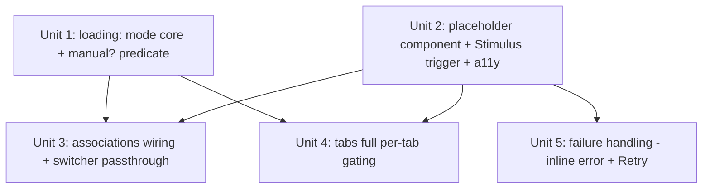

# feat: Manual (on-demand) Turbo Frame loading for tabs and associations

## Overview

Add a third frame-loading mode, **`manual`**, to Avo resource Show pages. Today a
Turbo Frame loads `eager` (immediately) or `lazy` (Turbo-native `loading="lazy"`,
on scroll/reveal). `manual` renders a placeholder with a **Load** button and
fetches nothing until the user clicks it. It applies uniformly to **tabs** and to
**`has_many` / `has_one` / `has_and_belongs_to_many`** association fields.

`manual` means one thing everywhere: *placeholder + Load button, no fetch until
click*. For tabs this is full per-tab gating — every manual tab (including the one
visible on load) shows its own button. The mode is **purely additive**: omitting
`loading:` leaves every existing tab/association behaving exactly as today.

| Mode | When it fetches | How expressed (after this change) | Default? |
|---|---|---|---|
| `eager` | Immediately with the page | existing keys; no `loading:` | Associations at top level |
| `lazy` | When the frame is revealed/scrolled into view | `lazy_load: true` (tabs) / `turbo_frame_loading: :lazy` (assoc) | Associations inside tabs/panels (switcher) |
| `manual` | Only when the user clicks **Load** | **new** `loading: :manual` (both surfaces) | never (opt-in) |

## Problem Frame

Show pages can carry expensive content (heavy queries, external APIs, large
associations). `lazy` auto-fetches the moment a frame becomes visible, so a tab or
association the user never needed still costs a request. Developers have no way to
say "don't fetch this until I ask." `manual` gives them an explicit, user-gated
load. (See origin: `docs/brainstorms/2026-06-08-on-demand-frame-loading-requirements.md`.)

## Requirements Trace

Carried from the origin requirements doc:

- R1. `manual` is a peer loading mode to `eager`/`lazy`; opt-in, no behavior change unless set.
- R2. Available on tabs and `has_many` / `has_one` / `has_and_belongs_to_many`.
- R3. Display/Show views only; Edit/New still render all fields (forms submit completely).
- R4. A manual frame renders a placeholder (title/description + **Load** button); fetches nothing until clicked. Uniform across associations and tabs.
- R5. Activating the button swaps the placeholder for real content, showing a loading indicator during the request (reuse `Avo::LoadingComponent`).
- R6. Every manual tab shows its own button when revealed (including the initial tab) and never auto-fetches on reveal.
- R7. Loaded content stays loaded while the user stays on the page (in-page tab switching); hard reload re-defers. Turbo back/forward is a verify-in-implementation case.
- R8. On load failure: inline error message + **Retry** (not the generic `failed_to_load` page, not a silent return to the pristine placeholder).
- R9. Load button is keyboard-focusable and screen-reader labeled (e.g. "Load Orders").
- R10. Placeholder shows a default label derived from the tab/association name.

## Scope Boundaries

- **Panels** are out of scope (not Turbo Frames today).
- **No page-level "Load all"** control.
- **No cross-reload memory** (no localStorage/server persistence of "loaded").
- **No custom button label** in v1 (default-from-name only).
- **No placeholder content preview** (e.g. association counts) in v1.
- **Defaults unchanged** — `manual` is additive; we do **not** flip top-level
  associations from `:eager` to `:lazy` or change any existing default.
- **`loading:` carries only `:manual` in v1** — no `:eager`/`:lazy` aliases and no
  general cross-key precedence contract; the manual render branch simply runs
  first so it wins when an old key is also set.
- Find-in-page / print / export not seeing unloaded content is accepted (same as `lazy`).

## Context & Research

### Relevant Code and Patterns

**DSL / item model**
- `lib/avo/resources/items/tab.rb` — `Tab` stores `@lazy_load = args[:lazy_load]` (boolean, `attr_reader :lazy_load`); `turbo_frame_id(parent:)`. Nested `Tab::Builder` (`Tab.new(title:, **args)`) carries args through. **Add `loading:` capture + `manual?` here.**
- `lib/avo/resources/items/tab_group.rb` — `TabGroup` has **no** loading attribute today; `group_param → "tab-group_#{id}"`. Nested `TabGroup::Builder#field` auto-wraps a standalone field into its own single-field `Tab` (constructed as `Tab.new title: title`, forwarding no args). A standalone `field ..., loading: :manual` is therefore gated at the **field** level (Unit 3), not by propagating `loading:` onto the generated tab — see Unit 1.
- `lib/avo/resources/items/holder.rb` — DSL surface: `tab(title:, **args)`, `tabs(...)`, `field(id, **args)`.
- `lib/avo/dsl/field_parser.rb` — `field ... loading: :manual` flows here → `instantiate_field(id, klass:, **args)`. No field class reads `turbo_frame_loading`/`loading` today.

**Fields**
- `lib/avo/fields/frame_base_field.rb` — shared base for has_many/has_one/habtm; `turbo_frame` and `frame_url(add_turbo_frame:)`. `#initialize` already captures named kwargs (`@reloadable`, `@linkable`). **Add `loading:` capture + `manual?` here** (shared by all three association types).
- `lib/avo/fields/concerns/frame_loading.rb` — `turbo_frame_loading` returns `kwargs[:turbo_frame_loading] || params[:turbo_frame_loading] || "eager"`. This returns an HTML `loading` value and **structurally cannot express `manual`** — `manual?` must be a separate predicate, not a `turbo_frame_loading` return value.
- `lib/avo/fields/has_and_belongs_to_many_field.rb` — `view_component_name → "HasManyField"`; HABTM reuses HasMany's show component (no own ERB).

**ViewComponents / templates**
- `app/components/avo/tab_group_component.rb` (`frame_args`, `is_not_loaded?(tab) == params[:tab_turbo_frame] != tab.turbo_frame_id(...)`, `active_tab_title` from `params[group_param]`) + `.html.erb` (the `tab.lazy_load && view.display?` branch at line ~31; active tab renders **inline** via `TabContentComponent`, non-active gets `loading: :lazy` + `src`).
- `app/components/avo/fields/has_many_field/show_component.{rb,html.erb}` (`include FrameLoading`; `turbo_frame_tag @field.turbo_frame, src: @field.frame_url, loading: turbo_frame_loading`).
- `app/components/avo/fields/has_one_field/show_component.{rb,html.erb}` — frame only when `@field.value` present; **nil value renders an attach/create empty-state panel, not a frame**.
- `app/components/avo/items/switcher_component.rb` (~line 74) — **hardcodes `turbo_frame_loading: :lazy`** for every field rendered inside tabs/panels. Keep this literal `:lazy` for non-manual fields; add a `final_item.manual?` branch for the manual path only (do **not** replace `:lazy` with a field-derived mode — the field has none, so it would default to eager). See Unit 3.
- `app/components/avo/loading_component.{rb,html.erb}` — spinner labeled `t('avo.loading') <title>`; the R5 mid-load affordance to reuse.
- `app/components/avo/empty_state_component.{rb,html.erb}` (+ `empty_state` helper) — the `.state` card markup to mirror for the manual placeholder.
- `app/components/avo/button_component.rb` + `a_button` / `a_link` helpers — Load/Retry button conventions.
- `app/views/avo/home/failed_to_load.html.erb` — the existing error UI (the `.state--frame-load-failed` markup inside `Avo::TurboFrameWrapperComponent`). **Note:** there is no `FrameLoadFailedComponent` class — only this ERB view and a `FrameLoadFailedComponentPreview` fixture. Mirror the `.state--frame-load-failed` markup, not a component class.

**Stimulus / JS**
- `app/javascript/js/controllers/select_controller.js` (`this.parentTurboFrame.src = url`) and `fields/panel_refresh_controller.js` (`frame.reload()`) — precedents for "a control inside a frame manipulates that frame." Model the new controller on these.
- `app/javascript/js/controllers/tabs_controller.js` — `changeTab`/`revealTabByName` toggle a `hidden` CSS class only (no fetch); localStorage key `resources.${resourceName}.tabgroups.${groupId}.selectedTab`. Reveal is `classList.remove('hidden')`, so a **no-`src` frame will not fetch on reveal** (the R6 behavior to verify).
- `app/javascript/application.js` —
  - lines ~104-115: global `turbo:before-fetch-response` rewrites any frame's `src` to `/failed_to_load` on HTTP 500. **Needs a discriminator to skip manual frames.**
  - lines ~93-102: `turbo:frame-load` strips `loading="lazy"` off completed frames (Turbo #886). Manual frames carry no `loading="lazy"`, so untouched — but review.
  - lines ~122-124: `turbo:before-cache` removes `[data-turbo-remove-before-cache]` — the hook to use if loaded manual content should re-defer on back/forward.

**Tests to mirror**
- `spec/system/avo/group_3/tabs_spec.rb` — the `it "lazy_load"` example (~lines 243-288) is the template; also the `with_temporary_items { tabs { tab ..., lazy_load: true } }` pattern for adding cases.
- `spec/system/avo/group_1/has_many_spec.rb` (asserts `turbo-frame[id="has_many_field_show_comments"]`, scrolls to trigger lazy load) and `reload_button_spec.rb` ("button inside frame triggers load").
- `spec/components/avo/frame_load_failed_component_preview_spec.rb` (+ preview) — template to mirror for testing the error/Retry state of `ManualFrameComponent`.
- `spec/lib/avo/fields/has_many_base_field_spec.rb` — unit-spec template for a new field-level attribute.
- `spec/dummy/app/avo/resources/person.rb` — canonical lazy-tab demo (`tab title: "Address", lazy_load: true`); add manual demos here. **No dummy resource currently sets `turbo_frame_loading` on an association**, so manual-association coverage needs a new fixture setting.
- Locale: keys live in **both** `lib/generators/avo/templates/locales/avo.en.yml` and `spec/dummy/config/locales/avo.en.yml`.

### Institutional Learnings

- No `docs/solutions/` knowledge base exists in this repo; the brainstorm doc plus the live source conventions are the institutional knowledge. All technical claims in the brainstorm were verified against source during research.
- `docs/plans/2026-05-18-001-accessible-table-keyboard-nav-plan.md` establishes the repo's a11y conventions (`tabindex`/`role`/`aria-live`/`aria-busy`, focusing dynamically-revealed content) to follow for R9 and focus-on-load. Turbo already toggles `aria-busy` on frames during fetch.

### External References

- None. The repo has strong local Turbo-frame patterns; external research was skipped per the planning gate.

## Key Technical Decisions

- **New `loading:` key, additive (per user decision).** Add a shared `loading: :manual` option to both tabs and association fields. Existing `lazy_load:` / `turbo_frame_loading:` keys and all defaults are unchanged. When `loading:` is omitted, behavior is identical to today.
- **`manual?` is a predicate, not a loading-attribute value.** Because `FrameLoading#turbo_frame_loading` feeds the HTML `loading` attribute (`eager`/`lazy` only), `manual` is modeled as a separate `manual?` predicate on a **new shared module** (`Avo::Concerns::FrameLoadingMode`) included by both `Tab` and `FrameBaseField`. `FrameLoading#turbo_frame_loading` stays untouched. Manual frames render with **no `src` and no `loading` attribute**.
- **`loading:` carries only `:manual` in v1, additively.** No general precedence contract and no `:eager`/`:lazy` aliases (closed as a non-goal). If both `loading: :manual` and an old key (`lazy_load:`/`turbo_frame_loading:`) are set, the manual render branch is simply evaluated first so manual wins at render time — this is defensive ordering, not an advertised precedence feature.
- **Trigger = no-`src` frame + a small Stimulus controller sets `src` on click.** Mirror `select_controller.js` / `panel_refresh_controller.js`. No `loading="lazy"` is ever set, so neither Turbo's lazy auto-fetch nor the #886 strip handler touches it.
- **Tabs: route all manual tabs (including the active one) through the placeholder branch.** Today the active tab renders inline; manual needs a new branch that emits a no-`src` placeholder uniformly. The Load URL must carry the params the component actually reads — `tab_turbo_frame` (= `tab.turbo_frame_id(parent: group)`) and the group param — **not** `active_tab_title` (which is written to URLs but never read server-side).
- **Failure: `data-` discriminator + inline error/Retry handled by the controller across all failure classes.** Mark manual frames so the global 500 handler in `application.js` skips them; the manual controller binds the failure events Turbo emits — `turbo:fetch-request-error` (network/timeout) and `turbo:before-fetch-response` for non-2xx (404/4xx/5xx) — and renders an inline error + **Retry** that re-issues the request. (Turbo fires no `turbo:frame-load` on failure, so completion hooks alone won't cover errors.)
- **`has_one` with nil value falls through to the existing attach/create empty state** (no Load button when there is no record to load).
- **`switcher_component` keeps injecting `:lazy` for non-manual fields** and branches to the manual path only when `final_item.manual?`. It does **not** "read the field's own mode" — the field has no `turbo_frame_loading` of its own, so that would regress in-tab/panel associations from lazy to eager. See Unit 3.

## Open Questions

### Resolved During Planning

- **DSL surface** → new shared `loading:` key, `loading: :manual`; old keys untouched; additive (user decision).
- **Default mode** → keep current defaults; `manual` purely opt-in (user decision).
- **Trigger mechanism** → no-`src` frame + `manual_frame_controller` sets `src` on click.
- **Tab params** → reproduce `tab_turbo_frame` + group param, not `active_tab_title`.
- **Failure UX** → `data-manual-frame` discriminator so the global handler skips; inline error + Retry in the controller.
- **`has_one` nil** → fall through to existing empty-state panel.

### Deferred to Implementation

- **Turbo back/forward / page-cache (R7 second half).** Verify whether a loaded manual frame's content is restored from snapshot (acceptable — not stale within a session) or should re-defer. If re-defer is wanted, tag loaded frames `data-turbo-remove-before-cache`. Resolve by observing real behavior.
- **Exact focus target after load** (frame heading vs. first interactive element) and the `aria-live` announce wording — settle against `Avo::LoadingComponent` output during implementation.
- **Group-level `tabs loading: :manual` propagation.** v1 sets `loading:` per-`tab`. A group-level `loading:` is treated as a no-op (not half-implemented) in v1; cascading it to all child tabs is an explicit follow-up.

(Note: `loading:` accepting `:eager`/`:lazy` as aliases is now closed as a **v1 non-goal** — `loading:` carries only `:manual` — and the cross-key precedence is handled defensively at render, not as a public contract. See Key Technical Decisions and Scope Boundaries.)

## High-Level Technical Design

> *This illustrates the intended approach and is directional guidance for review, not implementation specification. The implementing agent should treat it as context, not code to reproduce.*

**DSL (directional grammar):**

```text
# Tabs — every manual tab shows its own Load button
tab title: "Orders", loading: :manual do
  field :orders, as: :has_many
end

# Associations — placeholder + Load button on the Show page
field :orders, as: :has_many, loading: :manual

# Unchanged: omitting `loading:` keeps eager/lazy exactly as today
tab title: "Address", lazy_load: true do ... end      # still lazy
field :comments, as: :has_many                          # still eager/lazy per context
```

**Mode × surface resolution (directional):**

```text
loading: omitted   -> manual? == false -> existing eager/lazy path (UNCHANGED)
loading: :manual   -> manual? == true  -> placeholder + Load button, no src
                      (gated by view.display? — ignored in Edit/New)
```

**Frame lifecycle (directional):**

```text
render (display view, manual?)        click Load                 success
┌───────────────────────────┐  user   ┌──────────────────────┐  swap   ┌──────────────┐
│ <turbo-frame> NO src       │ ─────▶  │ controller sets src= │ ─────▶  │ real content │
│  data-manual-frame         │         │ LoadingComponent /   │         │ (focus moved)│
│  [Load button] (aria-label)│         │ aria-busy spinner    │         └──────────────┘
└───────────────────────────┘         └─────────┬────────────┘
        ▲                                        │ 500 / error
        │ reveal (tabs): classList toggle        ▼
        │ → NO fetch (no src)            ┌──────────────────────┐
        └────────────────────────────── │ inline error + Retry │
          (global 500 handler skips      │ (Retry re-sets src)  │
           data-manual-frame)            └──────────────────────┘
```

## Implementation Units



- [ ] **Unit 1: `loading:` mode core + `manual?` predicate**

**Goal:** Capture a new `loading:` option on tabs and association fields and expose a `manual?` predicate, without changing any existing default.

**Requirements:** R1, R2, R3 (data layer)

**Dependencies:** None

**Files:**
- Create: `lib/avo/concerns/frame_loading_mode.rb` — a small shared module that normalizes `args[:loading]` and exposes `manual?`. Included by both `Tab` and `FrameBaseField`. (Do **not** fold this into `FrameLoading`, which keeps owning the `eager`/`lazy` string.)
- Modify: `lib/avo/resources/items/tab.rb` (include the module; capture `args[:loading]`; `manual?`)
- Modify: `lib/avo/fields/frame_base_field.rb` (include the module; capture `args[:loading]`; `manual?`, shared by has_many/has_one/habtm)
- Test: `spec/lib/avo/fields/frame_base_field_spec.rb` (create or extend), `spec/lib/avo/resources/items/tab_spec.rb` (create or extend)

**Approach:**
- One shared module so `Tab` and `FrameBaseField` resolve `loading:` identically and answer `manual?`. `turbo_frame_loading` (eager/lazy string) is untouched — `manual?` is orthogonal.
- v1 accepts only `loading: :manual`; omitted → `manual? == false` and zero change.
- **Standalone field auto-wrapped into a tab:** when `TabGroup::Builder#field` wraps a `field ..., loading: :manual` into a single-field tab, the gating happens at the **field** level (Unit 3 show component), so the generated tab stays non-manual. Do **not** propagate `loading:` onto the generated tab — that would double-gate (a placeholder inside a placeholder). No `tab_group.rb` change is needed for this case.

**Patterns to follow:** `FrameBaseField#initialize` named-kwarg capture (`@reloadable`, `@linkable`); `Tab`'s existing `attr_reader :lazy_load`.

**Test scenarios:**
- Happy path: `Tab.new(title:, loading: :manual).manual?` is `true`; `field ... loading: :manual` → field `manual?` is `true`.
- Edge case: no `loading:` → `manual?` is `false` for both tab and field (defaults preserved).
- Edge case: `lazy_load: true` (tab) and `turbo_frame_loading: :lazy` (field) still resolve to their existing behavior and `manual? == false`.
- Edge case: both `loading: :manual` and `lazy_load: true` on a tab → `manual?` is `true` (render-layer ordering is enforced in Unit 4, not here).
- Integration: a standalone `field ..., loading: :manual` auto-wrapped into a tab gates at the field level (the field's `manual?` is `true`; the generated tab's `manual?` is `false`, avoiding double-gating).

**Verification:** New unit specs pass; existing tab/field specs unchanged (no default drift).

---

- [ ] **Unit 2: Manual placeholder component + Stimulus trigger controller + a11y**

**Goal:** Build the reusable primitive both surfaces use — a `turbo-frame` with three states (placeholder + **Load** button → loading spinner → inline error + **Retry**), driven by a Stimulus controller that sets the frame `src` on click and manages focus. The **deferred load URL** is passed to the component as a kwarg and carried in a `data-` attribute for the controller.

**Requirements:** R4, R5, R9, R10 (and the interim failure guard for R8)

**Dependencies:** None. This unit is a foundation; Units 3, 4, and 5 depend on it.

**Files:**
- Create: `app/components/avo/manual_frame_component.rb` + `.html.erb` (a `turbo-frame` with **no `src`**, marked `data-manual-frame`, holding the deferred load URL in a `data-` value; renders the placeholder/Load-button state, and — wired in Unit 5 — the error/Retry state. Placeholder, loading, and error are three states of this one component, not separate components.)
- Create: `app/javascript/js/controllers/manual_frame_controller.js` (`ManualFrameController`; `load` action sets the frame `src` from the `data-` value; toggles loading/aria-busy)
- Modify: `app/javascript/js/controllers.js` — the actual Stimulus registry (there is **no** `controllers/index.js` and no auto-discovery). Add `import ManualFrameController from './controllers/manual_frame_controller'` and `application.register('manual-frame', ManualFrameController)`. The component's `data-controller` must be `manual-frame` (dash form).
- Modify: `app/javascript/application.js` — add the one-line early-return guard `if (e.target.dataset.manualFrame) return` at the **top** of the `turbo:before-fetch-response` 500 handler now (so the interim state between this unit and Unit 5 is a no-op, not a wrong `failed_to_load` redirect). Full inline-error handling lands in Unit 5.
- Modify: `lib/generators/avo/templates/locales/avo.en.yml` and `spec/dummy/config/locales/avo.en.yml` (keys: `load`, `retry`, error copy)
- Test: `spec/components/avo/manual_frame_component_spec.rb`; a focused system test via `with_temporary_items`

**Approach:**
- Placeholder mirrors `EmptyStateComponent` `.state` markup; reuse `Avo::LoadingComponent` for the mid-load state (R5). Load button via `a_button`/`ButtonComponent`, keyboard-focusable, `aria-label` = "Load <title>" (R9).
- **Title derivation:** the placeholder title comes from the tab title (tabs) or the field's humanized name (associations); the button label is "Load " + that title (e.g. `order_items` → "Load Order items").
- Controller mirrors `select_controller.js` (`frame.src = …`) + `panel_refresh_controller.js`. Set `src` from the `data-` value; do **not** add `loading="lazy"`.
- **Focus management (extends R9 — per the brainstorm design-deferred item, not R9 proper):** after content swaps in (`turbo:frame-load` on this frame), move focus to a sensible target and/or announce via `aria-live`, following `docs/plans/2026-05-18-001-accessible-table-keyboard-nav-plan.md`. The in-scope R9 guarantee is just: focusable + labeled button, and focus is not dropped to `<body>` after load; the exact focus target is the deferred design item.

**Execution note:** Build the component's render contract test-first (placeholder renders no `src` and a labeled button).

**Patterns to follow:** `EmptyStateComponent`, `LoadingComponent`, `ButtonComponent`, `select_controller.js`, `panel_refresh_controller.js`, the explicit registration list in `controllers.js`.

**Test scenarios:**
- Happy path: component renders a `turbo-frame` with **no `src`**, a `data-manual-frame` marker, `data-controller="manual-frame"`, and a Load button labeled from the title.
- Happy path (system): clicking Load sets the frame `src` and the real content replaces the placeholder; the spinner shows during the request.
- Edge case: no network request is made before the click (assert the `turbo-frame` has no `src` and no request fires).
- Accessibility: Load button is reachable by keyboard (Tab) and exposes an `aria-label` like "Load Orders"; after load, focus is not dropped to `<body>`.
- Edge case: default label derives correctly from a multi-word name ("Order items" → "Load Order items").

**Verification:** Placeholder shows a focusable, labeled Load button; clicking loads content with a visible spinner; no request fires pre-click; a 500 mid-load is a no-op (not a `failed_to_load` redirect) even before Unit 5.

---

- [ ] **Unit 3: Wire associations (has_many / has_one / habtm) to manual**

**Goal:** Render association frames as manual placeholders when `manual?`, including the switcher passthrough fix, without regressing eager/lazy associations.

**Requirements:** R2, R4, R5 (associations)

**Dependencies:** Unit 1, Unit 2

**Files:**
- Modify: `app/components/avo/fields/has_many_field/show_component.html.erb` (branch: `@field.manual?` + display view → render `ManualFrameComponent` with `@field.frame_url` as the deferred load URL; else existing `turbo_frame_tag ... src:`)
- Modify: `app/components/avo/fields/has_one_field/show_component.html.erb` (add the manual branch **only inside the value-present path**; the **nil-value path is untouched** — no manual branch is entered, the existing attach/create empty-state panel renders, no turbo-frame)
- Modify: `app/components/avo/items/switcher_component.rb` (~line 74 — **keep `turbo_frame_loading: :lazy` literally for non-manual fields**; only diverge when `final_item.manual?`, in which case render the manual placeholder path with no `loading` kwarg)
- Modify: `spec/dummy/app/avo/resources/*.rb` (add a `has_many ... loading: :manual`, a `has_one ... loading: :manual`, and a habtm case)
- Test: `spec/system/avo/group_1/manual_loading_has_many_spec.rb` (new), extend has_one/habtm coverage

**Approach:**
- HABTM reuses HasMany's show component, so the has_many branch covers it — add explicit coverage, no separate ERB.
- The deferred load URL for associations is `@field.frame_url`; the manual placeholder withholds it until click.
- **Switcher fix (highest-blast-radius edit, prevents a P0 regression):** the field instance has **no `turbo_frame_loading` of its own** — `FrameLoading#turbo_frame_loading` reads the component kwargs, which the switcher populates. So "read the field's own mode" is a trap: a non-manual field would fall back to the `"eager"` default and every in-tab/panel association would silently flip from lazy to eager. Therefore: **keep injecting `turbo_frame_loading: :lazy` for non-manual fields**, and branch on `final_item.respond_to?(:manual?) && final_item.manual?` only to render the manual path. The literal `:lazy` default for switcher fields is preserved.

**Patterns to follow:** existing `turbo_frame_tag @field.turbo_frame, src: @field.frame_url` shape; `has_one` empty-state branch.

**Test scenarios:**
- Happy path: `has_many ... loading: :manual` renders a Load button; no `has_many_field_show_*` fetch until click; content loads on click.
- Happy path: HABTM with `loading: :manual` behaves identically (delegated component).
- Edge case: `has_one ... loading: :manual` with a present value → Load button → loads on click.
- Edge case: `has_one ... loading: :manual` with **nil** value → existing attach/create empty state renders (no Load button, no turbo-frame).
- **Regression (must distinguish lazy from eager):** an existing `has_many` inside a tab/panel (no `loading:`) still renders its frame with `loading="lazy"` and is **not** fetched on initial paint — assert the `turbo-frame` carries `loading="lazy"` and has no content until reveal (a "content eventually appears" assertion would pass for an eager frame too and miss the regression).
- Edge case (R3): the same manual association on an Edit/New view renders the full field, not a placeholder.

**Verification:** Manual associations gate behind a button; non-manual in-tab/panel associations still carry `loading="lazy"` (unchanged); has_one nil falls through to empty state.

---

- [ ] **Unit 4: Wire tabs to manual (full per-tab gating)**

**Goal:** Every tab marked `loading: :manual` renders its own Load-button placeholder — including the tab visible on load — and never auto-fetches on reveal.

**Requirements:** R4, R6, R7 (tabs)

**Dependencies:** Unit 1, Unit 2

**Files:**
- Modify: `app/components/avo/tab_group_component.rb` (a method building the manual frame's deferred load URL for a tab: `resource_path(... tab_turbo_frame: tab.turbo_frame_id(parent: group), "tab-group_#{group.id}" => tab.title)` — the group-param **value is the raw `tab.title`** (server compares it via `CGI.unescape` against `tab.title.to_s`), not the parameterized id; plus a per-tab `manual?` helper)
- Modify: `app/components/avo/tab_group_component.html.erb` (new manual branch — see Approach for the exact branch shape and ordering)
- Modify: `spec/dummy/app/avo/resources/person.rb` (add a `tab ..., loading: :manual`)
- Test: extend `spec/system/avo/group_3/tabs_spec.rb` (mirror the `lazy_load` example with a `manual` case)

**Approach:**
- **Keep the inner `is_not_loaded?` split** (this is load-bearing — without it the Load click re-renders the placeholder forever). The manual branch mirrors the lazy branch's structure: render the `ManualFrameComponent` placeholder when `is_not_loaded?(tab)`, and `TabContentComponent` (real content) when the framed request arrives carrying the matching `tab_turbo_frame`. The **only** differences from lazy: the frame has no `src` and no `loading="lazy"`, and a Load button supplies the `src` on click.
- **Branch ordering:** evaluate `tab.manual? && view.display?` **before** the existing `tab.lazy_load && view.display?` branch, so a tab set with both keys takes the manual (no-`src`) path and never enters the lazy/eager src-setting branch.
- The deferred URL carries the params the component actually reads (`tab_turbo_frame` + the `tab-group_<id>` group param), **not** `active_tab_title` (written to URLs but never read server-side). Turbo extracts only the matching frame from the response, so sibling-tab `hidden`/active state in the framed re-render is irrelevant.
- Reveal via `tabs_controller.js` is a CSS `hidden` toggle; a no-`src` frame must not fetch on reveal — assert this explicitly (R6).
- R7 in-page persistence: once loaded (the framed response swaps in `TabContentComponent`), the content stays in the DOM across CSS show/hide tab switches. Back/forward is the deferred verification item.

**Patterns to follow:** existing `frame_args` / `turbo_frame_tag tab.turbo_frame_id(...)` and the `is_not_loaded?` placeholder-vs-content split; the `tab.lazy_load && view.display?` gating shape.

**Test scenarios:**
- Happy path: a `manual` tab shows a Load button on the initially-visible tab; no fetch until clicked; **clicking Load renders the real tab content** (not the placeholder again).
- Happy path: a second `manual` tab in the same group also shows its own button; revealing it (clicking the tab) shows the button and does **not** fetch until Load is clicked.
- Integration (R7): after loading a manual tab, switching away and back keeps the content without re-fetching (content remains in the DOM).
- Edge case (R6): revealing a manual tab fires no network request (no `src`).
- Edge case (R3): manual tab on Edit/New renders inline content, not a placeholder.
- Edge case (precedence at render): a tab with both `loading: :manual` and `lazy_load: true` renders a no-`src` placeholder and fires no request on reveal (manual branch wins).
- Edge case: a mixed group (one `manual` tab + one `lazy_load: true` tab + one eager tab) — each behaves per its own mode.

**Verification:** Every manual tab gates behind its own button; clicking Load shows real content; reveal never fetches; loaded content persists across in-page tab switches.

---

- [ ] **Unit 5: Failure handling — inline error + Retry with discriminator**

**Goal:** A failed manual load shows an inline error + **Retry** in the frame, instead of the generic `failed_to_load` page, by making the global 500 handler skip manual frames.

**Requirements:** R8

**Dependencies:** Unit 2

**Files:**
- Modify: `app/javascript/application.js` (the `data-manual-frame` early-return guard was added to the 500 handler in Unit 2; here, confirm it and verify the #886 `loading="lazy"` strip handler does not touch manual frames — they carry no `loading="lazy"`)
- Modify: `app/javascript/js/controllers/manual_frame_controller.js` (bind the failure events and render the error state; `retry` action re-issues the request)
- Modify: `app/components/avo/manual_frame_component.html.erb` (add the **error state** — inline message + **Retry** — to the existing component from Unit 2; mirror the `.state--frame-load-failed` markup from `app/views/avo/home/failed_to_load.html.erb`. Do **not** create a separate error component.)
- Modify: locale files (error message + `retry` key) — both generator template and dummy
- Test: `spec/system/avo/group_1/manual_loading_failure_spec.rb` (new); component spec for the error state of `ManualFrameComponent`

**Approach:**
- **Cover all failure classes, not just 500.** The global handler only fires on HTTP 500; the early-return guard makes it skip manual frames there. The controller must additionally bind `turbo:fetch-request-error` (network/timeout) and `turbo:before-fetch-response` for non-2xx (404/4xx/5xx-other) on its frame, since Turbo emits **no** `turbo:frame-load` on failure — without this a non-500 manual failure would leave a blank frame.
- On any of those failure events for this frame, render the error state (inline message + **Retry**). `retry` resets the frame `src` (same URL) to re-issue; on repeated failure the error state persists.

**Execution note:** Drive with a failing-endpoint system test first (a dummy action that 500s), asserting the inline error appears rather than the `failed_to_load` page.

**Patterns to follow:** the `.state--frame-load-failed` markup in `app/views/avo/home/failed_to_load.html.erb`; `ButtonComponent` for Retry.

**Test scenarios:**
- Error path (500): a manual frame whose load 500s shows the inline error + **Retry**, and does **not** navigate to / render the `failed_to_load` page.
- Error path (non-500): a manual frame load that 404s or hits a network error also shows the inline error + **Retry** (not a blank frame).
- Error path: clicking **Retry** re-issues the request; once the backend succeeds, content loads.
- Regression/Integration: a non-manual (lazy/eager) frame that 500s still routes to the existing `failed_to_load` page (the guard only affects `data-manual-frame`).
- Edge case: repeated failure keeps the inline error + Retry visible (no broken/empty frame).

**Verification:** Manual-frame failures (500 and non-500) stay inline with a working Retry; existing frame error handling is unchanged for non-manual frames.

## System-Wide Impact

- **Interaction graph:** The `switcher_component` change (Unit 3) sits on the render path of **every** field inside a tab or panel — the largest blast radius. Default must remain `:lazy` for non-manual fields. The `application.js` 500-handler change (Unit 5) is global to all Turbo frames — must early-return only for `data-manual-frame`.
- **Error propagation:** Manual frames intercept their own 500s (inline error + Retry); all other frames keep the existing `failed_to_load` behavior. Non-500 failures (network, timeout, other statuses) should also surface as the inline error via the controller, not a blank frame.
- **State lifecycle risks:** Loaded manual content lives in the DOM and persists across in-page tab switches (CSS show/hide). Turbo page-cache / back-forward may snapshot loaded content or restore a placeholder — verify; use `data-turbo-remove-before-cache` only if re-defer is desired.
- **API surface parity:** `loading: :manual` works uniformly on tabs, has_many, has_one, and habtm (habtm via the has_many component). The `manual?` predicate lives on the shared `FrameBaseField` and on `Tab`, so all three association types and tabs share one code path.
- **Integration coverage:** Reveal-without-fetch (Unit 4) and switcher passthrough (Unit 3) are the cross-layer behaviors unit tests can't prove — covered by system tests.
- **Unchanged invariants:** No existing default changes. `eager`/`lazy` frames, `lazy_load: true` tabs, `turbo_frame_loading: :lazy` associations, the `failed_to_load` flow for non-manual frames, and Edit/New rendering are all explicitly preserved.

## Risks & Dependencies

| Risk | Mitigation |
|------|------------|
| **Switcher change flips non-manual in-tab associations from lazy to eager (P0 regression)** — the field has no `turbo_frame_loading` of its own, so "read the field's mode" falls back to `"eager"` | Keep injecting `turbo_frame_loading: :lazy` literally for non-manual fields; branch only on `final_item.manual?`. Regression test asserts the frame carries `loading="lazy"` and is not fetched on initial paint (not just "content eventually appears") |
| Manual tab Load click re-renders the placeholder forever instead of content | Keep the inner `is_not_loaded?(tab)` split in the manual branch (placeholder when not loaded, `TabContentComponent` when the framed request arrives); test that clicking Load shows real content |
| `loading: :manual` + `lazy_load: true` on a tab still enters the lazy src-setting branch | Order the `tab.manual?` branch **before** `tab.lazy_load`; render-layer test for the both-keys case |
| Global 500-handler change breaks error handling for non-manual frames | Guard early-returns only for `data-manual-frame`; regression test that a non-manual 500 still hits `failed_to_load` |
| Non-500 manual failures (network/timeout/404) leave a blank frame | Controller binds `turbo:fetch-request-error` + non-2xx `turbo:before-fetch-response`; non-500 failure test |
| Interim state: manual failures before Unit 5 lands | One-line `data-manual-frame` early-return guard moved into Unit 2, so the interim is a no-op; R8 inline error fully lands in Unit 5 |
| A manual frame accidentally carries `src`/`loading="lazy"` and auto-fetches on reveal | Component emits no `src`/`loading`; explicit test that revealing a manual tab fires no request |
| `has_one` nil value path mishandled | Manual branch not entered on the nil path; test it falls through to the existing empty state (no turbo-frame) |
| Turbo back/forward restores stale or re-fetches manual content (R7) | Deferred-to-implementation verification; `data-turbo-remove-before-cache` (already used at `application.js` ~line 123) available if re-defer is needed |

## Documentation / Operational Notes

- Document the new `loading: :manual` option for tabs and associations in the Avo docs site; note it is display-only, opt-in, and (for tabs) gates every manual tab individually.
- Add the new locale keys (`load`, `retry`, error copy) to the generator template so host apps pick them up.
- No migrations, no rollout/feature-flag concerns — purely additive view behavior.

## Sources & References

- **Origin document:** [docs/brainstorms/2026-06-08-on-demand-frame-loading-requirements.md](docs/brainstorms/2026-06-08-on-demand-frame-loading-requirements.md)
- Tabs: `app/components/avo/tab_group_component.{rb,html.erb}`, `app/javascript/js/controllers/tabs_controller.js`, `lib/avo/resources/items/tab.rb`, `tab_group.rb`
- Associations: `lib/avo/fields/concerns/frame_loading.rb`, `lib/avo/fields/frame_base_field.rb`, `app/components/avo/fields/has_many_field/show_component.html.erb`, `has_one_field/show_component.html.erb`, `app/components/avo/items/switcher_component.rb`
- Affordances: `app/components/avo/loading_component.*`, `empty_state_component.*`, `button_component.rb`, `app/views/avo/home/failed_to_load.html.erb` (the `.state--frame-load-failed` markup)
- Failure path: `app/javascript/application.js`, `config/routes.rb` (`failed_to_load`), `app/controllers/avo/home_controller.rb`
- Tests to mirror: `spec/system/avo/group_3/tabs_spec.rb`, `spec/system/avo/group_1/has_many_spec.rb`, `reload_button_spec.rb`, `spec/components/avo/frame_load_failed_component_preview_spec.rb`
- A11y conventions: `docs/plans/2026-05-18-001-accessible-table-keyboard-nav-plan.md`
