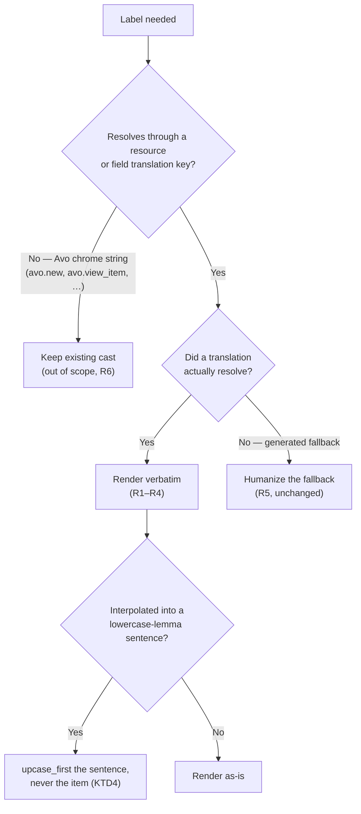

# Trust Resolved Translations Verbatim - Plan

## Goal Capsule

**Objective.** Stop Avo from applying `.humanize`, `.capitalize`, or `.upcase_first` to strings resolved from a **resource or field translation key**. Humanization stays, but only on generated fallbacks derived from class and attribute names.

**Authority hierarchy.** Linear AVO-1461 > this plan > PR #4639's existing diff. PR #4639 is a reference for intent and test fixtures, not a specification — its field-layer hunks predate `translate_field_name` and must not be applied literally.

**Stop conditions.** Stop and surface if: dropping a cast would regress Avo's own chrome strings to lowercase (see KTD3 — this is why the chrome sites are out of scope); or if the `i18n-tasks` lint suite fails, which would mean locale files were touched when this plan says they should not be.

**Execution profile.** Continue on the existing branch `cursor/trust-translations-verbatim-7901` (PR #4639), rebased onto current `main`. Behavior-changing, so specs prove each surface.

**Tail ownership.** The caller (LFG) owns commit/push/PR. U6 targets a **different git repo** and cannot ship in the same PR — see U6.

---

## Product Contract

### Summary

Avo resolves resource and field labels through I18n, then casts the result with `.humanize` or `.capitalize`. That cast destroys casing the developer deliberately wrote: a locale entry of `"Payment Intent ID"` renders as `"Payment intent id"`, and `"API Products"` renders as `"Api products"`. This plan removes the cast from every site that consumes a resource-translation or field-translation value, and leaves it in place on generated fallbacks and on Avo's own chrome strings.

### Problem Frame

`String#humanize` downcases every word not in the acronym inflection list; `String#capitalize` downcases everything after the first character. Both are correct tools for turning `payment_intent_id` into `Payment intent id` — a generated fallback derived from an attribute name. Both are wrong applied to `"Payment Intent ID"`, which a developer typed into a locale file precisely because the generated form was unacceptable.

The cast is currently the *only* thing standing between a user's locale file and the screen, so it silently overrides every translation. Users have no escape hatch: there is no option to opt out of humanization, and re-casing the locale entry cannot help because the cast is applied unconditionally.

### Requirements

**Trusting translated values**

- R1. A value resolved from a field translation key renders exactly as written in the locale file, in both singular and plural forms.
- R2. A value resolved from a resource translation key renders exactly as written, across resource labels, plural labels, navigation labels, breadcrumbs, page titles, and chart headings.
- R3. A resource-specific save-button label (`<resource_translation_key>.save`) renders exactly as written.
- R4. A translated resource or field name interpolated into an Avo sentence (`Create new %{item}`, `Attach %{item}`, `view %{item}`, `detach %{item}`) is interpolated verbatim, not downcased first.

**Preserving fallback behavior**

- R5. When no translation resolves, the generated fallback is still humanized exactly as it is today — `payment_intent_id` still renders `Payment intent id`, and `Avo::Resources::Product` still renders `Product`.
- R6. Avo's own chrome strings (`avo.new`, `avo.edit`, `avo.view`, `avo.undo`, and the leading verb of `avo.view_item` / `avo.detach_item`) still render with their current display casing.

**Communicating the change**

- R7. The published i18n documentation stops recommending locale values that will now render lowercase, and states that translations are used verbatim.
- R8. The Avo 4 upgrade guide records the behavior change and tells users how to respond.

### Acceptance Examples

- AE1. Given `avo.field_translations.payment_intent_id.one: "Payment Intent ID"`, a `field :payment_intent_id` renders the label `Payment Intent ID`. (Covers R1)
- AE2. Given no translation for `field :missing_field_name`, the label renders `Missing field name`. (Covers R5)
- AE3. Given `avo.resource_translations.product.other: "API Products"`, the products index page title, breadcrumb, and sidebar entry all read `API Products`. (Covers R2)
- AE4. Given `avo.resource_translations.product.save: "Save API credentials"`, the new-product form's submit button reads `Save API credentials`. (Covers R3)
- AE5. Given `avo.resource_translations.product.one: "API Product"`, the new-product panel heading reads `Create new API Product`. (Covers R4)
- AE6. Given the pt locale defines `test.translation_key.course.other: cursos` (lowercase), the courses index in `:pt` renders `cursos` — lowercase, as written. (Covers R2, and demonstrates the breaking change)
- AE7. The "new" breadcrumb still renders `New`, not `new`, in the default locale. (Covers R6)

### Scope Boundaries

**In scope.** Every call site that casts a value which resolved through `avo.resource_translations.*`, `avo.field_translations.*`, a resource-scoped field key, or a `<resource_translation_key>.save` key.

**Deferred to follow-up work**

- Re-casing Avo's chrome lemmas. `avo.en.yml` deliberately stores `new: new`, `edit: edit`, `undo: undo`, `view_item: view %{item}`, `detach_item: detach %{item}`. The `.humanize` at those call sites supplies the display casing. Removing it would render lowercase chrome across all ten shipped locales. Fixing this properly means re-casing every locale file and is a separate piece of work.
- `app/components/avo/index/resource_controls_dropdown_component.rb:78`. `singular_resource_name.humanize` feeds a case-insensitive `gsub` matcher, not display. It is not rendered, so verbatim casing is not observable there.
- `lib/avo/resources/base.rb` `default_panel_name`'s `@params[:related_name].capitalize`. `related_name` is a request parameter, not an I18n-resolved value.
- The `default:` kwarg that `ArrayField#translated_name` and `HasManyField#translated_name` accept and then ignore in favor of `default_name`. Pre-existing; correcting it changes fallback behavior and belongs in its own change.

**Outside this change's identity.** Adding a configuration flag to restore humanization. The premise of AVO-1461 is that the cast is a bug, not a feature with an opt-out.

---

## Planning Contract

### Key Technical Decisions

- KTD1. **Continue on PR #4639's branch, rebased onto `main`, rather than opening a fresh branch.** (session-settled: user-directed — chosen over closing #4639 and starting from scratch: the user asked to continue if the PR was a good base or close to one, and roughly 60% of its hunks still apply cleanly, its acronym test fixtures are reusable, and continuing preserves the PR and Linear linkage.) The branch is 23 commits behind `main` with merge base `e3256601`.

- KTD2. **At the field layer, delete the cast — do not port PR #4639's `default: nil` plumbing.** `main` already has `BaseField#translate_field_name(count:, default:)` (`lib/avo/fields/base_field.rb:383`, from #4637 and #4652), which walks `translation_lookup_keys`, calls `t(key, count:, default: nil)`, returns the first present result, rescues `I18n::InvalidPluralizationData`, and falls back to the supplied `default`. Applying the PR's `t(translation_key, ...)` form literally would bypass `translation_lookup_keys` and regress resource-scoped field translations.

- KTD3. **Scope the change to resource/field translation values; leave Avo's chrome casts alone.** Evidence: `lib/generators/avo/templates/locales/avo.en.yml` stores `new: new`, `edit: edit`, `undo: undo`, `view: View`, `view_item: view %{item}`, `detach_item: detach %{item}`. The call-site `.humanize` is what capitalizes those for display. Removing it would ship lowercase chrome. The clean rule this plan implements is narrower and fully testable: *never cast a value that came from a resource or field translation key.*

- KTD4. **Where a cast serves both purposes, replace `.humanize` with `.upcase_first`.** `t("avo.view_item", item: @resource.name).humanize` must capitalize the lowercase `view` lemma (R6) while leaving the interpolated resource name alone (R4). `.upcase_first` does exactly that: `"view API Product"` becomes `"View API Product"`. Same for `t("avo.detach_item", item: title)`.

- KTD5. **Drop `.upcase_first` from `default_panel_name` as redundant.** `avo.create_new_item` is `Create new %{item}` — already sentence-cased. The remaining fix there is to interpolate the resolved name verbatim while lowercasing only the *generated* fallback, so an untranslated `Product` still yields `Create new product`.

- KTD6. **Do not edit any locale YAML file; store test fixtures in-memory.** `spec/system/avo/i18n_spec.rb` is an `i18n-tasks` lint suite that fails on non-normalized files and missing keys, and it runs as its own CI job. Using `I18n.backend.store_translations` inside an `around` block keeps fixtures out of that suite's reach entirely.

- KTD7. **Leave `spec/dummy/config/locales/avo.pt.yml` lowercase and flip the assertion to match.** The pt fixture defines `one: curso / other: cursos`. Today `.humanize` masks that and the spec asserts `"Cursos"`. Capitalizing the fixture would hide the very consequence being shipped. Asserting `"cursos"` makes the suite document the breaking change, and it keeps the companion `"Criar novo curso"` assertion passing unchanged.

- KTD8. **Keep PR #4639 in draft; do not mark it ready.** This is a user-visible breaking change in someone else's draft PR. Release timing is the maintainer's call.

### High-Level Technical Design

The rule is a single predicate applied at each call site: *did this string come from a resource or field translation key?*

The fallback branch already works: callers pass pre-humanized defaults (`BaseField#name` passes `default_name`, which is `@id.to_s.humanize(keep_id_suffix: true)`; `Resources::Base.name` passes `demodulized_class_name.underscore.humanize`). That is why deleting the outer cast satisfies R1–R4 without breaking R5.

### Assumptions

- The Cursor-authored branch `cursor/trust-translations-verbatim-7901` is safe to force-push after rebase. It is a draft PR in the team's own repo with no external contributors.
- Rebasing produces conflicts only in `lib/avo/fields/base_field.rb`, `array_field.rb`, `has_many_field.rb`, and `spec/features/avo/i18n_spec.rb`. Those are the files `main` moved via #4637, #4652, and #4646.

### Sources & Research

- `lib/avo/fields/base_field.rb:383-401` — `translate_field_name` and `translation_lookup_keys`, the reason KTD2 holds.
- `lib/generators/avo/templates/locales/avo.en.yml:96,147,208,211,212,91,82,62,187` — the chrome lemma casing that grounds KTD3 and KTD4.
- `spec/dummy/config/locales/avo.en.yml` — `resource_translations.product.save: "Save the product!"` and `product.fields.title` fixtures; both survive the change unchanged, which is why existing assertions keep passing.
- `.github/workflows/tests.yml:349` — the dedicated `bundle exec rspec spec/system/avo/i18n_spec.rb` job that motivates KTD6.
- PR #4639 diff — reference for intent and for the acronym fixture idea.

---

## Implementation Units

### U1. Rebase the branch onto current `main`

**Goal.** Get `cursor/trust-translations-verbatim-7901` onto current `main` with a clean tree, resolving conflicts in favor of `main`'s structure.

**Requirements.** Prerequisite for R1–R6.

**Dependencies.** None.

**Files.** No source edits — conflict resolution only, in `lib/avo/fields/base_field.rb`, `lib/avo/fields/array_field.rb`, `lib/avo/fields/has_many_field.rb`, `spec/features/avo/i18n_spec.rb`.

**Approach.** Fetch and rebase onto `origin/main`. At each field-layer conflict, take `main`'s side wholesale — `translate_field_name(...)` with its trailing cast intact. U2 then removes the cast. Do not carry the PR's `t(translation_key, count:, default: nil).presence || default` form into the resolution; it is the regression KTD2 warns about. For `spec/features/avo/i18n_spec.rb`, take `main`'s side; U7 rewrites the spec deliberately.

**Execution note.** Resolve to a state that is *identical to `main`* in the conflicted files, so the behavior diff introduced by U2–U6 is reviewable in isolation.

**Test scenarios.** `Test expectation: none -- rebase mechanics, no behavior change. The full suite runs at the end of U7.`

**Verification.** `git status` clean, `git log` shows the branch's commits replayed on top of current `main`, and `git diff origin/main` in the four conflicted files is empty.

---

### U2. Trust field translations

**Goal.** Field labels render translated values verbatim while untranslated fields still humanize.

**Requirements.** R1, R5. Covers AE1, AE2.

**Dependencies.** U1.

**Files.**
- `lib/avo/fields/base_field.rb`
- `lib/avo/fields/array_field.rb`
- `lib/avo/fields/has_many_field.rb`

**Approach.** Delete the trailing cast from all four `translated_name` / `translated_plural_name` implementations: `.humanize` in `base_field.rb` (both `count: 1` and `count: 2`), `.capitalize` in `array_field.rb` and `has_many_field.rb`. `translate_field_name` already returns the resolved translation or the supplied `default`, and callers supply humanized defaults, so R5 holds with no other change. Leave the ignored `default:` kwarg quirk alone (deferred).

**Patterns to follow.** `translate_field_name` at `lib/avo/fields/base_field.rb:383`.

**Test scenarios.**
- Covers AE1. A field whose shared translation key resolves to `"Payment Intent ID"` reports that exact string as its name, and `"Payment Intent IDs"` as its plural name.
- Covers AE2. A field with no translation at any lookup key reports the humanized attribute name (`missing_field_name` → `Missing field name`).
- A `has_many` field whose translation resolves to a multi-word acronym value (`"API People"`) renders that panel title verbatim — the case `.capitalize` previously destroyed to `"Api people"`.
- A resource-scoped field translation still wins over the shared key (guards the #4637 behavior the rebase must not regress).

**Verification.** `bundle exec rspec spec/features/avo/i18n_spec.rb` passes, including the pre-existing resource-scoped-translation example.

---

### U3. Trust resource translations

**Goal.** Resource names, plural names, navigation labels, and save-button labels render translated values verbatim.

**Requirements.** R2, R3, R5.

**Dependencies.** U1.

**Files.**
- `lib/avo/resources/base.rb`
- `lib/avo/resources/controls/save_button.rb`

**Approach.** In `name_from_translation_key`, drop `.humanize` — callers already pass humanized defaults (`demodulized_class_name.underscore.humanize` from `name`, `name.pluralize` from `plural_name`). Keep the `I18n::InvalidPluralizationData` rescue. In `navigation_label`, drop `.humanize`; `plural_name` is already correct. In `SaveButton#initialize`, drop `.capitalize` — `avo.save` is already `Save`, so the default path is unaffected, and a resource override like `"Save the product!"` keeps its casing.

**Test scenarios.**
- Covers AE3 (model layer). With `avo.resource_translations.product.one/other` set to `"API Product"` / `"API Products"`, `Avo::Resources::Product.name`, `.plural_name`, and `.navigation_label` return those strings verbatim.
- With no resource translation, `.name` still returns the humanized demodulized class name and `.plural_name` its pluralization.
- Covers AE4. With `avo.resource_translations.product.save` set to `"Save API credentials"`, the new-product form's submit button carries that label.
- The existing `"Save the product!"` dummy fixture still renders unchanged.
- A resource translation defined without pluralization subkeys still falls back via the `InvalidPluralizationData` rescue rather than raising.

**Verification.** `bundle exec rspec spec/features/avo/i18n_spec.rb` passes, including the pre-existing `have_button("Save the product!")` example.

---

### U4. Trust resource names at render sites

**Goal.** Page titles, breadcrumbs, and chart headings stop re-casting `plural_name`.

**Requirements.** R2. Covers AE3.

**Dependencies.** U3.

**Files.**
- `app/controllers/avo/base_controller.rb`
- `app/controllers/avo/charts_controller.rb`
- `app/views/avo/partials/distribution_chart_full.html.erb`

**Approach.** Replace every `@resource.plural_name.humanize` with `@resource.plural_name` — one in `index`'s `@page_title`, and the breadcrumb calls in `index`, `new`, `create`, `set_edit_title_and_breadcrumbs`, and `add_via_breadcrumbs`. Same in `charts_controller.rb`'s `distribution_chart_full` page title and in the panel title in the partial. Leave `@field_id.to_s.humanize` in both chart sites untouched — `@field_id` is a raw field identifier, a generated fallback, not a translation. Leave `t("avo.new").humanize` and `t("avo.edit").humanize` untouched per KTD3.

**Test scenarios.**
- Covers AE3. With `avo.resource_translations.product.other: "API Products"`, visiting the products index renders `API Products` in the breadcrumb trail and in the sidebar navigation entry.
- Covers AE6. Visiting the courses index with `force_locale: :pt`, where the pt fixture is lowercase `cursos`, renders `cursos` verbatim.
- Covers AE7. The "new" breadcrumb on a new-record page still renders `New`, proving the chrome cast survived.

**Verification.** `bundle exec parallel_rspec spec/features spec/requests` passes — breadcrumbs and page titles are exercised broadly there, so this unit is the one most likely to surface incidental assertion drift.

---

### U5. Trust names interpolated into Avo sentences

**Goal.** A resolved resource or field name interpolated into an Avo sentence keeps its casing, while the sentence's own lowercase lemma still displays capitalized.

**Requirements.** R4, R5, R6. Covers AE5, AE7.

**Dependencies.** U2, U3.

**Files.**
- `lib/avo/resources/base.rb` (`default_panel_name`)
- `app/components/avo/fields/has_one_field/show_component.html.erb`
- `app/components/avo/fields/gravatar_field/index_component.html.erb`
- `app/components/avo/fields/id_field/index_component.html.erb`
- `app/components/avo/fields/preview_field/index_component.rb`
- `app/components/avo/resource_component.rb`

**Approach.** Two distinct shapes here — do not conflate them.

*Shape one — the interpolated item is a resolved name that is being downcased before interpolation.* In `default_panel_name`'s `:new` branch, `name` already resolves the translation and `.humanize(capitalize: false)` then destroys it. Resolve the item through the resource translation key with a **lowercased generated fallback**, so a translated `"API Product"` interpolates verbatim while an untranslated `Avo::Resources::Product` still yields `Create new product`. Reuse `name_from_translation_key` rather than duplicating translation-resolution logic. Drop the now-redundant `.upcase_first` per KTD5 — `avo.create_new_item` is already `Create new %{item}`. Apply the same treatment to the two `@field.name.humanize(capitalize: false)` interpolations in the has-one show component.

*Shape two — the whole sentence is cast to fix a lowercase lemma.* `t("avo.view_item", item: @resource.name).humanize` in the gravatar, id, and preview field components, and `t("avo.detach_item", item: title).humanize` in `resource_component.rb`, must keep capitalizing `view` / `detach` while leaving the interpolated name alone. Replace `.humanize` with `.upcase_first` per KTD4.

**Execution note.** Shape one changes fallback rendering if the lowercased-fallback detail is missed — verify the untranslated path explicitly, not just the translated one.

**Test scenarios.**
- Covers AE5. With `avo.resource_translations.product.one: "API Product"`, the new-product panel heading reads `Create new API Product`.
- With no resource translation, the new-record panel heading still reads `Create new <lowercased humanized class name>` — unchanged from today.
- A has-one field whose name resolves to a translated acronym value renders `Attach <verbatim name>` and `Create new <verbatim name>` on the show component.
- A record link title built from `avo.view_item` renders `View <verbatim resource name>` — capital `V`, untouched interpolation.
- A detach control label renders `Detach <verbatim title>`.

**Verification.** `bundle exec parallel_rspec spec/features spec/requests` and `bundle exec rspec spec/components` both pass.

---

### U6. Update i18n documentation and the upgrade guide

**Goal.** Published docs stop recommending locale values that will now render lowercase, and the upgrade guide records the change.

**Requirements.** R7, R8.

**Dependencies.** U2–U5 (document the behavior that actually shipped).

**Target repo.** The docs site is a **separate git clone** at `docs/` in the workspace (`avo-hq/docs.avohq.io`), not part of the `avo` repo. It cannot ship in the same PR — it needs its own commit and PR. Paths below are relative to that clone.

**Files.**
- `docs/4.0/i18n.md`
- `docs/4.0/upgrade.md`

**Approach.** In `i18n.md`, capitalize the YAML examples under "Localizing resources" and "Localizing fields" — they currently show `one: 'usuario'` and `one: 'archivo'`, which after this change render lowercase in titles and breadcrumbs. Add a short note that Avo uses translated values exactly as written and humanizes only generated fallbacks. Update the FAQ section "The I18n.t method defaults to the name of that field/resource", whose example YAML has the same lowercase problem, and whose description of the internal call no longer matches the code. In `upgrade.md` — currently a five-line stub — add the first real entry: resource and field translations are no longer humanized; users whose locale entries are lowercase should capitalize them; users who relied on Avo's implicit humanization of a translated value now control casing directly.

**Patterns to follow.** VitePress conventions already used in `docs/4.0/` — `:::warning` callouts, language-tagged fenced blocks, line-highlight annotations.

**Test scenarios.** `Test expectation: none -- documentation-only. Verified by build, not by spec.`

**Verification.** `npx vitepress build docs` from the docs clone completes without errors, and the changed pages render with working anchors.

---

### U7. Prove the contract with specs

**Goal.** `spec/features/avo/i18n_spec.rb` proves verbatim rendering across every surface and proves the fallback path still humanizes.

**Requirements.** R1–R6. Covers AE1–AE7.

**Dependencies.** U2–U5.

**Files.**
- `spec/features/avo/i18n_spec.rb`

**Approach.** Add an `around` block that stores acronym-bearing fixtures via `I18n.backend.store_translations` and restores state afterward, per KTD6 — no locale YAML edits, so the `i18n-tasks` suite is untouched. Fixtures need internal capitals so the old casts were provably destructive: `.capitalize` turns `"API People"` into `"Api people"`, and `.humanize` turns `"Payment Intent ID"` into `"Payment intent id"`. Cover the field layer, the resource layer, the render sites, the save button, the interpolated-sentence sites, and the untranslated fallback.

Prefer page-level assertions over test doubles. PR #4639 asserted the save-button label through a `double(translation_key:)` and that example failed on CI; a fixture overriding `avo.resource_translations.product.save` to `"Save API credentials"` plus a visit to the new-product path proves the same thing against real rendering.

Update the two existing assertions that this change legitimately moves: the has-many panel title (now driven by the `"API People"` fixture) and the pt courses title, which flips from `"Cursos"` to `"cursos"` per KTD7. Leave `"Criar novo curso"` alone — it still passes, because the pt fixture's singular is already lowercase.

**Execution note.** Run the i18n spec first for a fast signal, then the full feature and request suites, since U4 touches breadcrumbs used across many specs.

**Test scenarios.** The AE list is the scenario list: AE1 through AE7, each asserted at the surface it names — model-level for AE1/AE2, page-level for AE3–AE7.

**Verification.** `bundle exec rspec spec/features/avo/i18n_spec.rb` passes; `bundle exec rspec spec/system/avo/i18n_spec.rb` still passes (no locale files touched); `bundle exec parallel_rspec spec/features spec/requests` and `bundle exec rspec spec/components` pass.

---

## Verification Contract

Run from the `avo` repo root.

| Gate | Command | Why |
|---|---|---|
| i18n behavior | `bundle exec rspec spec/features/avo/i18n_spec.rb` | Fast signal on the contract this plan ships |
| i18n lint | `bundle exec rspec spec/system/avo/i18n_spec.rb` | Confirms no locale YAML drifted out of normalization (KTD6) |
| Features & requests | `bundle exec parallel_rspec spec/features spec/requests` | Breadcrumbs and page titles from U4 are exercised broadly here |
| Components | `bundle exec rspec spec/components` | Covers the U5 component sites |
| System groups | `bundle exec parallel_rspec spec/system/avo/group_1` (and `group_2`, `group_3`) | Matches the CI matrix; catches label assertions elsewhere |
| Ruby lint | `bundle exec standardrb` | CI gate `runner / standardrb` |
| ERB lint | `bundle exec erblint --lint-all` | CI gate `runner / erb-lint` |
| Docs build | `npx vitepress build docs` from the docs clone | U6 only |

Expect assertion drift outside `i18n_spec.rb`: any spec asserting a humanized resource label may now see the verbatim form. Each such failure is a real signal — fix the assertion only after confirming the new rendering is what this plan intends.

## Definition of Done

**Global**

- Every in-scope cast is removed; the chrome casts named in KTD3 are demonstrably still in place.
- No locale YAML file changed in the `avo` repo.
- The full CI matrix is green on PR #4639.
- No abandoned or experimental code remains in the diff.
- PR #4639 remains a draft (KTD8), with its description updated to describe the shipped scope and the breaking change.
- The docs change (U6) is committed and pushed as its own PR in the docs repo, and the user is told it is a separate PR.

**Per unit**

- U1 — the four conflicted files are byte-identical to `main`.
- U2, U3 — translated values render verbatim; untranslated values still humanize.
- U4 — page titles and breadcrumbs render `plural_name` untouched; `@field_id.to_s.humanize` still humanizes.
- U5 — both shapes handled distinctly; the untranslated fallback path verified, not assumed.
- U6 — no lowercase locale example remains in the two documented sections; the upgrade guide has an entry.
- U7 — every AE has a corresponding assertion, and both i18n suites pass.

## Open Questions

- Deferred. Should Avo eventually offer a dedicated locale key for the mid-sentence (lowercase) form of a resource name, so `Create new %{item}` can read naturally in languages where a capitalized noun mid-sentence is wrong? This change makes the tension visible but does not resolve it. Not launch-blocking — the current behavior is strictly more predictable than the cast it replaces.
