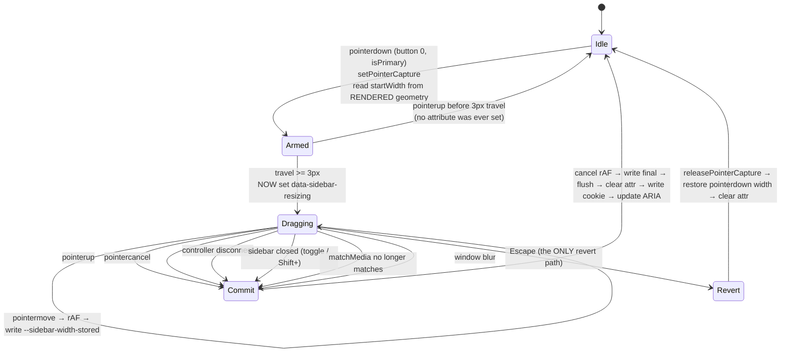
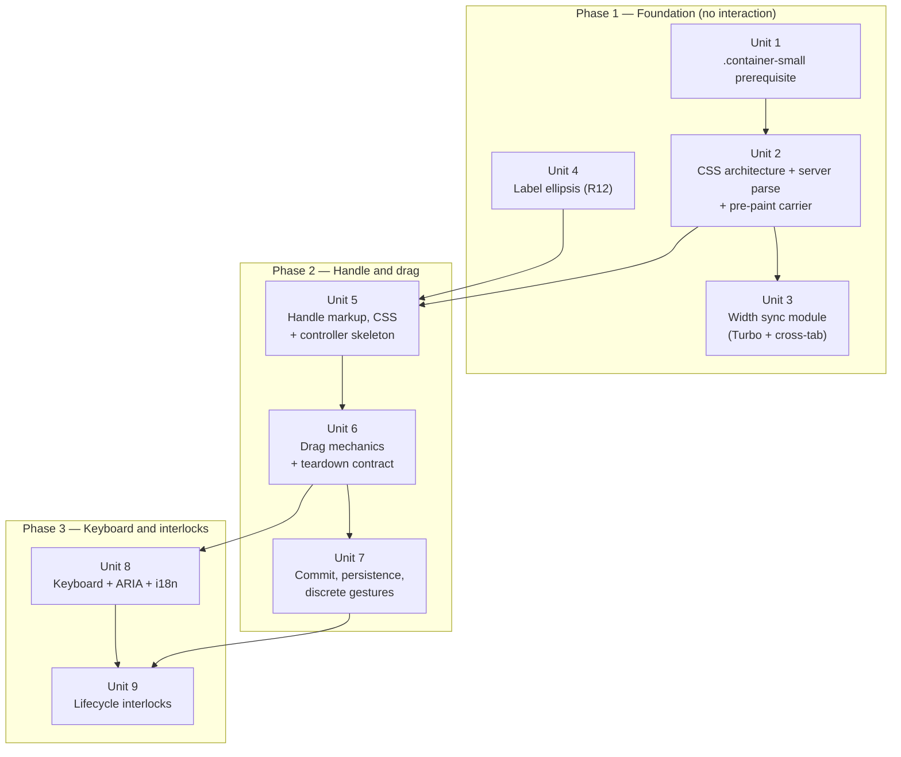
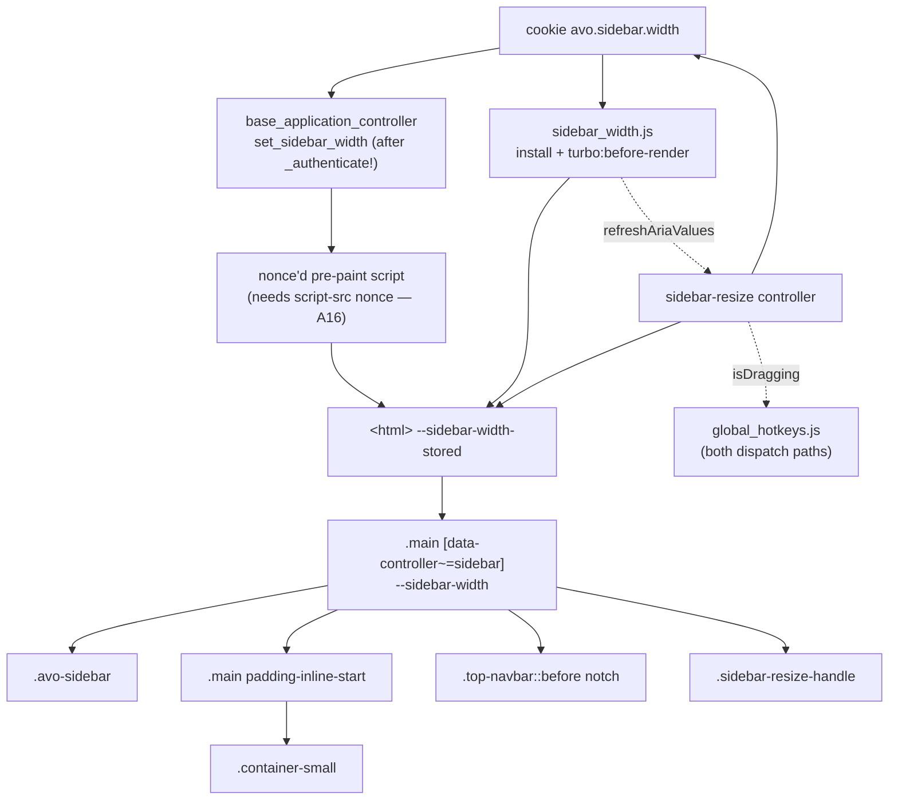

# feat: Resizable Sidebar

## Overview

Avo's main navigation sidebar is a fixed 256px. This plan makes the boundary
between the sidebar and `.main-content` a drag handle at `>= lg` (1024px), with
the chosen width persisted per browser in a cookie, validated server-side, and
applied on first paint. Below `lg`, and on coarse-pointer devices, nothing
changes.

The work is not "store one number". `--sidebar-width` is consumed by two paths
with two different breakpoint behaviors, so the feature is a **stored value plus
a newly-gated derivation** (see origin: Key Decisions).

Two things surfaced during planning that materially shaped the plan:

1. **A CSP constraint.** An inline `style` attribute on `<html>` would make every
   page of every Avo admin depend on `style-src 'unsafe-inline'` — which CSP L3
   *ignores* when a nonce-source is present, i.e. the Rails-generated default.
   Avo has no such dependency in its layout today. The carrier is instead a
   nonce'd pre-paint script.
2. **A layout prerequisite.** `.container-small` is a *fixed* 960px width, and
   R10's 480px maximum would overflow it on every show/edit page above a ~287px
   sidebar. Sequenced first.

---

## ⚠ Strategic questions the planner could not decide

Planning ran without an interactive channel. Five questions came out of review
that are **the user's to answer, not the planner's**. Each would change the shape
or the existence of large parts of this plan. They are stated here rather than
buried because answering them before implementation starts is far cheaper than
after.

### S1. Does Unit 4 alone solve the stated problem?

The Problem Frame names one concrete user pain: labels wrap. **Unit 4 fixes
exactly that** — one CSS class plus `min-w-0`, zero dependencies, and the origin
says it "fixes the actual reported pain directly." The remaining eight units
serve a different goal: per-user width tuning. Neither document cites an issue,
support ticket, usage metric, or user quote establishing demand for it.

The origin flagged the falsification test itself — *"Worth revisiting if per-user
demand turns out to be weaker than assumed"* — and this plan never runs it.

**Cheapest resolution:** ship Unit 4 alone in the next release and measure. If
wrapped labels were the whole problem, ~8 units, a 19-locale diff, ~45 system
specs, a new trust boundary, a new global CSS hook, and a known AA gap are all
avoided.

### S2. Does the origin's rejection of the simple alternative still hold?

The origin rejected an install-wide `Avo.configuration.sidebar_width` on one
ground: *"the value of this feature is per-user tuning."* But this plan does not
deliver per-user tuning — the cookie is **per browser profile**, explicitly not
user-scoped, and the plan declines the per-user mechanism Avo already ships
(`Avo::Configuration::Appearance` `persistence: :database`). On database-persistence
hosts that produces an asymmetry the plan itself predicts *"will read as a bug."*

So the rejection's sole premise is only partially delivered. Worth an explicit
re-affirmation rather than inheritance.

### S3. Could preset widths *replace* continuous drag rather than supplement it?

The plan identifies a 2–3 item preset-width control as the smallest WCAG SC 2.5.7
fix, and evaluates it only as an *addition*. As a **replacement** it would delete
Units 5, 6 and 9 outright (handle geometry, pointer capture, drag mechanics, the
geometry matrix, the four cross-controller abort paths), remove the plan's own
highest-consequence failure mode, close SC 2.5.7, make the simpler carrier in S4
viable, and deliver the same per-browser granularity the cookie already gives.

That comparison was never made. It should be.

### S4. Was a server-rendered *class* carrier considered? (No.)

The carrier decision evaluates three candidates and misses a fourth that the plan
cites as its own precedent one row later: `html_theme_classes` server-renders
`neutral-theme-*` / `accent-theme-*` / `scheme-*` **as classes on `<html>`**.

A server-rendered class or data attribute (`<html data-sidebar-width="384">`) with
stylesheet rules has **zero CSP surface**, needs no nonce, **works with JS
disabled**, and survives Turbo for exactly the reason already verified. Its only
cost is quantization — which is *free* under S3's preset model, and cheap even for
continuous drag (8px steps = 36 rules).

The CSP finding, assumption A14, and the entire Unit 2 carrier partial exist only
because this option was never on the table. **If S3 resolves toward presets, S4
almost certainly follows.**

### S5. WCAG SC 2.5.7 — is shipping non-conformant acceptable?

Detailed in [Open Questions](#flagged--wcag-sc-257). Two corrections from review:

- The original justification (*"the origin's Scope Boundaries exclude
  configuration surfaces"*) **was wrong** and has been removed. The origin's
  boundary is *"No configuration API for **host apps** to change the min/max
  bounds or the default"* — a Ruby/initializer surface. An in-admin preset control
  is an end-user affordance and no origin boundary excludes it. This is purely a
  cost-versus-conformance call.
- There is currently **no off-switch**. The plan ships "no configuration API", so
  a host under a VPAT or public-sector procurement obligation acquires a known AA
  failure on every admin page by upgrading, with no supported remedy. If 2.5.7 is
  genuinely deferred, Unit 5 should gain `Avo.configuration.sidebar_resizable = false`.

**Does Avo have a stated WCAG conformance target?** If any customer relies on an
AA claim, this is a commitment, not a deferral.

> **Resolved (Unit 5).** 2.5.7 is deferred, with
> `Avo.configuration.sidebar_resizable = false` shipped as the off-switch. Per
> the conditional in the decision table this also narrows the grab zone, since
> AA is not reachable either way — see the updated A5.

---

## Problem Frame

Long navigation labels wrap onto multiple lines. `.sidebar-link` is `@apply
py-1.5 my-px` with no `truncate`, `min-w-0` or ellipsis, so nothing is clipped
today — it just reflows. The only escape is toggling the sidebar fully off.

The width flows from one variable but not through one gate:

| Consumer | Location | Breakpoint-gated? |
| --- | --- | --- |
| `.avo-sidebar { w-(--sidebar-width) }` | `app/assets/stylesheets/css/layout.css` (`.avo-sidebar`) | **No** — every breakpoint |
| `--sidebar-offset-size: var(--sidebar-width)` | `layout.css` (`lg` media block) | Yes |
| `.main { padding-inline-start: var(--sidebar-offset-size) }` | `layout.css` (`.main`) | Inherits the above |
| `--top-navbar-start-notch-offset: var(--sidebar-offset-size)` | `layout.css` (`.top-navbar` style query) | Inside `@container style(...)` |

A value set directly on the host would outrank any media query, so a
desktop-chosen 480px would produce a 480px overlay on a phone. The stored value
must land in a **distinct** variable from which `--sidebar-width` derives only
inside the `lg` block.

## Requirements Trace

Carried verbatim from the origin. Coverage is in the
[Requirement → Unit map](#requirement--unit-map).

**Resize interaction** — R1 boundary is the handle · R2 faint divider at rest,
grip on hover/focus/drag · R3 grab zone >= 12px, straddling, must not eat link /
content-edge / scrollbar clicks · R4 1:1 tracking, layout transitions suspended ·
R5 selection suppressed, col-resize cursor · R6 double-click resets by clearing
the stored value · R7 clean drag end on capture loss

**Bounds and defaults** — R8 not rendered on coarse-pointer/no-hover · R9 default
stays 256px · R10 clamp `[200px, min(480px, 40vw)]`, pin at bounds · R11 stored
value over the viewport max clamps for display without overwriting

**Label overflow** — R12 single-line ellipsis with full label on hover

**Persistence** — R13 persistent cookie in the existing key namespace · R14
written on drag end and keystroke settle, not per pointer move · R15 applied
server-side on first paint, no 256px flash · R16 client-side reconciliation for
restoration / prefetch / other tabs, instant and untransitioned · R17 cookie is
user-controlled input — parse to integer and clamp before it reaches any rendered
style

**Responsive** — R18 not resizable below `lg` · R19 default width below `lg`
regardless of stored value · R20 no handle when closed, out of the tab order

**A11y / i18n** — R21 keyboard operable separator with orientation and
current/min/max, 16px / 64px steps, translated accessible name, live value ·
R22 correct edge and inverted drag direction in RTL

### Success criteria (from origin)

- Drag to a comfortable width, navigate, find it unchanged with no visible jump.
- A user bothered by a wrapped resource name discovers the affordance unprompted.
  **Note the tension:** Unit 4 removes the visible symptom that would prompt that
  discovery, so the affordance must carry discovery on its own. This is why the
  idle cursor (Unit 5) is a required deliverable, not a nicety.
- A user who never touches the divider sees today's layout and never triggers a
  resize while aiming at a sidebar link.
- The sidebar edge stays under the cursor throughout the drag, including on a
  full index table at max `per_page`.
- Layout stays correct at both bounds — no overlapping navbar notch, no clipped
  content, no broken notch geometry.
- Fully usable by keyboard and correct in RTL.

## Scope Boundaries

Carried from origin: `Avo::ResourceSidebarComponent` and
`Avo::UI::PanelComponent`'s `.panel__sidebar` are out of scope · no cross-device
sync · no collapse-to-icons / rail mode · no per-resource or per-page widths ·
no drag-to-close.

> **Amended by request: the default width IS configurable.** The origin's
> boundary was *"no configuration API for host apps to change the min/max bounds
> or the default"*. `Avo.configuration.sidebar_default_width` now exists. The
> **bounds** remain unconfigurable — `SIDEBAR_WIDTH_MIN`/`MAX` stay
> `private_constant` and the configured default is clamped into them, so it can
> never place the sidebar at a width the handle cannot drag back to. Two
> consequences worth noting: the configured default applies **only at `>= lg`**
> (below it the sidebar is a full-height overlay, and a wide value would cover a
> phone screen, so R19's mobile 256px is unchanged), and **remove-when-default
> now means the configured default**, so a host on 400px does not accumulate
> cookies that merely restate their own setting.

Added during planning:

- **No live cross-tab sync.** No `storage` event, no `BroadcastChannel`. Other
  tabs converge on their next Turbo navigation or full load.
- **The cookie is not user-scoped.** Two users sharing a browser profile share a
  width — matching the existing `theme` / `accent_color` / `per_page` cookies.
  Asymmetry to accept: on hosts with `Appearance` `persistence: :database`, every
  *other* preference is per-user. See [S2](#s2-does-the-origins-rejection-of-the-simple-alternative-still-hold).
- **A modest fingerprinting surface is accepted.** A non-`httpOnly`, `/`-scoped
  cookie with ~281 distinct values is ~8 bits of stable entropy readable by any
  script on the origin, alongside the existing unnamespaced preference cookies.
  Mitigated by remove-when-default on every write site. Note the entropy figure
  assumes the cookie persists; see A2 on user-agent lifetime caps.
- **Known dead-end state, accepted:** a coarse-pointer device at `>= lg` applies a
  stored width but renders no handle and no tab stop. A 2-in-1 resized to 480px in
  mouse mode and then flipped to touch has **no path back** — no drag, no keyboard,
  no reset. The [S3](#s3-could-preset-widths-replace-continuous-drag-rather-than-supplement-it)
  preset control would close this; note it when deciding.

## Context & Research

### Relevant code and patterns

| Concern | Follow this |
| --- | --- |
| Server-side cookie read → ivar | `app/controllers/avo/base_application_controller.rb` — `set_sidebar_open` (private, registered last, **after `_authenticate!`**) |
| Helper reading a cookie with a configured default | `app/helpers/avo/application_helper.rb` — `current_neutral` / `current_accent` / `current_scheme` |
| Persistent cookie option hash | `app/helpers/avo/application_helper.rb` — `{value: "1", path: "/", max_age: …, same_site: :lax}` |
| **Nonce'd pre-paint script writing `documentElement`** | `app/views/avo/partials/_color_theme_override.html.erb` — the carrier pattern adopted here |
| Server-rendered preference **classes** on `<html>` | `app/helpers/avo/application_helper.rb` — `html_theme_classes`. See [S4](#s4-was-a-server-rendered-class-carrier-considered-no) |
| Client cookie writes | `app/javascript/js/controllers/appearance_controller.js` — `setPreferenceCookie`, incl. **remove-when-default** |
| Small conditional layout element | `app/views/avo/partials/_back_to_top.html.erb` + its layout call site |
| Shared JS helper module | `app/javascript/js/helpers/` — imported as `import { x } from '../helpers/x'` |
| Non-controller JS installed from the entry point | `app/javascript/js/global_hotkeys.js` → `installGlobalHotkeys()`, **called from `app/javascript/application.js:35`** (not `app/javascript/js/application.js`, which is the Stimulus bootstrap) |
| Reaching another Stimulus controller | `global_hotkeys.js` — `window.Stimulus?.getControllerForElementAndIdentifier(el, 'appearance')` |
| Stimulus registration | `app/javascript/js/controllers.js` |
| rAF-coalesced controller with symmetric `connect`/`disconnect` | `app/javascript/js/controllers/header_menu_controller.js` — `scheduleUpdate()` |
| `matchMedia` listener lifecycle | `app/javascript/js/controllers/appearance_controller.js` |
| `window.Avo.configuration` payload | `app/views/avo/partials/_javascript.html.erb` |
| CSS entry point | `app/assets/stylesheets/application.css` — `@layer components`, `./css/sidebar.css` imported **last** |
| `prefers-reduced-motion` precedent | `css/components/modal.css`, `css/components/ui/checkbox.css`, `css/fields/key_value.css` |
| **Helper unit tests with cookie stubs** | `spec/helpers/avo/application_helper_spec.rb` — already tests `current_neutral` / `current_accent` via `allow(helper).to receive(:cookies).and_return({theme: "slate"})`. This is the home for the new parse table |
| System spec idioms | `spec/system/avo/group_1/sidebar_spec.rb` — `Capybara.reset_sessions!`, `current_window.resize_to`, `data-action` selectors |
| Reading a CSS custom property in a spec | `spec/system/avo/group_2/tags_spec.rb` — `page.evaluate_script` + `getPropertyValue(…).trim()` |
| Keyboard interaction in a spec | `spec/system/avo/group_1/hotkey_spec.rb` |
| axe driver switch | `spec/support/axe_driver.rb` — `config.before(:each, a11y: true) { driven_by :selenium, using: :headless_chrome }`. **See the driver caveat in Unit 8** |
| Locale keys | `lib/generators/avo/templates/locales/avo.{19 locales}.yml` — flat, alphabetized under `en: avo:` |

Confirmed absences: **nothing in `app/javascript` uses Pointer Events or
`setPointerCapture`**, **no spec drags an element**, **no spec sets a cookie
directly**, and `role="separator"` / `aria-valuenow` appear nowhere in `app/`. All
four are new ground for this repo.

### Institutional learnings

`docs/solutions/` does not exist. Two relevant items from the session memory index:

- **`main-content-focus-ring-must-be-inset`** — `#main-content`'s focus ring needs
  a negative outline-offset or the navbar/sidebar hide it. The handle overlays that
  edge; see Unit 5's z-index and focus decisions.
- **`customizable-css-vars-in-variables-css`** — user-overridable CSS variables
  belong in `variables.css`. `--sidebar-width-stored` is not host-overridable, so
  it stays out.

### External references

> **Version caveat, must be resolved before relying on the reads below.**
> `package.json` declares `tailwindcss ^4.3.3` and `@hotwired/turbo-rails ^8.0.23`,
> and `yarn.lock` resolves to those. The checked-out `node_modules` holds
> **tailwindcss 4.2.0 and @hotwired/turbo 8.0.20** — the versions every
> "verified" claim below was read from. **Run `yarn install` and re-verify the
> Tailwind compile check and the Turbo dist reads before implementation.** The
> claims are very likely still true; they are just not yet true of what CI installs.

- Turbo 8.0.20 dist, read directly. `PageRenderer.renderElement` only calls
  `document.body.replaceWith(...)`; `MorphingPageRenderer` targets the same
  element; `ErrorRenderer` additionally replaces `<head>`. **`documentElement` is
  never replaced on any path.** `turbo:before-render` fires for restoration visits
  and prefetched responses; `event.detail.newBody` is **detached**, so synchronous
  mutation lands before paint. `turbo:before-cache` does **not** fire for
  `data-turbo-preload`. <https://turbo.hotwired.dev/reference/events>
- **Turbo blanks the `nonce` on every `<head>` element** (`elementWithoutNonce`)
  and re-applies one only for `<script>` (`activateScriptElement`, reading
  `<meta name="csp-nonce">`). A nonce'd `<style>` applies on cold load and is
  **dropped on the first Drive visit** — a latent bug in
  `_appearance_overrides.html.erb` today, invisible only because its content is
  request-invariant.
- **CSP Level 3:** if `style-src` contains a nonce-source or hash-source,
  `'unsafe-inline'` is **ignored**. `spec/dummy/config/initializers/content_security_policy.rb`
  sets `content_security_policy_nonce_directives = %w[script-src style-src]` —
  verbatim the Rails-generated template. **CSSOM writes (`element.style.setProperty`)
  are outside CSP's scope; the `<script>` performing them is not** — see the CSP
  decision row.
- Tailwind v4.2.0, verified by compiling with the repo's own CLI: `--spacing(64)`
  compiles to `calc(var(--spacing) * 64)` (runtime, not static) and is legal in
  `var()` fallback position. The proposed CSS compiles to exactly the intended
  `clamp(...)` inside `@media (min-width: 64rem)`, and
  `xl:px-0 xl:w-full xl:max-w-240 xl:mx-auto` emits `width:100%` +
  `max-width:960px` + `margin-inline:auto`. `@variant lg` works at top level;
  `@custom-media` is emitted verbatim and is inert.
- MDN cascade: media queries filter at *relevance*, so a media-gated rule reading
  an ungated inherited custom property is still gated.
- MDN `@property`: registering with an `initial-value` makes `var()` fallbacks
  **unreachable**.
- **Flexbox §4.2:** auto cross-axis margins suppress `align-self: stretch`.
  Load-bearing for Unit 1.
- WAI-ARIA APG Window Splitter Pattern. `aria-orientation` is **omitted** by the
  APG but defaults to `horizontal` on `separator` — must be set explicitly.
  `Enter` is marked required; `Home`/`End`/`F6` optional. The canonical example is
  unbuilt (w3c/aria-practices#130). <https://www.w3.org/WAI/ARIA/apg/patterns/windowsplitter/>
- **axe-core 4.12 declares `separator: { requiredAttrs: ["aria-valuenow"] }`** — a
  `role="separator"` without `aria-valuenow` fails `aria-required-attr`. Drives
  Unit 5's static-ARIA decision.
- Core-AAM 1.2 §3.4.3.74–75 — a focusable `separator` maps to UIA *Thumb* +
  RangeValue but to the **same** MSAA/ATK role as a decorative one. Open JAWS
  defect (FreedomScientific/VFO-standards-support#489): `aria-valuenow` is never
  announced. Value announcement is best-effort.
- **WCAG 2.2 SC 2.5.7**, verbatim: *"Achieving keyboard equivalence for a dragging
  operation does not automatically meet this success criterion, unless that
  equivalent keyboard operation also provides controls that can be clicked or
  tapped with a pointer."*
- **WCAG 2.2 SC 2.5.8** — measures the *pointer-accepting region*, not the visual.
  The *Spacing* exception is unavailable here (a sidebar link sits ~2px away).
- MDN Pointer Events: `pointerup` is **not** delivered after `pointercancel`;
  `lostpointercapture` fires on every termination including DOM removal, but
  **not** on `display: none`.
- **Safari ITP caps client-set (`document.cookie`) lifetimes at 7 days.** A2's
  1-year `max_age` is a request, not a guarantee.
- Ferrum 0.17.2 delegates `mouse` from `Browser` to `Page`, and `Ferrum::Mouse`
  exposes `move(x:, y:, steps:)`, `down`, `up` — so
  `page.driver.browser.mouse.move/down/up` is real. Whether CDP-synthesized input
  produces working `setPointerCapture` in headless Chrome is unproven here.
- Ecosystem consensus on live-vs-deferred updates: **live** (VS Code `Sash`,
  react-resizable-panels). Caveat: both are component-tree apps with virtualized
  or reconciled subtrees; Avo's worst case is a non-virtualized server-rendered
  table.
- Ruby, verified by execution: `/^\d+$/.match?("200\n<script>…")` → **true**
  (`^`/`$` are line anchors; `\Z` permits a trailing newline). `\d` is ASCII-only,
  so `"٤٨٠"` is rejected — but `"٤٨٠".to_i == 0`.
  `Integer(v, 10, exception: false)` accepts `"2_0_0"`, `" 200 "`, `"+200"`.
  **Rack 3.2.6 can hand you a UTF-8-tagged String with invalid bytes, on which
  `blank?`, `presence` and `Regexp#match?` all raise `ArgumentError`.**

### Prior art

Branch `feature/resizable-sidebar` (one local commit, 2026-02-26, never pushed,
434 commits behind `main`, targets `.panel__sidebar`). Read with
`git show feature/resizable-sidebar:app/javascript/js/controllers/panel_sidebar_resize_controller.js`.

**Lift two ideas:** the RTL delta inversion
(`delta = isRtl ? (clientX - startX) : (startX - clientX)`, reading direction off
`getComputedStyle(this.element).direction`) and the grab zone wider than the visual.

**Do not carry over:** `window.Avo.localStorage` persistence, `MIN_WIDTH = 240`
with no max, writing `sidebarTarget.style.width` directly, the `hidden md:flex`
gate, separate `mousedown`/`touchstart` paths, `bg-neutral-200`, and the absence
of keyboard/ARIA.

## Key Technical Decisions

| Decision | Rationale |
| --- | --- |
| **The carrier is a nonce'd pre-paint `<script>`, not an inline `style` attribute** | Avo's layout and always-rendered chrome contain **zero** inline `style` attributes today; they appear only on opt-in surfaces. A `style` attribute on `<html>` would make every page of every Avo admin depend on `style-src 'unsafe-inline'` — which CSP L3 **ignores** when a nonce-source is present, the Rails-generated default. The failure is silent: 256px on every cold load, correct after the first Turbo visit — precisely the R15/R16 flash the architecture exists to prevent. |
| **Scoping that CSP claim precisely** | The CSSOM write is outside `style-src`. **The `<script>` that performs it is squarely governed by `script-src`** and runs only if the host lists `script-src` in `content_security_policy_nonce_directives` and `content_security_policy_nonce` is non-nil. Hosts shipping `script-src :self` with no nonce directive block the carrier and get the same 256px-then-jump. Avo already carries this dependency via `_color_theme_override.html.erb`, but the failure consequence differs. See A16 and Unit 3's install-time recovery pass. |
| **`--sidebar-width-stored` lives on `<html>`** | Turbo never replaces `documentElement`, so restoration/prefetch staleness is structurally impossible. `<html>` is already this codebase's carrier for raw user preferences. |
| **Rejected: a server-rendered `<style>` in `<head>`** | Turbo *does* merge head stylesheets, so it would re-apply on normal visits with zero JS. It loses on the motivating case: **restoration visits render from the snapshot cache, whose head was captured at `turbo:before-cache`** — Back after a resize restores the stale rule — and `data-turbo-preload` bypasses that event. Also subject to nonce blanking. |
| **Not evaluated: a server-rendered *class* / `data-` attribute** | Zero CSP surface, no nonce, works with JS disabled, survives Turbo. Cost is quantization. **This is a genuine gap in the decision record** — see [S4](#s4-was-a-server-rendered-class-carrier-considered-no). |
| **`--sidebar-width` derivation stays on `[data-controller~="sidebar"]`**, inside the `lg` media block | `layout.css:37-41` establishes that *derived layout variables* originate on the lowest common ancestor of `.top-navbar`, `.avo-sidebar` and `.main-content`. Preserved exactly. Only the raw preference is inherited from `<html>`. Boundary: **preferences on `<html>`, layout derivation on the host**. |
| **`clamp()` in CSS owns R10's bounds and R11's re-clamping** | Viewport-reactive display clamping with no JS resize listener and no write-back. Inside the `lg` block `40vw >= 409.6px`, so the min is always below the max. |
| **Bounds are emitted into `window.Avo.configuration`**, not hardcoded in JS | `SIDEBAR_WIDTH_MIN`/`MAX` live in `lib/avo.rb`; the controller and helper read them directly, and `_javascript.html.erb` emits them for JS — the same route `sidebar_controller.js` already uses for `cookies_key`. Only the stylesheet keeps a commented duplicate. Drift between the JS clamp and the CSS clamp shows up as a drag that pins at a different width than the layout renders, and an `aria-valuemax` that lies. |
| **Do not register `--sidebar-width-stored` with `@property`** | An `initial-value` makes the `var()` fallback unreachable, and `--spacing(64)` is not computationally independent. Unregistered also keeps it untransitionable — what a 1:1 drag wants. |
| **Server clamps to `[200, 480]` only; the `40vw` term is CSS-owned** | The server has no viewport. |
| **R17's invariant is a *type* invariant** | The helper returns an **Integer or `nil`, never a String**. With that there is no XSS path even with a sloppy regex. R17 is an **availability and correctness** boundary, not an injection one. |
| **Live layout updates during the drag**, rAF-throttled, single write site | Ecosystem consensus. Contingency in Unit 6 — note it is effectively **one** contingency, not two (see A4). |
| **Grab zone 15px, biased into `.main-content`** — `[offset − 2px, offset + 13px]` | **Settled in Unit 5, S5 having resolved toward deferring 2.5.7.** 24px would meet SC 2.5.8, but it reaches 11px past what the layout has to spare and covers the start edge of every breadcrumb link, panel body and panel button on a show page — measured, not predicted. AA is unreachable here either way, so the strip stops at the earliest interactive box edge instead. Note the budget is **not** the 17px of border + padding: the first breadcrumb pulls its own 4px of padding back out for optical alignment, which is what puts the ceiling at +13px. Only 2px bite into the sidebar, leaving >= 6px of the 8px `body.os-pc` scrollbar gutter clear. |
| **The at-rest divider is `.main-content`'s existing `border-s`** — the handle draws no second line | `.main-content` already renders `border-s border-(--color-main-content-border)`, and `--color-main-content-border: var(--border-color)` — the same token the handle would use. A new 1px line 2px away would produce **two parallel hairlines on every admin page** for every user including non-resizers, violating "sees today's layout". The handle's `::before` is transparent at rest and paints only on hover / focus / drag. |
| **The handle carries `cursor: col-resize` unconditionally**, not only during a drag | The hover cursor is the single most reliable way every OS teaches a drag affordance, and S1's tension means the affordance must carry discovery alone. Without it the strip reads as `text` over content the user cannot select — actively miscommunicating. |
| **The grip reveal *replaces* the unified focus outline** | The handle is a 24px strip spanning the viewport height; `focus.css`'s 2px outline would draw a tall rectangle over page content. Suppressed via a plain-selector override in `sidebar_resize.css` (specificity 0,1,0, never `!important`). Concrete replacement in A15. |
| **`div[role="separator"][tabindex="0"]` with static ARIA from Unit 5** | APG's pattern. `separator` forces `role="presentation"` on descendants, so **the grip must be a pseudo-element**. axe-core requires `aria-valuenow` on `separator`, so Unit 5 renders server-computed static values and Unit 8 makes them dynamic — otherwise Unit 5's a11y assertion cannot pass. |
| **`aria-valuenow`/`min`/`max` in raw px + translated `aria-valuetext`** | Coherent 16/64px deltas per keypress. MDN sanctions non-default min/max. |
| **No `aria-live` region; skip ARIA writes during pointer drag** | Range widgets announce natively when focused; a live region double-announces. |
| **`data-sidebar-resizing` on `<html>` is a CSS hook only — not the JS contract** | The `*`-scoped `cursor` rule is why it must be global (`cursor` on `<body>` is defeated by every descendant declaring its own). As a JS channel it is an implicit global with no owner; cross-controller reads go through `getControllerForElementAndIdentifier` + a public `isDragging` getter. Stimulus outlets deliberately not introduced — the repo uses zero. |
| **The attribute is set at threshold crossing, not at `pointerdown`** | Setting it at `pointerdown` makes every incidental click in the 24px strip flash the global cursor, suppress transitions and reveal the grip — the opposite of "never triggers a resize while aiming at a sidebar link". `setPointerCapture` still happens at `pointerdown`; only the visual state is deferred. |
| **Capture loss commits; `Escape` reverts** | R7 says capture loss ends *"at the last valid width"*. `lostpointercapture` fires for both, so it needs a flag set by the cancel path. |
| **Cookie `path: "/"`, matching the existing family** | Path-scoping to `Avo.configuration.root_path` would be a real privacy and bytes-on-the-wire win, but hosts can mount Avo at `/` and the whole existing preference family uses `/`. Recorded rather than inherited silently. |
| **`secure` set conditionally** (`location.protocol === 'https:'`) | Stricter than the existing precedent (`sidebar_controller.js` and `appearance_controller.js` both call `Cookies.set` with no options). Make this the house standard. |
| **`@media (min-width: theme(--breakpoint-lg))`**, matching `layout.css` | `@variant lg` is v4-idiomatic, but consistency inside one file wins. |
| **`matchMedia('(min-width: 64rem)')`, never a hardcoded `1024`** | `sidebar_controller.js` hardcodes `1024`, which diverges when a host raises the root font size. |

### Threat model for the cookie

R17 says "user-controlled input" without saying *whose* control:

1. **The admin user themselves.** Bounded by the clamp. The only adversary the
   origin models.
2. **Anyone who can set a cookie on the origin without XSS** — a sibling subdomain
   (cookies ignore scheme and port), a network attacker on any plaintext request,
   or the host app writing the same key. **This turns an unhandled invalid-UTF-8
   byte sequence into a remote, persistent DoS of another user's admin panel.**
3. **The host application itself.** Can redeclare `--sidebar-width`, and can write
   the cookie with a non-String value (Rails' jar caches assigned values).

Verified non-issues, recorded so they are not re-litigated: no XSS path (Integer
or `nil`); **no CSS injection** — `var()` substitution cannot create declarations
or selectors, and the value lands in a `<length>` slot inside `clamp()`; no
prototype pollution or DOM clobbering; no ReDoS; no CSRF or session-fixation angle.

### The `.container-small` prerequisite

`layout.css` declares `.container-small { @apply xl:px-0 xl:w-240 xl:mx-auto; }`
— a **fixed** 960px width. `CONTAINER_WIDTH_DEFAULTS` makes `:small` the default
for `show`, `new`, `edit`, `create`, `update`.

`container_classes` renders onto the *same element* as `.main-content__container`
(`application.html.erb:73`), and `.container-small`'s `xl:px-0` is emitted after
`.main-content__container`'s `md:px-2` at equal specificity — so at `>= xl` that
8px is **zero**. `.main-content`'s 1px `border-inline-start` does apply. Available
= `V − S − 32 − 1`; overflow when `S > V − 993`.

| Layout viewport | Max sidebar before overflow | R10's max | Overflow at max |
| --- | --- | --- | --- |
| 1024px | n/a (`xl` inactive) | 409.6px | none |
| 1280px | **287px** | 480px | 193px |
| 1366px | **373px** | 480px | 107px |
| 1440px | **447px** | 480px | 33px |
| 1920px | 927px | 480px | none |

**The defect is not live today** — at 256px the tightest slack is 31px at 1280px
(14–16px after a classic scrollbar). It becomes reachable only once the sidebar
can exceed ~287px, which only this feature enables. It is a **feature-caused
prerequisite, not a pre-existing bug**.

**Any maximum above 287px makes Unit 1 mandatory.** The largest flat maximum that
never overflows at 1280px is ~280px — barely above today's default, which is why
A1 chooses to fix the container instead.

**Rejected alternative:** constraining the sidebar max by available content width
(`min(480px, 40vw, calc(100vw - 993px))`). The `993` constant derives from
`.container-small`; index pages use `.container-large`, which has no such
constraint — so **the sidebar would resize when navigating between index and
show**, failing the origin's first success criterion.

## Open Questions

### Resolved during planning

| Question (origin: Deferred to Planning) | Resolution |
| --- | --- |
| Which element carries the server-rendered width | `<html>`, written by a nonce'd pre-paint script. No collision: `layout.css` declares `--sidebar-width` (a different variable) on the sidebar host and derives it from the inherited stored value only inside the `lg` block. |
| Which element hosts the handle | Neither — a `position: fixed` sibling overlay at `inset-inline-start: calc(var(--sidebar-offset-size) − 2px)`, `top: var(--top-navbar-height)`, `height: calc(100dvh − var(--top-navbar-height))`, `z-index` between `.avo-sidebar` (50) and `.top-navbar` (400). |
| How the grab zone interacts with `border-s` and `rounded-ss` | The content-side budget is **17px** (16px padding + 1px border), not 24px. A 22px bite lands 5px inside the container's content box once Unit 1 makes it fill the available space. The `border-s` **is** the at-rest divider — the handle draws no second line. Index pages keep the full 24px (`.container-large` does not override the padding). |
| Suspending transitions without a snap | `html[data-sidebar-resizing]` gating `transition: none`. The snap is a **sequencing bug**: cancel the pending rAF, write the final value, force a style flush, *then* remove the attribute. |
| Coalescing; live vs commit-on-release | rAF-throttled single write, live. |
| Whether the mobile default needs handling beyond the CSS gate | Pure CSS. The base declaration is untouched, so `.avo-sidebar`'s ungated `w-(--sidebar-width)` renders 256px below `lg`. |
| Where the handle sits in the tab order | Immediately after the `#main-sidebar` wrapper — after all nav links, before the content, after both skip links. |
| Navbar notch geometry at both bounds | The pseudo-elements are fixed-size quarter-circles positioned by `inset-inline-start`, so they **translate rather than deform**. The risk is z-order and the seam meeting a 16px curve in `align-with-main-content: true`. |
| Turbo reconciliation hook | `turbo:before-render`. `turbo:before-cache` is not a substitute — `data-turbo-preload` bypasses it. |
| Whether ellipsis breaks badges, scroll-into-view, or the profile footer | `hotkey_badge(…, class: "ms-auto")` and `.sidebar-link__external-icon` become no-op `ms-auto` under a `flex-1 min-w-0` label. `scrollSidebarMenuItemIntoView` uses `getBoundingClientRect`, unaffected. Profile footer at 200px is a Unit 4 check. |

### Deferred to implementation

- **Exact grab-zone split under macOS overlay scrollbars.** Derived from the 8px
  `body.os-pc` gutter; `os-mac` reserves ~15px, more forgiving. Local-only check —
  headless Linux CI cannot reproduce macOS overlay scrollbars.
- **Whether the rAF-throttled live write holds 60fps on a max-`per_page` index
  table.** Gated verification in Unit 6.
- **Exact `title` behavior for labels that do not overflow.** Ships unconditional
  (A9).
- **How `set_sidebar_width` reaches the parse living in `Avo::ApplicationHelper`** —
  via the `helpers` view-context proxy, a shared module, or a duplicated read.
  Naming the call path is a five-minute decision at the keyboard.

### Flagged — WCAG SC 2.5.7

**Not satisfied as specified, and keyboard support does not close it.** The
Understanding document is explicit: keyboard equivalence counts only *"[if] that
equivalent keyboard operation also provides controls that can be clicked or tapped
with a pointer."*

R6's double-click reset **is** a single-pointer non-dragging resize, but reaches
exactly one width. The navbar toggle and `Shift+\` are single-pointer but perform
*collapse*, not *resize*.

**No origin Scope Boundary excludes an in-admin preset control** — the boundary
concerns a host-app configuration API for bounds and defaults. This is purely a
cost-versus-conformance decision. See [S3](#s3-could-preset-widths-replace-continuous-drag-rather-than-supplement-it)
and [S5](#s5-wcag-sc-257--is-shipping-non-conformant-acceptable).

## Assumptions made during planning

| # | Assumption | Basis | If overridden |
| --- | --- | --- | --- |
| A1 | Fix `.container-small` rather than lowering R10's max | Any max above 287px makes Unit 1 mandatory; the only Unit-1-free flat max is ~280px, barely above today's 256px default | Drop R10's max to `min(280px, 40vw)` — **not 320px, which still overflows at 1280px** — and delete Unit 1 |
| A2 | Cookie `max_age` is 1 year | R13 mandates one but names no duration. **This is a request, not a guarantee: Safari's ITP caps client-set cookie lifetimes at 7 days**, so R13's "survives a browser restart" is true for a week on Safari | Change one constant |
| A3 | Handle is an ERB partial, not a ViewComponent | A **singleton layout element with no props, no reuse, and no isolable rendering context** — same shape as `_back_to_top.html.erb`. Its geometry depends on `--sidebar-offset-size` and `--top-navbar-height`, neither of which exists in a Lookbook preview, and it is `display: none` below `lg` — so a preview would assert nothing or a fiction. Coverage comes from real-page axe assertions | Build a component + preview |
| A4 | Single write site during the drag (`documentElement`) | `.main` contains essentially the whole page, so scoping the write to it buys ~nothing. **Consequence: Unit 6's contingency (1) is largely a no-op by this same reasoning** — the plan effectively has one real contingency (commit-on-release), and that is a redesign that contradicts R4 | Add the host-scoped write and treat it as a genuine option |
| A5 | ~~Grab zone `[offset − 2px, offset + 22px]`, 24px total~~ — **superseded in Unit 5: `[offset − 2px, offset + 13px]`, 15px total** | S5 resolved toward deferring 2.5.7, so SC 2.5.8 is not reachable and the 24px strip's measured cost (covering the start edge of breadcrumbs, panel bodies and panel buttons) is not worth paying. The ceiling is +13px, not the +17px the padding suggests, because the first breadcrumb pulls its 4px of padding back out | Widen it and accept the overlap, or reflow `.main-content`'s start padding |
| A6 | Add `Home` / `End`. **Do not add `Enter`** | APG marks `Enter` required for splitters that collapse *and restore* — but here `Enter` would close the sidebar, Unit 9 would hide the handle, and there would be **no way back via the handle** | Add `Enter` with an explicit restore path |
| A7 | In RTL, `ArrowLeft` widens | Symmetric with R22's drag inversion; neither R21 nor R22 specifies keyboard direction | Flip the mapping |
| A8 | `Escape` cancels a drag, reverting to the `pointerdown` width — the **only** revert path | Every OS resize affordance does this; R7 requires all other terminations to commit | Remove the handler |
| A9 | `title` on sidebar link labels is unconditional | Simplest correct read of R12; VS Code does the same | Add the measured variant |
| A10 | R12 extends to section and group **headings** | At the new 200px minimum a long section title still wraps — a *new* defect this feature introduces | Scope Unit 4 to links only |
| A11 | Global hotkeys and `Shift+\` are suppressed while dragging | An unguarded document keydown listener plus `hotkeyFireHandler`'s `el.click()` can navigate mid-drag. **Cost to weigh:** this couples the whole keyboard system to the resize controller and escalates the stuck-attribute failure from cosmetic to a total shortcut lockout. Per R7 nothing is *lost* on a mid-drag navigation (it commits) — only surprise | Accept the hazard; the guards and one of the six abort paths disappear |
| A12 | Cross-tab convergence on the next Turbo navigation or full load | R16 requires reconciliation but never states *when* | Add `storage` / `BroadcastChannel` sync |
| A13 | **Three** locale keys, added to all 19 templates in one commit | R21 names one; `aria-valuetext` needs a second, and the handle's `title` (A15) a third. No parity spec exists, but `skip_to_sidebar` was added to all 19 in `c631f0961` | Add to `en` only |
| A14 | **With JS disabled the sidebar renders at the 256px default** | Forced by the carrier decision — a CSSOM write requires JS. Consistent with the plan's no-JS posture. R15's "server-side on first paint" is satisfied in the sense that the value is computed server-side and emitted into a `<head>` script that runs before body parse — **but R15 is satisfied by redefinition, not by construction**, and every CSP-related risk flows from that substitution | Adopt the S4 class carrier, or accept `style-src 'unsafe-inline'` |
| A15 | **Concrete grip and focus spec** (the plan otherwise leaves "grip" undefined): a 2px-wide, 24px-tall rounded bar, vertically centered in the viewport, `--color-content-secondary`. `opacity: 0` at rest; `0.6` on hover; `1` on `:focus-visible` and while dragging, where the seam also thickens to 2px and takes `--color-content`. The focus state **replaces** the unified outline. The handle also carries a translated `title` naming both gestures | Without a concrete spec two implementers ship visibly different chrome and no test catches it. These exact values are a planner's choice, not a designer's | Substitute any concrete alternative — the requirement is that *something* concrete is specified |
| A16 | **The host lists `script-src` in `content_security_policy_nonce_directives`** | Avo already depends on this via `_color_theme_override.html.erb`. If not, the carrier is blocked and R15 degrades to a first-navigation correction — mitigated by Unit 3's install-time recovery pass | Adopt the S4 class carrier |

## High-Level Technical Design

> *This illustrates the intended approach and is directional guidance for review,
> not implementation specification. Treat it as context, not code to reproduce.*

### Where the width lives, and who reads it

```
cookie  avo.sidebar.width = "384"
   │
   │  server (after _authenticate!):
   │    value = cookies[key].to_s
   │    nil if empty? / !valid_encoding? / bytesize > 4
   │    nil unless /\A\d+\z/          ← \A..\z, NOT ^..$
   │    else value.to_i.clamp(200, 480)
   │    ── returns Integer or nil, NEVER a String ──
   ▼
nonce'd <script> in <head>            ← CSSOM write is outside style-src,
   document.documentElement.style        but this <script> IS governed by script-src
     .setProperty('--sidebar-width-stored', '384px')
   │
   ▼
<html>                                 ← never replaced by Turbo
   │
   │  inherits
   ▼
.main[data-controller~="sidebar"]
   │
   ├─ (always)          --sidebar-width: --spacing(64)          ← today's default
   │
   └─ (@media >= lg)    --sidebar-width:
   │                      clamp(200px,
   │                            var(--sidebar-width-stored, --spacing(64)),
   │                            min(480px, 40vw))               ← R10 + R11, pure CSS
   │
   ├─ (@media >= lg, open) --sidebar-offset-size: var(--sidebar-width)   [unchanged]
   │
   ▼
.avo-sidebar { w-(--sidebar-width) }      ← ungated: 256px below lg  (R19)
.main        { padding-inline-start: var(--sidebar-offset-size) }
.top-navbar::before { inset-inline-start: var(--sidebar-offset-size) }
.sidebar-resize-handle { inset-inline-start: calc(var(--sidebar-offset-size) - 2px) }
```

**`--sidebar-width-stored` is ungated and inherited; the *derivation* is gated.**
A value on `<html>` cannot reach past a media query that never matched on a
descendant.

### Drag lifecycle — note the commit/revert split



The `Armed` state is what keeps an incidental click in the 24px strip from
flashing the global cursor and suppressing transitions.

Every arrow out of `Dragging` must clear `data-sidebar-resizing`. Missing one
leaves the document with `cursor: col-resize`, `user-select: none`, suppressed
transitions **and — given A11 — no keyboard shortcuts at all**, until the next
full page load. Hence Unit 5's **unconditional backstop** (`removeAttribute` in
`connect()` and on `turbo:load`) rather than relying on six individually-correct
abort paths.

### Handle geometry

```
      sidebar body          seam        .main-content
  ┌──────────────────┬──┬──┬─┬────────────────────────────
  │  link text …     │  │  │▏│  ← border-s (1px) = THE at-rest divider
  │                  │  │  │ │     (handle draws no second line)
  │            ┌─────┴──┤  │ │
  │            │ 8px    │  │ │  ← os-pc scrollbar gutter
  │            │ gutter │  │ │     (6px stays clear)
  └────────────┴────────┴──┴─┴────────────────────────────
                       ↑  ↑ ↑        ↑        ↑
                   offset−2 │ offset │    offset+13
                            │        └─ 17px of border + padding, BUT the first
                            │           breadcrumb pulls 4px of it back out for
                            │           optical alignment → +13px is the ceiling
                            └─ hit area: 15px, cursor: col-resize always
                               grip: ::after pseudo-element only
```

## Implementation Units



Units 3 and 4 are independent of each other and of the Phase 2 chain. Unit 4 is
sequenced before Unit 5 so every later visual check at the 200px bound sees the
finished label treatment.

> **Spec infrastructure needed before Unit 1's first assertion.** Nothing in the
> repo sets a cookie from a spec today. Add one helper to `spec/support` wrapping
> `page.driver.set_cookie(name, value, domain:, path:)` plus a removal
> counterpart, and note the two ordering constraints: an origin must already be
> established (so a throwaway `visit` first), and it interacts with
> `Capybara.reset_sessions!`, which the sidebar specs already call. Roughly a
> dozen scenarios across Units 1–3 depend on it.

---

- [x] **Unit 1: Make `.container-small` max-width-based**

**Goal:** Remove the fixed 960px width that would overflow once the sidebar can
exceed ~287px.

**Requirements:** R10 (enabler), success criterion *"no clipped content"*.

**Dependencies:** None.

**Files:**
- Modify: `app/assets/stylesheets/css/layout.css` (`.container-small`)
- Check: `app/assets/stylesheets/css/components/field-wrapper.css` — has its own
  `.container-small` rule; confirm it sets no width
- Test: `spec/features/avo/full_width_container_spec.rb` (existing — still passes)
- Test: `spec/system/avo/group_1/sidebar_resize_spec.rb` (new)

**Approach:**
- **The exact utility list matters.** `.container-small` is a flex item of
  `.main-content` (`flex flex-col`), and per Flexbox §4.2 **auto cross-axis margins
  suppress `align-self: stretch`**. The naive edit
  (`xl:px-0 xl:max-w-240 xl:mx-auto`) collapses the container to its content width
  on every show/edit page. The correct edit keeps an explicit width:
  **`xl:px-0 xl:w-full xl:max-w-240 xl:mx-auto`**.
- **Contract:** a provable no-op at every viewport reachable today **for
  un-overridden Avo CSS**. `max-width: 960px` on a stretching flex item renders
  identically to `width: 960px` whenever >= 960px is available, and it always is.
- **The exception the contract does not cover:** `avo-overrides` loads *after*
  `avo/application`, so a host's `.container-small { width: 1200px }` wins today.
  After this change it is silently clamped by an Avo-owned `max-width: 60rem` the
  host never wrote and cannot discover from their own stylesheet. That is a real
  behavior change on a documented extension point and it **must** appear in the
  release notes.
- Also outside the proof: hosts setting `container_width: {index: :small}` with
  wide tables. No paid gem references `.container-small` (verified across all eight).

**Execution note:** Add the 1280px regression coverage before changing the CSS.

**Patterns to follow:** `.container-large` and `.container-full-width` in
`layout.css` — both already flexible.

**Test scenarios:**
- *Happy path (the contract):* at 1920×1080 the container renders at exactly 960px
  and stays centered — **this is the scenario that catches the Flexbox auto-margin
  trap**, which would otherwise ship visibly broken on every show/edit page.
- *Edge case:* at 1280×800 on a show page with a **480px** sidebar forced via the
  cookie, `document.documentElement.scrollWidth <= clientWidth`. Fails before,
  passes after.
- *Edge case:* at 1440×900 with a 480px sidebar, no horizontal page scroll.
- *Edge case:* at 1280×800 with today's 256px sidebar, no horizontal page scroll
  and the container width is unchanged from `main`.
- *Edge case (the new coupling):* inject a host-style `.container-small { width: 1200px }`
  override and assert it is clamped to 960px — so the behavior change is at least
  visible in the suite rather than only in a host's bug report.
- *Integration:* `spec/features/avo/full_width_container_spec.rb` still passes.

**Verification:** Show pages at 1280 / 1366 / 1440 / 1920px produce no horizontal
page scroll at both 256px and a forced 480px; the 1920px rendered width is
byte-identical to `main`.

---

- [x] **Unit 2: CSS variable architecture, server-side validation, pre-paint carrier**

**Goal:** Introduce `--sidebar-width-stored`, gate the `--sidebar-width` derivation
behind `lg`, and apply a validated width before first paint. No handle, no drag.
Provable by setting the cookie by hand.

**Requirements:** R9, R10, R11, R13 (read half), R15, R17 (server half), R19.

**Dependencies:** Unit 1.

**Files:**
- Modify: `app/assets/stylesheets/css/layout.css` — the `lg`-gated derivation plus
  **two required comments**
- Modify: `app/controllers/avo/base_application_controller.rb` — `set_sidebar_width`
  registered **after `_authenticate!`**
- Modify: `app/helpers/avo/application_helper.rb` — the validated parse
- Modify: `lib/avo.rb` — `SIDEBAR_WIDTH_MIN` / `SIDEBAR_WIDTH_MAX` alongside
  `COOKIES_KEY`. **Decide whether these are public API** (like `COOKIES_KEY`) or
  `private_constant` — the origin's boundary excludes a host-facing bounds knob, so
  making them public creates one by accident
- Modify: `app/views/avo/partials/_javascript.html.erb` — emit both into
  `window.Avo.configuration` so Units 6 and 8 read them instead of hardcoding
- Create: `app/views/avo/partials/_sidebar_width_override.html.erb`
- Modify: `app/views/layouts/avo/application.html.erb` — render in `<head>`,
  immediately after `_color_theme_override`
- Test: `spec/helpers/avo/application_helper_spec.rb` (**existing file** — the
  parse table joins the `current_neutral` / `current_accent` cookie-override
  examples and reuses their `allow(helper).to receive(:cookies)` stub)
- Test: `spec/system/avo/group_1/sidebar_resize_spec.rb`

**Approach:**

*Cookie key* `"#{Avo::COOKIES_KEY}.sidebar.width"` → `avo.sidebar.width`.

*The parse is a trust boundary; every guard is load-bearing:*

```
value = cookies[key].to_s                      # jar can return a non-String
return nil if value.empty?
return nil unless value.valid_encoding?        # ← prevents a 500
return nil if value.bytesize > 4
return nil unless /\A\d+\z/.match?(value)      # \A..\z — NOT ^..$
value.to_i.clamp(Avo::SIDEBAR_WIDTH_MIN, Avo::SIDEBAR_WIDTH_MAX)
```

- **`valid_encoding?` is not optional.** Rack 3.2.6 hands you a UTF-8-tagged
  String with invalid bytes for `avo.sidebar.width=%C3%28`. `blank?`, `presence`
  and `Regexp#match?` all raise `ArgumentError` — a **500 on every page of the
  admin**, persisting until the user clears cookies, and settable remotely per the
  threat model.
- **`\A`/`\z`, not `^`/`$`.** `/^\d+$/.match?("200\n<script>alert(1)</script>")` is
  **true**. `\Z` also permits a trailing newline.
- **Do not "simplify" to `Integer(value, 10, exception: false)`** — accepts
  `"2_0_0"`, `" 200 "`, `"+200"`.
- **Do not "simplify" to bare `to_i`** — `nil.to_i → 0 → clamp → 200` ships a
  **200px sidebar for every existing user on day one**, violating R9. `"٤٨٠".to_i`
  is also `0`.
- **The invariant is a type invariant:** Integer or `nil`, never a String. Assert
  the return *type*.

*Carrier.* A partial in `<head>` with `nonce="<%= content_security_policy_nonce %>"`,
mirroring `_color_theme_override.html.erb`. It interpolates the **validated
Integer** as a JS number literal and calls `setProperty`, or emits nothing when
`nil`. No client-side cookie read on cold load — the server already parsed it.

*CSS.* The base `[data-controller~="sidebar"] { --sidebar-width: --spacing(64) }`
stays exactly as-is. Inside the existing `@media (min-width: theme(--breakpoint-lg))`
block, add a `--sidebar-width` declaration on `[data-controller~="sidebar"]` —
**no `[data-sidebar-open-value]` qualifier**, because the width must be correct
even while the sidebar is translated off-screen. Media queries carry zero
specificity, so the gated rule must appear after the base declaration; it already
does.

*Two required comments in `layout.css`* — deliverables, not taste. After this unit
the stylesheet contains `var(--sidebar-width-stored, --spacing(64))` with **no
definition anywhere in `app/assets/stylesheets`**. (1) At the derivation site, name
the producer by path. (2) Extend the block comment at `layout.css:37-41` so it
reads as *derived layout variables originate here; the raw stored preference is
inherited from `<html>` — see …*.

Do **not** register `--sidebar-width-stored` with `@property`.

**Execution note:** Test-first. The parse table is the whole risk surface of R17.

**Patterns to follow:** `set_sidebar_open` for the before_action shape and
ordering; `current_neutral` for read-cookie-then-default;
`_color_theme_override.html.erb` for the nonce'd script.

**Test scenarios:**
- *Happy path:* cookie `"384"` → helper returns the **Integer** `384`; the page
  contains a nonce'd script setting `384px`; computed `--sidebar-width` is 384px
  and `.main`'s `padding-inline-start` matches at 1440px.
- *Edge case (R9, the regression that matters most):* **no cookie** → `nil`, **no
  script emitted**, computed width 256px. Assert the script's absence.
- *Error path (the 500):* `"\xC3\x28"` → `nil` **and the page renders 200 OK**.
  Highest-severity scenario in the unit.
- *Error path:* `""`, `"abc"`, `"400abc"`, `"1e9"`, `"-50"`, `"+200"`, `"2_0_0"`,
  `" 200 "` → all `nil` (note `"400abc"` must **not** yield 400, `"1e9"` must not
  yield 1).
- *Error path (the anchor trap):* `"200\n<script>alert(1)</script>"` → `nil`. A
  `^`/`$` regex returns 200 here.
- *Error path (Unicode):* `"٤٨٠"` and fullwidth `４８０` → `nil` (not 0 → 200).
- *Error path:* a 5000-digit value → `nil` via the bytesize guard.
- *Edge case (type):* every input above returns `Integer` or `nil`.
- *Edge case (R10):* `"50"` → `200`. `"9999"` → `480`.
- *Edge case (R11):* `"480"` at **1024px** → the script still says `480px` while
  computed width is `409.6px`. Widening to 1440px restores 480px with no request.
- *Edge case (R19):* `"480"` at **428px** → computed width `256px` and
  `.avo-sidebar` renders 256px. **This proves the gated-derivation architecture.**
- *Integration:* `window.Avo.configuration` exposes both bounds.
- *Integration:* cookie `"384"`, navigate between two Avo pages — correct on both.

**CSP verification — a documented manual/local run, not a suite scenario.**
`spec/dummy/config/initializers/content_security_policy.rb` gates the whole policy
on `ENV["DUMMY_CSP_REPORT_ONLY"] == "1"`, read at boot, so it cannot be toggled
inside an example, and no CI job sets it. Run
`DUMMY_CSP_REPORT_ONLY=1 bundle exec rspec spec/system/avo/group_1/sidebar_resize_spec.rb`
and assert **no `script-src` violation, no `style-src` violation, and a correctly
applied width** — checking `script-src` matters more than `style-src`, because a
blocked carrier is the failure mode A16 describes and a `style-src`-only assertion
cannot see it. Note the dummy sets `content_security_policy_report_only = true`, so
nothing is ever actually blocked; this detects reports, not enforcement. Two cheap
suite assertions carry most of the same power and **should** live in the suite: the
layout emits no inline `style` attribute, and the carrier `<script>` carries a
nonce. Decide whether the env-var run becomes a CI job or stays a documented
manual check.

**Verification:** Setting `avo.sidebar.width` by hand and reloading produces the
chosen width with no 256px flash; 480px chosen on desktop renders 256px at 428px;
no script for a user with no cookie.

---

- [ ] **Unit 3: Width sync module (Turbo reconciliation and cross-tab)**

**Goal:** Guarantee the rendered width always matches the stored width on every
navigation path, with no animated jump — including in other tabs, and including
when the Unit 2 carrier is blocked.

**Requirements:** R15 (confirming), R16, R17 (client half).

**Dependencies:** Unit 2 only.

**Files:**
- Create: `app/javascript/js/helpers/sidebar_width.js` — the shared clamp/parse plus
  `installSidebarWidthSync()`
- Modify: **`app/javascript/application.js`** — invoke alongside
  `installGlobalHotkeys()` (line 35). Not `app/javascript/js/application.js`, which
  is the Stimulus bootstrap
- Test: `spec/system/avo/group_1/sidebar_resize_spec.rb`

**Approach:**

*Why a module, not the controller.* A coarse-pointer desktop applies a stored width
with the handle at `display: none`, so reconciliation must run where the handle is
hidden. Putting it in the controller works only because Stimulus connects hidden
elements — luck, not design. A module invoked from the entry point has no such
coupling and lets this unit land in parallel with Units 4–5.

*The hook.* `turbo:before-render`. It sits downstream of **every** delivery path;
`turbo:before-cache` is bypassed by `data-turbo-preload`.

***Also run one reconciliation pass at install time.*** `turbo:before-render` does
not fire on a full page load, so if the Unit 2 carrier is blocked (A16) the width is
wrong until the first navigation — the exact 256px-then-jump the carrier decision
exists to avoid. The module already owns a validated parse of the same cookie, so
this is a few lines and it is the recovery path for the carrier's own failure mode.

*R17 applies here too.* This runs on every navigation and writes a cookie value into
a rendered style. Without validation it **defeats the server clamp entirely** — set
the cookie to `999999`, navigate, and the client writes it; Unit 6's drag baseline
reads *rendered* geometry so it will not correct it, and Unit 8's `aria-valuemax`
becomes a lie. Use the shared parse; do not duplicate.

*Cookie absence must propagate.* `if (cookie) setProperty(...)` means a reset in tab
A never reaches tab B. Call `removeProperty` when the cookie is absent or invalid.

*But guard against a failed write.* Making the cookie the sole authority converts any
silent write failure into an automatic revert on the user's next click: drag to
400px, write fails, navigate, snap to 256px with no error. "Cookie absent" is
indistinguishable from "cookie never persisted", and this is reachable via
cookie-blocking policies, a full jar, cross-site framing (SameSite=Lax), and
**Safari's ITP 7-day cap**. Unit 7 reads the cookie back after writing and sets an
in-memory flag when it did not persist; **skip the `removeProperty` branch while
that flag is set**, so a failed persist degrades to "holds for this session" rather
than "reverts on the next click".

*No transition needed.* `--sidebar-width-stored` is unregistered and not animatable.
Assert it anyway — registering it later would silently break this.

*Guard an in-flight drag* by asking the controller via
`getControllerForElementAndIdentifier`. Belt-and-braces; Unit 9 aborts on
`turbo:visit`.

*Call `refreshAriaValues()`* on the controller after a sync (see Unit 8).

*Also record:* because Turbo discards the server-rendered head on every visit, the
server value only ever matters on a **cold full load**. R15's *"and normal Turbo
visits"* clause is satisfied because nothing changes on those visits.

**Patterns to follow:** `global_hotkeys.js` + its `installGlobalHotkeys()` call;
`app/javascript/js/helpers/` for the shared clamp.

**Test scenarios:**
- *Happy path (R15):* a cold load with `"384"` renders 384px with no intermediate
  256px frame — sample on the first `requestAnimationFrame` after
  `DOMContentLoaded`.
- *Happy path (R16):* set the cookie externally, Turbo-navigate → the width updates.
- *Edge case (reset propagation):* delete the cookie externally, navigate → 256px
  and **no** `--sidebar-width-stored` property. A naive `if (cookie)` misses this.
- *Error path (R17, client):* cookie `"999999"` externally, navigate → **480px**.
- *Error path:* cookie `"abc"` externally, navigate → 256px.
- *Error path (failed write, with Unit 7):* stub a failing `Cookies.set`, drag, then
  navigate → the width **survives** rather than reverting.
- *Error path (carrier blocked):* simulate the carrier not executing → the
  install-time pass still applies the correct width before the first navigation.
- *Edge case:* drag to 400px, navigate forward, press **Back** → 400px.
- *Edge case:* with `turbo-prefetch` enabled, hover a link, resize, click → new width.
- *Edge case:* untransitioned — two consecutive frames after `turbo:render` are equal.
- *Integration:* with `Avo.configuration.turbo[:instant_click]` disabled, the width
  still reconciles.

**Verification:** Two tabs, resize in one, navigate in the other → converged,
instantly. Reset propagates. No path renders 256px first and then jumps.

---

- [x] **Unit 4: Sidebar label and heading ellipsis**

**Goal:** Labels and headings render on one line with an ellipsis when they
overflow, full text on hover.

**Requirements:** R12.

**Dependencies:** None (parallel with Units 1–3).

**Files:**
- Modify: `app/components/avo/sidebar/link_component.html.erb` — both branches wrap
  the label in a bare `<span>` with no class
- Modify: `app/assets/stylesheets/css/sidebar.css` — add `.sidebar-link__label`; add
  `min-w-0` to **both** `.sidebar-section__header` and
  `.sidebar-section__header-inner` (neither has it), plus `shrink-0` on the collapse
  chevron in the `<button>`/`justify-between` branch
- Modify: `app/components/avo/sidebar/heading_component.html.erb` and/or
  `group_component.html.erb` as the markup requires
- Test: `spec/system/avo/group_1/sidebar_spec.rb` (extend)

**Approach:**
- `.sidebar-link__label` gets `@apply flex-1 min-w-0 truncate`. `truncate` alone is
  insufficient — a flex item will not shrink below its content size without
  `min-w-0`, and `flex-1` is what makes `ms-auto` on `hotkey_badge` and
  `.sidebar-link__external-icon` behave (with a long label there is no free space,
  so `ms-auto` correctly becomes a no-op).
- Confirm the badge and external icon do not shrink; add `shrink-0` if they do.
- `title` unconditional (A9), on the inner `<span>` not the `<a>`.
- Reaches `avo-menu`'s custom sidebars for free — they reuse
  `Avo::Sidebar::LinkComponent`.
- **Note the S1 tension:** this unit removes the visible symptom that would prompt
  discovery of the resize affordance.

**Patterns to follow:** `.sidebar-profile__title` / `__subtitle` already use
`text-ellipsis overflow-hidden`; `.sidebar-profile__info` already has `min-w-0`.

**Test scenarios:**
- *Happy path:* a long `navigation_label` at 256px renders on **one** line — assert
  `offsetHeight` matches a short-labelled sibling.
- *Happy path:* that element has `scrollWidth > clientWidth` and a `title` equal to
  the full label.
- *Edge case:* at 200px the label is one line and the hotkey badge is fully visible
  and not squashed.
- *Edge case:* a short label is unaltered — no wrapping, no shift versus `main`.
- *Edge case:* an external link keeps its icon at the end of a truncated label.
- *Edge case (A10):* a long **section heading** at 200px does not wrap; a
  collapsible group heading keeps its chevron fully visible.
- *Integration:* active-item scroll-into-view still works on page load.
- *Integration:* the profile footer renders without overflow at 200px.

**Verification:** No label or heading wraps at 256px or 200px; hover reveals the
full text; the 256px sidebar is otherwise pixel-identical to `main`.

---

- [x] **Unit 5: Handle markup, CSS, and controller skeleton**

**Goal:** A fully rendered, correctly styled, correctly gated handle that reveals
itself when appropriate. It does not drag yet, but it is complete enough to verify
geometry, visuals, gating and accessibility.

**Requirements:** R1, R2 (rest + hover + focus), R3, R8, R18, R20 (both halves),
R21 (static ARIA), R22 (edge placement).

**Dependencies:** Units 2 and 4.

**Approach note on scope:** the controller skeleton lives here rather than in Unit 6
so that `hidden` has **one owner from the first commit** and this unit is
independently verifiable. Without it the handle would be `display: none` for the
whole unit and every geometry scenario would be unverifiable.

**Files:**
- Create: `app/views/avo/partials/_sidebar_resize_handle.html.erb`
- Create: `app/assets/stylesheets/css/components/sidebar_resize.css`
- Create: `app/javascript/js/controllers/sidebar_resize_controller.js` — skeleton
  only: `connect()` / `disconnect()`, the `hidden` reveal, the `matchMedia`
  listener, the unconditional `data-sidebar-resizing` backstop, and a public
  `isDragging` getter that returns `false`
- Modify: `app/javascript/js/controllers.js` — register `'sidebar-resize'`
- Modify: `app/assets/stylesheets/application.css` — import **after**
  `./css/sidebar.css` if it must override sidebar rules
- Modify: `app/views/layouts/avo/application.html.erb` — render immediately after
  the `#main-sidebar` wrapper
- Test: `spec/system/avo/group_1/sidebar_resize_spec.rb`

**Approach:**
- **Markup:** one `div` with `role="separator"`, `tabindex="0"`,
  `aria-orientation="vertical"`, `aria-controls="main-sidebar"`, a translated
  `aria-label`, a translated `title` (A15), and **static server-computed
  `aria-valuenow` / `aria-valuemin` / `aria-valuemax`**. The static values are
  required: **axe-core 4.12 lists `aria-valuenow` as a required attribute of
  `separator`**, so deferring all ARIA to Unit 8 would make this unit's a11y
  assertion fail. Unit 8 makes them dynamic.
  - **Decision, not an option:** add `id="main-sidebar"` handling explicitly. The
    wrapper at `application.html.erb:62` already carries that id and is the
    skip-link target; `aria-controls` points at it and a comment records why (the
    wrapper contains `.avo-sidebar`, which has no id of its own).
- **`role="separator"` forces `role="presentation"` on descendants.** The grip must
  be a pseudo-element (`::after`), never a child node.
- **Geometry:** `position: fixed`,
  `inset-inline-start: calc(var(--sidebar-offset-size) - 2px)`, `width: 24px`,
  `top: var(--top-navbar-height)`,
  `height: calc(100dvh - var(--top-navbar-height))`. `z-index` between 50 and 400
  so the navbar stays clickable; `.skip-to-content:focus` at `z-[9999]` stays above.
- **The content-side budget is 17px, not 24px.** `.container-small`'s `xl:px-0`
  zeroes the inner 8px at `>= xl`, so a 22px bite lands **5px inside** the
  container's content box once Unit 1 makes it fill the box. This is not a one-time
  check — it is a **permanent invariant** binding every future Avo field and panel,
  every paid gem's show/edit UI, and every host's custom fields. Add an automated
  regression asserting no interactive element's `getBoundingClientRect().left` falls
  inside the handle's strip on a show page at 1280px. Index pages keep the full
  24px.
- **Visuals (A15):** `cursor: col-resize` **unconditionally** on the handle, not
  gated on `[data-sidebar-resizing]` — this is the discoverability signal. The
  at-rest divider is `.main-content`'s existing `border-s`; the handle's `::before`
  seam is transparent at rest. `::after` grip: 2px × 24px rounded bar, vertically
  centered, `--color-content-secondary`, `opacity: 0` at rest → `0.6` on hover → `1`
  on `:focus-visible`, where the seam also thickens to 2px in `--color-content`.
  The focus state **replaces** `focus.css`'s outline via a plain-selector override
  (specificity 0,1,0, never `!important`).
  - Specify a hover-in transition (short, e.g. `--speed-fast`) — the cursor crosses
    this strip on every trip from sidebar to content, dozens of times a session, so
    an instant high-contrast reveal reads as noise.
- **`@media (prefers-reduced-motion: reduce)`** zeroes the handle's transitions.
  Established convention here (`modal.css`, `ui/checkbox.css`, `fields/key_value.css`).
- **`touch-action: none`** so a hybrid device reporting `pointer: fine` does not
  have the gesture stolen as a pan.
- **Three render gates:** `display: none` below `lg`; `display: none` under
  `@media (pointer: coarse)` / `(hover: none)`; and the `hidden` attribute.
  `display: none` removes the element from the tab order, satisfying R18/R8 for
  keyboard with no JS.
  - **Recorded deviation:** the origin's state table says the handle is "not
    rendered" for those two cases. This implementation renders it and hides it with
    `display: none`. Functionally equivalent (no pointer target, out of the tab
    order), chosen so the element's existence is not coupled to media queries — and
    after Unit 3 nothing depends on it existing.
- **`hidden` has exactly one owner: this controller.** The partial renders `hidden`
  **always**; `connect()` removes it only when the sidebar is open and the media
  query matches. `sidebar_controller` must never mutate the attribute (Unit 9 calls
  a public method). Clean no-JS state: no handle, correct default width, no strip
  eating content clicks, no orphaned tab stop.
- **Colors:** semantic tokens only. Never `bg-neutral-200`, never `*-primary-NNN`
  (removed in Avo 4; renders invisible).
- **RTL:** `inset-inline-start` and `start`/`end` throughout.
- `print:hidden` when `Avo.configuration.hide_layout_when_printing` is set.
- **If S5 resolves toward deferring 2.5.7**, add
  `Avo.configuration.sidebar_resizable = false` here as the off-switch.

**Patterns to follow:** `_back_to_top.html.erb`; `.avo-sidebar` for the fixed-overlay
geometry; `back_to_top_controller.js` for a minimal connect/disconnect controller.

**Test scenarios:**
- *Happy path:* at 1440px with the sidebar open the handle is visible, 24px wide,
  and its `getBoundingClientRect().left` is within 2px of the sidebar's end edge.
- *Happy path (discoverability):* `getComputedStyle(handle).cursor === 'col-resize'`
  at rest.
- *Happy path:* exactly one 1px divider is visible at the seam at rest — assert the
  handle's `::before` is transparent, so no second hairline appears.
- *Edge case (R18):* at 900px the handle is `display: none` and unreachable by Tab.
- *Edge case (R20):* with the sidebar closed the handle is not visible and not in
  the tab order.
- *Edge case (R20 / no-JS):* on a cold load with the sidebar closed, the **server
  response HTML** contains the handle with `hidden` present — assert on raw HTML.
- *Edge case (R3):* a click 6px inside the sidebar from the seam lands on the
  sidebar or its scroll gutter, not the handle.
- *Edge case (R3):* a sidebar link near the sidebar's end edge still navigates.
- *Edge case (the permanent invariant):* on a show page at 1280px with a 480px
  sidebar, no interactive element's left edge falls inside the handle's strip.
- *Edge case (R22):* in RTL the handle sits on the sidebar's left edge.
- *Edge case (reduced motion):* under emulated `prefers-reduced-motion: reduce` the
  handle's `transition-duration` is `0s`.
- *Integration:* the navbar toggle remains clickable where it overlaps the seam.
- *Integration (a11y):* `be_axe_clean.within("[role='separator']")` — see the driver
  caveat in Unit 8; if axe requires `a11y: true`, this example moves to its own
  tagged file.

**Verification (geometry matrix — in the browser).** The full cross-product is 36
cells and most cannot differ, since notch geometry varies with notch config and
direction, not viewport width. Check the 8 that can:

| Cell | Why it can differ |
| --- | --- |
| default notch × LTR × 200px | baseline |
| default notch × LTR × effective max | the other bound |
| default notch × RTL × 200px | mirrored notch and handle edge |
| `notch-enabled: false` × LTR | pseudo-elements suppressed |
| `align-with-main-content: true` × LTR | notch offset by `--sidebar-offset-size`; the start corner stays rounded with the sidebar open, so the seam meets a 16px curve — **inset the seam to clear the radius** rather than leaving the result to whoever runs the matrix |
| `align-with-main-content: true` × RTL | mirrored variant |
| 1280px × show page × effective max | tightest content-side budget |
| `os-pc` vs `os-mac` | 8px reserved gutter vs ~15px overlay. **Local-only** — headless Linux CI cannot reproduce macOS overlay scrollbars |

Also confirm at each: no clipped content, no horizontal page scroll on both an
index and a show page, and the scroll gutter still grabbable with its hover-revealed
thumb appearing when approached from inside the sidebar.

**Cosmetic note, unmeasured:** `.top-navbar__center` is `xl:w-120` (480px) and
viewport-centered, so at a 480px sidebar on a 1280px viewport the search input reads
visibly off-centre relative to the content panel. Not in the matrix; flag if it
looks wrong.

---

- [x] **Unit 6: Drag mechanics and the teardown contract**

**Goal:** 1:1 pointer-tracked resize with pointer capture, transition suppression,
cursor and selection handling, bound pinning and feedback. The drag works; it does
not yet persist.

**Requirements:** R2 (drag reveal), R4, R5, R7 (own-lifecycle half), R10 (pinning),
R22 (drag inversion).

**Dependencies:** Unit 5.

**Files:**
- Modify: `app/javascript/js/controllers/sidebar_resize_controller.js`
- Modify: `app/assets/stylesheets/css/components/sidebar_resize.css` — the
  `html[data-sidebar-resizing]` rules **and the handle's own drag-state visual**
  (R2's third clause) **and the at-bound state**
- Test: `spec/system/avo/group_1/sidebar_resize_spec.rb`

**Approach:**

*Drag start.* Only when `event.button === 0 && event.isPrimary`.
`setPointerCapture(event.pointerId)` in `try`/`catch` (throws `NotFoundError` when
the id does not match an active pointer — this also keeps synthetic-event tests from
throwing). **Do not set `data-sidebar-resizing` yet** — see the Armed state below.

> **Deviation found in implementation: `pointermove`/`pointerup` are bound to
> `window`, not to the handle.** The plan assumed `setPointerCapture` retargets
> them to the handle for the drag's duration. Measured under Chrome/CDP, it does
> not: `hasPointerCapture()` returns `true` and no `lostpointercapture` fires,
> yet every subsequent `pointermove` still targets whatever sits under the
> cursor — so a capture-dependent drag tracks nothing after the first ~15px.
> Binding to `window` for the drag's duration makes the drag independent of
> whether capture holds anywhere. Capture is still requested (it helps real
> input), but nothing depends on it, and `lostpointercapture` is no longer a
> termination path — `window`'s `pointerup`/`pointercancel`, `disconnect()` and
> `blur` cover every exit.

**Read `startWidth` from the *rendered* geometry, never from the stored value.**
When R11's display clamp is active (stored 480 at 1024px renders 409.6), a
stored-value baseline makes the first ~70px of travel a dead zone and the handle
detaches from the cursor — violating R4 and the "edge stays under the cursor"
criterion. Read `getBoundingClientRect().width` once at `pointerdown`, then never
touch layout again during the drag.

*The Armed state.* `data-sidebar-resizing` is set on the first `pointermove` that
crosses 3px of travel, not at `pointerdown`. Otherwise every incidental click in the
24px strip — which extends 22px into content, near the container edge on show pages
— momentarily applies the global `col-resize` cursor, `user-select: none`,
transition suppression and the grip reveal. That is a visible cursor-and-seam flash
on a path users cross constantly, and the opposite of "never triggers a resize while
aiming at a sidebar link".

*Drag move.* Record the latest `clientX`; schedule one rAF performing a single
`setProperty` on `documentElement`. Do **not** use `getCoalescedEvents()` — it
exists for path reconstruction in drawing apps, is not Baseline, and is
secure-context-only. Clamp using the bounds from `window.Avo.configuration`, not
hardcoded literals.

RTL inversion: `delta = isRtl ? (clientX - startX) : (startX - clientX)`, reading
direction off `getComputedStyle(this.element).direction`.

*At-bound feedback.* Set `data-at-bound="min|max"` on the handle when the clamp
engages, driving a distinct visual (grip color or seam thickness). Without it the
pointer keeps moving while the edge stays still with zero cue — and for keyboard
users, given the rejected `aria-live` region and the known JAWS `aria-valuenow`
defect, a bound press currently produces **no feedback in any modality** and the
widget is indistinguishable from a broken one. Note the global
`cursor: col-resize !important` on `*` forecloses the conventional directional
(`e-resize`/`w-resize`) cue unless the handle's own rule is allowed to win while
pinned — decide which.

*Drag end — order matters.* Cancel the pending rAF; write the final value; force a
style flush (the existing `this.mainAreaTarget.offsetHeight` idiom); *then* remove
`data-sidebar-resizing`. Removing it in the same task lets the browser coalesce both
and animate the restored `transition: width 0.1s` from the pre-drag value — exactly
the snap R4 forbids.

*Own-lifecycle abort paths* (the other four are in Unit 9). These are the
controller's own symmetry and must not be deferred — `disconnect()` fires on **every**
Turbo navigation:
1. **`disconnect()`** — unconditional cleanup.
2. **`window` `blur`** — not in the Pointer Events spec's guaranteed suppression list.

The unconditional backstop already landed in Unit 5's skeleton.

*Public API.* `isDragging` now returns real state.

*CSS.* `html[data-sidebar-resizing]` gates `transition: none` on `.main`,
`.main-content` and `.avo-sidebar`; `user-select: none`; the handle's strengthened
grip; and
`html[data-sidebar-resizing] *, html[data-sidebar-resizing] *:hover { cursor: col-resize !important }`
— the `*` form is required because a plain `body { cursor }` is defeated by every
descendant declaring its own.

**Execution note:** Write the teardown contract test-first.

**Patterns to follow:** `header_menu_controller.js` for the rAF idiom;
`back_to_top_controller.js` for listener symmetry.

**Test scenarios:**
- *Happy path:* drag 100px toward the content — the sidebar widens by ~100px and
  `.main`'s `padding-inline-start` follows.
- *Edge case (R10):* drag far past the minimum → pins at 200px, and
  `data-at-bound="min"` appears. Far past the maximum at 1440px → pins at 480px.
- *Edge case (R11 baseline):* with the cookie at `480` at 1024px (rendering
  409.6px), a small drag moves the edge **immediately** — no dead zone.
- *Edge case (R22):* in RTL, dragging *away* from the sidebar widens it.
- *Edge case (the Armed state):* click in the strip with < 3px travel —
  `data-sidebar-resizing` is **never present at any point**, not merely absent
  afterwards. Sample with a `MutationObserver`.
- *Error path (R7):* release outside the viewport → ends at the last valid width,
  attribute cleared.
- *Error path (R7):* `pointercancel` mid-drag → **commits** the last valid width
  (not a revert), attribute cleared.
- *Error path:* Turbo navigation mid-drag → after render, no `data-sidebar-resizing`
  and the page is interactive.
- *Error path (backstop):* set the attribute by hand, navigate → gone after
  `turbo:load`.
- *Integration (R4):* during a drag `getComputedStyle('.main').transitionProperty`
  is `none`; after release it is restored **and** the width does not animate —
  sample on the frame after release.
- *Integration (R5):* `getSelection().toString()` stays empty while the pointer
  traverses content text.
- *Integration (R2):* the handle keeps its strengthened visual even when the pointer
  has moved far from it.

**Verification:** The sidebar edge stays under the cursor on a resource index at max
`per_page`. **Gated acceptance check** — profile it. Be honest about the fallbacks:
contingency (1) (host-scoped write) is largely a no-op by A4's own reasoning, so the
real fallback is **(2) commit-on-release with a transform preview — a UX redesign
that contradicts R4, the "edge under the cursor" criterion, and the cited ecosystem
consensus.** Note the default `per_page_steps` is `[12, 24, 48, 72]`, so the risk at
defaults is likely overstated; hosts set it freely.

---

- [x] **Unit 7: Commit, persistence, and discrete gestures**

**Goal:** Make the drag stick, and add the pointer-only gestures.

**Requirements:** R6, R13 (write half), R14 (drag half), R7 (Escape branch).

**Dependencies:** Unit 6.

**Files:**
- Modify: `app/javascript/js/controllers/sidebar_resize_controller.js`
- Test: `spec/system/avo/group_1/sidebar_resize_spec.rb`

**Approach:**

*Cookie write — synchronous on drag end, not debounced.* One write per drag is not a
perf concern, and a debounce opens a real race: release, then immediately click a
sidebar link → Unit 3's listener reads the *stale* cookie and reverts the width the
user just chose. Debounce keystrokes only (Unit 8).

*Shape.* `Cookies.set(key, value, { expires: 365, path: '/', sameSite: 'lax', secure: location.protocol === 'https:' })`.
Key from `window.Avo.configuration.cookies_key`, exactly as `sidebar_controller.js`
does.

*Read the cookie back after writing.* If it did not persist, set an in-memory flag
marking this tab's `<html>` value as locally authoritative; Unit 3 then skips its
`removeProperty` branch. Without this, a blocked or capped cookie silently reverts
the user's width on their next click.

*Remove-when-default applies to **every** write site.* A drag landing on exactly 256
must `Cookies.remove`, not write `"256"` — otherwise it creates a long-lived cookie
indistinguishable from a deliberate preference, which survives any future change to
the product default.

*Double-click reset (R6).* Remove the cookie **and**
`documentElement.style.removeProperty('--sidebar-width-stored')` — not a write of
`256px`. Cancel any pending rAF and any pending write first: the sequence is
`pointerdown, pointerup, click, pointerdown, pointerup, click, dblclick`, so both
pointer pairs run the machinery and a late write can re-pin the width the reset just
cleared.
- **Give the gesture feedback.** Remove `data-sidebar-resizing` *before*
  `removeProperty` so the restored 100ms width transition animates the return —
  otherwise the reset is indistinguishable from nothing happening, and a
  double-click at exactly the default produces no response at all. The plan already
  notes this is **not** the editor convention (VS Code / Finder auto-size to
  content), so users will not arrive with the right expectation; the `title` from
  A15 is what tells them it exists.

*Drag threshold.* Already enforced by Unit 6's Armed state; this unit adds the
"no cookie write below 3px" half.

*Escape (A8) — the only revert path.* Restore the `pointerdown` width, release
capture, write nothing. Requires a flag, since `lostpointercapture` fires for both.

*If S3/S5 resolve toward preset widths, they land here* — every gesture in this unit
is already single-pointer and non-dragging.

**Patterns to follow:** `appearance_controller.js#setPreferenceCookie`;
`sidebar_controller.js` for cookie key construction.

**Test scenarios:**
- *Happy path:* after a drag, navigate — the width persists with no visible jump.
- *Happy path (R6):* double-click → returns to 256px **with a visible animated
  transition**, cookie **absent** (not `"256"`), no `--sidebar-width-stored`.
- *Edge case (remove-when-default):* drag to exactly 256px → cookie **removed**.
- *Edge case:* a < 3px click leaves width and cookie unchanged.
- *Edge case (the dblclick race):* double-click rapidly 5× → the final state is the
  default every time, with no cookie.
- *Edge case:* double-click while already at the default → a perceptible
  acknowledgement (grip flash) rather than silence.
- *Error path (A8):* `Escape` mid-drag → reverts to the `pointerdown` width, cookie
  unchanged.
- *Error path (the debounce race):* release a drag and immediately click a sidebar
  link → the destination renders at the dragged width.
- *Error path (failed write):* stub `Cookies.set` to fail → the width survives a
  Turbo navigation instead of reverting.
- *Error path (R7):* release outside the viewport → cookie holds the last valid width.
- *Integration:* drag, then open a link in a new tab → cold-loads at the dragged width.

**Verification:** Every commit path writes exactly once; every revert path writes
zero times. The cookie carries `Max-Age`, `Path=/`, `SameSite=Lax`, and `Secure`
over HTTPS.

---

- [ ] **Unit 8: Keyboard operation, dynamic ARIA and i18n**

**Goal:** Full keyboard operation and correct AT exposure, in both text directions.

**Requirements:** R21, R22 (keyboard half), R14 (keystroke half).

**Dependencies:** Unit 6.

**Files:**
- Modify: `app/javascript/js/controllers/sidebar_resize_controller.js`
- Modify: `app/views/avo/partials/_sidebar_resize_handle.html.erb` — the Stimulus
  String value carrying the `aria-valuetext` template
- Modify: `lib/generators/avo/templates/locales/avo.en.yml` **and the other 18**
- Check: `spec/dummy/config/locales/avo.en.yml` — a near-complete override of the
  gem's `en` file; confirm it does not shadow the three new keys
- Test: `spec/system/avo/group_1/sidebar_resize_spec.rb`

**Approach:**

**Land the 19-file locale diff as its own commit within this unit** — mechanically
separable, precedent `c631f0961`, and reviewer-hostile mixed into a JS diff.

*Keys.* `ArrowLeft` / `ArrowRight` step 16px; with a modifier, 64px. **In RTL,
`ArrowLeft` widens** (A7). `Home` → minimum, `End` → maximum. **No `Enter`** (A6).

*Dynamic ARIA.* Unit 5 rendered static server-computed values; this unit makes them
live. `aria-valuemax` is viewport-dependent — recompute
`min(SIDEBAR_WIDTH_MAX, 0.4 * innerWidth)` on connect and on `matchMedia`/`resize`,
re-reading `aria-valuenow` from the *rendered* width at the same time. Without this,
R21's *"reported current value updates as the width changes"* is false after any
window resize and whenever R11's display clamp is active.

**Expose a public `refreshAriaValues()` and have Unit 3's sync call it.** A cross-tab
correction changes the rendered width but fires neither `connect` nor `resize`. It
would otherwise work only because the handle lives inside `<body>` and Turbo's body
replacement forces a reconnect — a load-bearing invariant nothing tests and no
comment records, which breaks the moment anyone moves the handle.

*Keep the accessible name **static*** — dynamic accessible names are unreliably
announced. The changing number goes in `aria-valuetext`.

*No `aria-live`; skip ARIA writes during a pointer drag* — commit once on drag end.
R21's "each step" is satisfied per keyboard press.

*Keystroke settle (R14).* Debounce the **cookie** write (~300ms trailing) so holding
an arrow key does not write per repeat. The DOM updates immediately; only persistence
is debounced. Flush on `blur` and `turbo:visit`.

*i18n.* Three keys in the flat, alphabetized `en: avo:` namespace: the accessible
name, a `%{width}`-interpolated valuetext, and the handle's `title` (A15). Add to all
19 with real translations. **Write the valuetext phrasing deliberately** — a bare
"409" is close to meaningless to a screen-reader user judging comfort. No parity spec
exists, so nothing fails if one is skipped; this is convention.

**Driver caveat — resolve before writing these specs.** The plan's earlier claim that
`be_axe_clean` "works in an ordinary system spec because `axe-rspec` is required
globally" is a non-sequitur: the global require makes the matcher *available*, not
*functional under Cuprite*. `spec/support/axe_driver.rb` switches to Selenium for
`a11y: true`, the only axe usage in the repo carries that tag, and CI runs
`spec/a11y` as its own job — axe has never been exercised under Cuprite here. If the
a11y examples need `a11y: true` they run under Selenium, where
`page.driver.browser.mouse` does not exist, so they **cannot share a file with the
drag examples**. Spike `be_axe_clean` once under Cuprite on any existing Avo page. If
it works, say so — it is new ground. If not, put the handle's a11y assertions in
separately-tagged examples in their own file and keep `sidebar_resize_spec.rb`
Cuprite-only.

**Patterns to follow:** `hotkey_spec.rb` for keyboard idioms. Nothing in `app/` uses
`role="separator"` or `aria-valuenow` — no in-repo precedent.

**Test scenarios:**
- *Happy path:* Tab to the handle, `ArrowRight` → widens 16px, `aria-valuenow`
  matches. `Shift+ArrowRight` → 64px. `Home` → 200px. `End` → the effective max.
- *Happy path:* release, wait past the debounce → the cookie holds the new value.
- *Edge case (R22):* in RTL, `ArrowLeft` widens and `ArrowRight` narrows.
- *Edge case:* `ArrowLeft` at 200px does not go below 200; `aria-valuenow` stays at
  200, no cookie write, **and `data-at-bound="min"` appears** — so at least one
  modality confirms the keypress was received.
- *Edge case:* stored 480 at 1024px → `aria-valuenow` reads 409, `aria-valuemax`
  reads 409.
- *Edge case:* resize 1440px → 1024px → `aria-valuemax` updates with no interaction.
- *Edge case (the cross-tab ARIA gap):* set the cookie externally, navigate, assert
  `aria-valuenow` matches the newly rendered width.
- *Edge case:* hold `ArrowRight` ~1s → exactly one cookie write after the settle.
- *Error path:* Tab away mid-debounce → the pending write flushes.
- *Integration:* non-empty translated `aria-label`, `title`, and an `aria-valuetext`
  containing the current pixel value; `aria-controls` resolves to `#main-sidebar`.
- *Integration:* the three keys resolve in a non-`en` locale and are not shadowed by
  `spec/dummy/config/locales/avo.en.yml`.
- *Integration (a11y):* `be_axe_clean` with the handle focused and ARIA populated —
  subject to the driver caveat above.

**Verification:** Fully operable by keyboard alone, LTR and RTL. No ARIA churn during
a pointer drag — assert a `MutationObserver` count, or sample `aria-valuenow`
mid-drag and confirm it is stale.

---

- [ ] **Unit 9: Lifecycle interlocks**

**Goal:** Coordinate with the sidebar controller, the global hotkey system, and the
viewport — the four cross-controller abort paths.

**Requirements:** R7 (completing it), R20 (client-side half).

**Dependencies:** Units 7 and 8.

**Files:**
- Modify: `app/javascript/js/controllers/sidebar_resize_controller.js` — public
  methods for "the sidebar closed" and for showing/hiding
- Modify: `app/javascript/js/controllers/sidebar_controller.js` — call them; guard
  `Shift+\`
- Modify: `app/javascript/js/global_hotkeys.js` — guard **both** dispatch paths
- Test: `spec/system/avo/group_1/sidebar_resize_spec.rb`

**Approach:**

*The four cross-controller abort paths* (1 and 4 landed in Unit 6). All **commit**
per R7 and all clear `data-sidebar-resizing`:

2. **Sidebar closed mid-drag** — release capture, commit, and **move focus off the
   handle before hiding it** if it is `document.activeElement`. Hiding a focused
   element drops focus to `<body>`, destroying the tab position and announcing
   nothing.
   **The rescue target needs a fallback:** with
   `Avo.configuration.sidebar_toggle_visible = false` the navbar toggle is
   `lg:hidden` (`_navbar.html.erb:10`) — `display: none` on desktop — so focusing it
   silently drops focus to `<body>`, the exact failure the rescue prevents. Fall
   back to `#main-content` (already `tabindex="-1"`).
3. **`matchMedia('(min-width: 64rem)')` stops matching** — reachable via page zoom,
   OS window snap, devtools docking. Note `display: none` does **not** implicitly
   release pointer capture; only DOM removal does.
5. **`turbo:visit`** — cancel any pending write.

*Global hotkey suppression (A11) — the guard must go in two places.* In
`global_hotkeys.js` the document `keydown` listener dispatches **`DIRECT_HOTKEYS`
only** (`?`, `/`, `i`, `Shift+M/N/A/T`, `j`, `k`, `Shift+K`). The `el.click()`
navigation on sidebar links comes from **`hotkeyFireHandler`**, reached via
`@github/hotkey`'s own document listener → `hotkey-fire`, wired in
`application.js`. **A guard in the keydown listener alone does not cover the
hazard.** Guard both, plus `sidebar_controller.js#handleToggleShortcut`. Read state
via `getControllerForElementAndIdentifier` + `isDragging`, not the `<html>`
attribute. Note `hotkeyFireHandler` navigates via a double `requestAnimationFrame`,
which interleaves with the drag's own rAF.

*Handle visibility on toggle (R20) — one owner.* `sidebar-resize` owns `hidden`
(Unit 5). `sidebar_controller` calls a public method and must not mutate the
attribute.

*Handle position during the toggle transition — decided, not an either/or.*
`--sidebar-offset-size` flips instantly while `.avo-sidebar` slides. **Transition the
handle's `inset-inline-start` with the same duration and easing `.avo-sidebar` uses
(0.1s ease-in-out), in both directions** — not `var(--speed-fast)` (90ms), which
would consistently arrive 10ms early and detach from the edge for the last frames of
every open, the exact artifact the transition exists to prevent. Suppressed under
`prefers-reduced-motion` per Unit 5.

*Optional, adjacent — may be dropped.* The pre-existing gap the origin flags: a
closed desktop sidebar keeps its links in the tab order because `toggleSidebar()`
removes the initial `hidden` class but never re-applies it. R20 concerns the handle
only and is satisfied without this. Separate reviewable change.

**Patterns to follow:** `appearance_controller.js` for the `matchMedia` lifecycle;
`global_hotkeys.js` for `getControllerForElementAndIdentifier`.

**Test scenarios:**
- *Error path:* start a drag, press `Shift+\` → ignored; the drag completes normally.
- *Error path:* start a drag, press `i` (a `DIRECT_HOTKEYS` entry) → no navigation.
- *Error path (the one a naive guard misses):* start a drag, press a **resource
  hotkey** (e.g. `p`, dispatched through `hotkeyFireHandler`) → no navigation. This
  passes with a keydown-only guard and must not.
- *Error path:* start a drag, close via the navbar toggle → the drag ends, attribute
  cleared, handle `hidden`, last valid width **committed**.
- *Edge case:* focus the handle, close the sidebar → `document.activeElement` is the
  navbar toggle, not `<body>`.
- *Edge case (the fallback):* with `sidebar_toggle_visible = false` at >= lg, focus
  the handle and close via `Shift+\` → `document.activeElement` is `#main-content`.
- *Edge case:* start a drag at 1440px, resize below 1024px mid-drag → aborts and
  commits, attribute cleared, sidebar renders 256px.
- *Edge case (R20):* close the sidebar, Tab from the last navbar control → focus
  never lands on the handle.
- *Integration:* close then reopen 3× → the handle reappears at the correct offset,
  tabbable, with no teleport. Sample its `left` against the sidebar's end edge on
  each frame of the open transition and assert the delta stays within 2px throughout.

**Verification:** No sequence of interruptions leaves `data-sidebar-resizing` on
`<html>`. No mid-drag navigation is possible via any keyboard path.

---

## Requirement → Unit map

| R | Unit(s) | Notes |
| --- | --- | --- |
| R1 | 5 | Fixed sibling overlay, not a border on either element |
| R2 | 5, 6 | Rest + hover + focus (5); drag-duration reveal and at-bound state (6) |
| R3 | 5 | 15px hit area `[−2px, +13px]` — ceiling set by the first breadcrumb's optical negative margin, not the 17px padding budget |
| R4 | 6 | rAF + transition suppression + release sequencing |
| R5 | 6 | `user-select: none` + `*`-scoped `col-resize` |
| R6 | 7 | Clears cookie **and** the inline property, with animated feedback |
| R7 | 6, 9 | Own-lifecycle paths (6); cross-controller paths (9); Escape branch (7). **All non-Escape paths commit** |
| R8 | 5 | `@media (pointer: coarse)` / `(hover: none)` → `display: none`. Deviation from "not rendered" recorded in Unit 5 |
| R9 | 2 | Guarded by "no valid cookie → no script emitted" |
| R10 | 1, 2, 6 | Unit 1 unblocks the 480px max; CSS `clamp()` (2); JS pinning + at-bound feedback (6) |
| R11 | 2, 6, 8 | CSS clamp (2); rendered-geometry baseline (6); ARIA refresh (8) |
| R12 | 4 | Extended to headings per A10 |
| R13 | 2, 7 | Read (2), write with read-back (7) |
| R14 | 7, 8 | Synchronous on drag end (7); debounced on keystroke settle (8) |
| R15 | 2, 3 | Pre-paint script (2); install-time recovery + cold-load test (3). **Satisfied by redefinition — see A14** |
| R16 | 3 | Restoration/prefetch structurally immune; cross-tab via `turbo:before-render` |
| R17 | **2, 3** | Server parse (2) **and the client sync's own parse (3)** — without the latter the server clamp is defeated |
| R18 | 5 | Pure CSS gate |
| R19 | 2 | Base declaration untouched; derivation gated |
| R20 | 5, 9 | Server-rendered `hidden` + single owner (5); toggle sync + focus rescue with fallback (9) |
| R21 | 5, 8 | Static server-computed ARIA (5, required by axe); dynamic values, keys and i18n (8). `Enter` deliberately omitted (A6) |
| R22 | 5, 6, 8 | Edge placement (5), drag inversion (6), key inversion (8) |

## System-Wide Impact



- **Interaction graph.** The two controllers coordinate through a public
  `isDragging` getter reached via `getControllerForElementAndIdentifier` — **not**
  the `<html>` attribute, which stays a CSS hook. `global_hotkeys.js` gains guards in
  **two** dispatch paths. `turbo:before-render` gains a subscriber. The
  `.main-content` focus ring, the navbar notch pseudo-elements, the sidebar scroll
  gutter and the skip links all overlap the handle's fixed strip.
- **Error propagation.** The dominant failure mode is a **stuck
  `data-sidebar-resizing` on `<html>`**. It survives every Turbo visit and wedges the
  cursor, selection, all layout transitions — **and, given A11, the entire
  keyboard-shortcut system including `Shift+\`**, the very shortcut a keyboard user
  would reach for. Mitigated by six abort paths *plus* the unconditional backstop,
  which self-heals on the next navigation.
- **CSP posture.** Avo's layout contains zero inline `style` attributes today; that
  invariant is preserved. The carrier's own execution depends on the host admitting
  a `script-src` nonce (A16), with Unit 3's install-time pass as the recovery path.
- **State lifecycle risks.** Cookie-write races addressed by a synchronous drag-end
  write with read-back, and cancel-on-`dblclick` / `turbo:visit`. Cookie *absence*
  must propagate as `removeProperty` **except** when the write-failure flag is set.
- **Response caching.** The layout now varies by a second cookie. Rails' default
  `Cache-Control: max-age=0, private, must-revalidate` is what keeps shared caches
  out — **Avo sets no cache headers on HTML responses and no `Vary: Cookie`**, so the
  invariant is owned by the host's Rails defaults and every CDN in front of them.
  Width-specific marginal risk is **zero**: the layout has varied per authenticated
  user since day one, so any cache that would leak a width is already leaking
  identity. Fragment caching never sees `--sidebar-width`.
- **Integration coverage.** Cross-layer behaviors unit tests will not prove: cookie →
  `before_action` → pre-paint script → CSS `clamp()` → rendered width; drag → cookie
  → Turbo navigation → server render; keyboard step → ARIA → debounced cookie →
  navigation; external cookie change → `turbo:before-render` → `refreshAriaValues`.
- **Host-app override surface.** Hosts can override Avo CSS and replace the sidebar
  body via `render_custom_sidebar?` or `avo-menu`. A host that redeclares
  `--sidebar-width` defeats the stored preference — accepted. `avo-menu` reuses
  `Avo::Sidebar::LinkComponent`, so **R12 reaches custom sidebars for free**. No paid
  gem references `.container-small`, but **host overrides of it are newly clamped** —
  see Unit 1.
- **Root font size ceiling.** `--spacing(64)` is rem-based and scales with the host's
  root font size; a stored px width does not, and **neither does the 200px minimum**
  — a host at `html { font-size: 20px }` gets a 320px default, an unchanged 1024px
  breakpoint, and a minimum well below the default. Upgrade path is storing rem.
- **Spec group balance.** ~45 new scenarios land in `spec/system/avo/group_1`. Per
  `spec/system/avo/read_about_groups.md` groups are balanced by example count —
  ship the rebalance in the same change rather than leaving it as a CI surprise.
- **Unchanged invariants.** `--sidebar-width` remains the single source of truth and
  its base declaration on the sidebar host is byte-identical to today. The
  `--sidebar-offset-size` rule, `.main`'s padding and the notch offset are untouched.
  `Avo::ResourceSidebarComponent` and `Avo::UI::PanelComponent` are not modified.
  `Avo::Configuration::Appearance` is deliberately not used — see S2.

## Risks & Dependencies

| Risk | Likelihood | Impact | Mitigation |
| --- | --- | --- | --- |
| An inline `style` attribute would make every Avo page depend on `style-src 'unsafe-inline'` — ignored by CSP L3 when a nonce-source is present | **Certain if built the obvious way** | High | Nonce'd pre-paint carrier (Unit 2) |
| **The carrier `<script>` itself is blocked** on hosts with `script-src` and no nonce directive → 256px cold load, correct after first navigation | Medium | High | A16 states the dependency; Unit 3's install-time reconciliation is the recovery path; the CSP check asserts **`script-src`**, not only `style-src` |
| Invalid-UTF-8 cookie → `ArgumentError` → **500 on every admin page**, remotely settable | Medium | High | `valid_encoding?` first in the parse, with an explicit `"\xC3\x28"` test; registered after `_authenticate!` |
| Stuck `data-sidebar-resizing` wedges cursor, selection, transitions **and all keyboard shortcuts** | Medium | High | Six abort paths **plus** an unconditional backstop in `connect()` and `turbo:load` |
| `.container-small` overflow above a ~287px sidebar | **Certain without Unit 1** | High | Unit 1 first, with a 1280px regression test |
| The naive `xl:max-w-240 xl:mx-auto` edit collapses the container (Flexbox §4.2) | High if unstated | High | Exact utility list in Unit 1; the 1920px scenario is the guard |
| `cookies[key].to_i.clamp(200, 480)` ships a 200px sidebar for every existing user | Medium (the obvious implementation) | High | Parse spelled out with the exact failing inputs as tests |
| Unit 3's client read without validation defeats the server clamp | Medium | Medium | Shared parse module; R17 mapped to Units 2 **and** 3 |
| A failed/capped cookie write silently reverts the user's width on their next click (Safari ITP caps client-set cookies at 7 days) | Medium | Medium | Read-back + locally-authoritative flag (Unit 7), honored by Unit 3 |
| Drag baseline from the stored value creates a dead zone after R11 clamping | Medium | Medium | Rendered-geometry baseline; explicit test with cookie 480 at 1024px |
| A keydown-only hotkey guard misses the actual navigation path (`hotkeyFireHandler`) | High if unstated | Medium | Both paths guarded; the failing test is "press a **resource** hotkey", not `i` |
| Two owners for `hidden` → stuck hidden after a close-reopen cycle | Medium | Medium | Single owner from Unit 5; close-reopen repeated 3× in test |
| Focus rescue targets a `lg:hidden` toggle when `sidebar_toggle_visible = false` | Medium | Medium | `#main-content` fallback, with its own test |
| Live relayout drops frames on a max-`per_page` index | Medium | Medium | Gated check (Unit 6). **Be honest: contingency (1) is largely a no-op per A4; the real fallback is a UX redesign** |
| Hit area swallows the scrollbar, or covers a content-side element's start edge | **Was live at 24px** | Medium | Asymmetric split narrowed to `[−2px, +13px]` in Unit 5; **automated** regression that no interactive element's left edge falls in the strip (it is what caught the 24px version) |
| **Ships AA-non-conformant on WCAG SC 2.5.7, with no off-switch** | **High as specified** | Medium | [S5](#s5-wcag-sc-257--is-shipping-non-conformant-acceptable). If deferred, add `sidebar_resizable = false` |
| Screen readers may not announce the value (open JAWS defect) | High | Low | Accepted; at-bound visual state gives one working modality |
| axe unproven under Cuprite; if it needs `a11y: true` it cannot share a file with the Ferrum drag | Medium | Medium | Spike once before writing Unit 5/8 a11y specs; split files if needed |
| ~~Cuprite/Ferrum cannot synthesize a drag with working `setPointerCapture`~~ — **confirmed true, and it was not only a test problem** | Certain | Medium | Resolved in Unit 6 by binding `pointermove`/`pointerup` to `window` instead of depending on capture retargeting. Ferrum's real mouse now drives the full drag in 14 specs |
| **Version claims read from `node_modules` (4.2.0 / 8.0.20), not the lockfile (4.3.3 / 8.0.23)** | Certain | Medium | `yarn install` and re-verify before implementation |
| A locale is missed — no parity spec exists | Medium | Low | All 19 in one commit per `c631f0961` |

### Pre-existing defects found during planning — file separately

1. **`_appearance_overrides.html.erb`'s nonce is blanked by Turbo** on every Drive
   visit. Invisible today because its content is request-invariant.
2. **`cookies[:theme]` / `[:accent_color]` / `[:color_scheme]` raise on invalid
   UTF-8** — `current_neutral` and friends call `presence` on every layout render.
   The same 500 as the width cookie, already shipping.
3. **`cache_hash` carries no authorization component** while
   `cache_resources_on_index_view` defaults to `Avo::PACKED` (true in the released
   gem). Where field visibility or `can_see` varies by user, a row rendered for a
   privileged user can be served to a less-privileged one for up to a day.
4. **Consider `Cache-Control: no-store` on Avo HTML responses.** One line; protects
   every consumer against a misconfigured CDN.
5. **`isInViewport` in `sidebar_controller.js`** compares viewport-relative
   `rect.right` against the parent's `width`, so in RTL it always returns false.
6. **`sidebar_controller.js` hardcodes `1024`** while the CSS uses `64rem`. Unit 9
   makes the two controllers coordinate across exactly that boundary — reconcile now
   or accept two disagreeing breakpoint sources.
7. **The uncommitted `back_to_top.css`** uses `inset-inline-start: 50%`
   (viewport-centered, not content-centered).

## Documentation / Operational Notes

- **User-facing docs** (separate repo, `/Users/adrian/work/avocado/docs`, VitePress,
  `docs/4.0/`): the drag affordance, the 200–480px bounds, double-click-to-reset,
  the keyboard shortcuts, and the "not resizable below `lg`" rule. Core-gem feature,
  no `license:` frontmatter.
- **Release notes.** Three items: (1) the resizable sidebar; (2) **`.container-small`
  now sets `max-width` — host overrides of its `width` via `avo-overrides` /
  `brand_css_overrides` are newly clamped and must set `max-width` too**; (3) A14 —
  with JS disabled the sidebar renders at the default.
- **No migration, no rollout gating, no monitoring.** Client-side plus one cookie.
  There is deliberately no configuration API; if one is needed, the `back_to_top`
  shape (`X_DEFAULTS.merge @x` + a commented initializer block) is the pattern.

## Sources & References

- **Origin document:** [docs/brainstorms/2026-07-23-resizable-sidebar-requirements.md](../brainstorms/2026-07-23-resizable-sidebar-requirements.md)
- Prior art: `git show feature/resizable-sidebar:app/javascript/js/controllers/panel_sidebar_resize_controller.js`
- Locale precedent: commit `c631f0961`
- Turbo events reference — <https://turbo.hotwired.dev/reference/events>
- Turbo Drive handbook — <https://turbo.hotwired.dev/handbook/drive>
- CSP Level 3 — <https://www.w3.org/TR/CSP3/>
- Tailwind v4 functions and directives — <https://tailwindcss.com/docs/functions-and-directives>
- MDN CSS cascade — <https://developer.mozilla.org/en-US/docs/Web/CSS/CSS_cascade/Cascade>
- MDN `var()` — <https://developer.mozilla.org/en-US/docs/Web/CSS/var>
- CSS Flexbox §4.2 (auto margins and stretch) — <https://www.w3.org/TR/css-flexbox-1/#auto-margins>
- MDN Pointer events — <https://developer.mozilla.org/en-US/docs/Web/API/Pointer_events>
- W3C Pointer Events spec — <https://w3c.github.io/pointerevents/>
- WAI-ARIA APG Window Splitter Pattern — <https://www.w3.org/WAI/ARIA/apg/patterns/windowsplitter/>
- MDN `separator` role — <https://developer.mozilla.org/en-US/docs/Web/Accessibility/ARIA/Reference/Roles/separator_role>
- Core-AAM 1.2 — <https://www.w3.org/TR/core-aam-1.2/>
- JAWS defect — <https://github.com/FreedomScientific/VFO-standards-support/issues/489>
- Understanding WCAG 2.2 SC 2.5.7 — <https://www.w3.org/WAI/WCAG22/Understanding/dragging-movements.html>
- Understanding WCAG 2.2 SC 2.5.8 — <https://www.w3.org/WAI/WCAG22/Understanding/target-size-minimum.html>
- react-resizable-panels — <https://github.com/bvaughn/react-resizable-panels>
- VS Code sash / splitview — <https://github.com/microsoft/vscode/blob/main/src/vs/base/browser/ui/sash/sash.ts>
- Nolan Lawson, high-performance input handling — <https://nolanlawson.com/2019/08/11/high-performance-input-handling-on-the-web/>
- Adrian Roselli, dynamic accessible names — <https://adrianroselli.com/2020/12/be-careful-with-dynamic-accessible-names.html>
