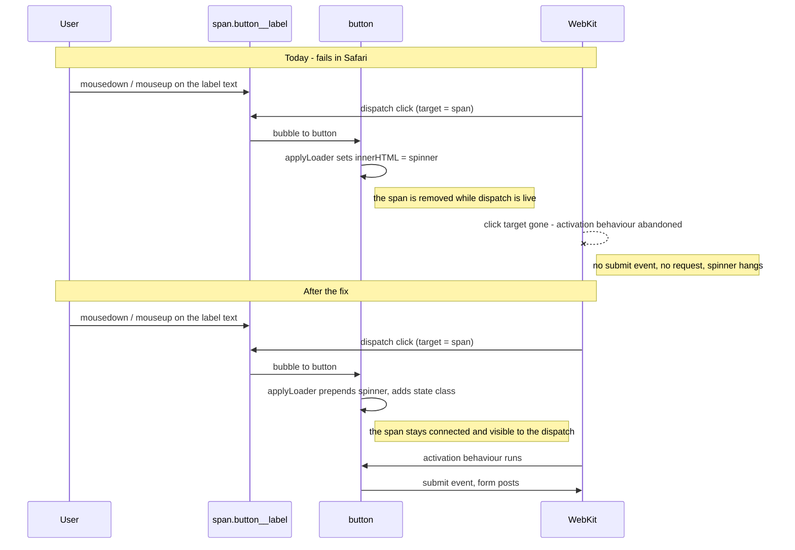
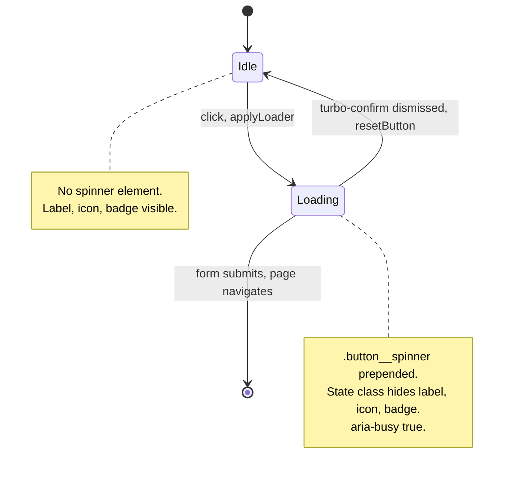

# Safari Save Button Click Target - Plan

## Goal Capsule

- **Objective:** An admin editing a record in Safari saves it by clicking Save, wherever on the button they click. Their edit reaches the database and they land on the record page.
- **Means:** Stop the loading-button controller from destroying the element the user clicked (KTD1).
- **Authority hierarchy:** Requirements (R-IDs) win on behavior. KTDs win on mechanism inside those requirements. Units override neither.
- **Execution profile:** One JavaScript controller, one stylesheet, one new system spec. No Ruby, no schema, no dependency.
- **Stop conditions:** Stop and report if the overlay approach cannot hide the label without changing the button's rendered size, or if removing the inline width/height pinning is observed to collapse any loading button.
- **Tail ownership:** `ce-work` implements; the branch `avo-1751/fix/save-button-doesnt-work-when-clicking-on-the-text-portion-in-safari` is already checked out.

---

## Product Contract

### Summary

The loading-button controller replaces the button's inner HTML with a spinner while the click event is still being dispatched. That destroys the `` the user clicked. WebKit responds by abandoning the submit button's activation behaviour entirely, so no submit event and no request ever fire. Replace the destructive swap with a spinner overlaid on top of content that stays in the DOM.

### Problem Frame

Avo wraps every button label in `` (`app/components/avo/button_component.rb`, `render_content`). Clicking the word "Save" makes that span the click event's target. The button carries `data-action="click->loading-button#attemptSubmit"`, and `applyLoader` runs `button.innerHTML = this.spinnerMarkup` synchronously inside that handler (`app/javascript/js/controllers/loading_button_controller.js:35`).

WebKit will not run a submit button's activation behaviour when its click target is removed mid-dispatch. The spinner appears, the form never submits, and nothing surfaces the failure - no validation error, no flash, no network request. Chrome and Firefox remove the same node and submit anyway, which is why the bug is Safari-only and why CI has never caught it.

Clicking the button's padding works because the click target is then the `<button>` itself, which survives. That is the whole difference between the working and failing case in the reporter's video.

### Key Decisions

- **Fix the controller, not the Save button.** Every button rendered with `loading: true` shares this controller and this failure mode; scoping the fix to Save would leave the same bug on every other loading button. `Governs R1.`
- **Ship without a Safari test in CI.** The suite runs Chrome through Cuprite only. Rather than defer the fix until Safari is in CI, encode the browser-agnostic invariant that Safari's behaviour depends on - the clicked node survives the dispatch - and verify Safari by hand once. `Governs R2, R6.`

### Requirements

**Submitting**

- R1. Clicking any part of a button rendered with `loading: true` - label text, icon, hotkey badge, or padding - submits the form in Safari, Chrome, and Firefox.
- R2. The element the user clicked stays in the DOM and stays connected for the entire click dispatch. Entering the loading state never removes or replaces a descendant of the button.
- R3. The `Mod+Enter` save shortcut keeps working.

**Loading presentation**

- R4. While loading, a centered spinner is visible, and the button's label, icon, and hotkey badge are hidden without changing the button's rendered width or height.
- R5. While loading, the button reports its busy state to assistive technology.

**Reset**

- R6. Cancelling a `turbo_confirm` dialog restores the button to its pre-click appearance and leaves it enabled.

### Acceptance Examples

- AE1. **Covers R1, R2.** Given a project edit page in Safari, when the admin changes the name and clicks directly on the word "Save", then the project is updated and the success flash appears.
- AE2. **Covers R4.** Given a Save button 96px wide at rest, when it enters the loading state, then it is still 96px wide and the label text is no longer visible.
- AE3. **Covers R6.** Given a `Store` record (`confirm_on_save = true`), when the admin clicks Save and dismisses the confirmation dialog, then the spinner disappears, the label is visible again, and the button is enabled.

### Scope Boundaries

**In scope**

- The loading state applied by `loading-button` to every button rendered with `loading: true`.
- The button stylesheet rules that present that loading state.

**Deferred to Follow-Up Work**

- Driving the loading state from `turbo:submit-start` / `turbo:submit-end` instead of the click event. That reflects actual submission rather than intent, and would cover submissions started by other means, but it is a larger change across `button_to`, link buttons, and non-form buttons.
- Null-guarding `connect()`'s `document.getElementById('turbo-confirm')` lookup. The dialog is rendered by `app/views/layouts/avo/application.html.erb`, so it is present today; a missing dialog would throw and disable the controller entirely.
- Replacing `w-4 h-4` with `size-4` in the `.loading-spinner` rule, per the project's CSS conventions.

**Out of scope**

- Any other Safari-specific behaviour.
- Restyling buttons or changing the spinner's appearance.

### Sources

- `app/javascript/js/controllers/loading_button_controller.js` - the controller; `applyLoader` at line 35 is the defect.
- `app/components/avo/button_component.rb` - `render_content` wraps the label in `.button__label`; `args` attaches the controller when `loading:` is set; `button_classes` adds `.button--loading` at render time.
- `app/components/avo/resource_component.rb`, `render_save_button` - the only caller passing `loading: true`.
- `app/assets/stylesheets/css/components/button.css` - `.button--loading` (`relative`) and `.button__spinner` (`absolute inset-0 flex items-center justify-center`) already exist. Nothing emits `.button__spinner`; it is orphaned CSS written for exactly this overlay.
- `app/assets/stylesheets/application.css` - `.loading-spinner`, shared with text inputs.
- [avo-hq/avo#4741](https://github.com/avo-hq/avo/issues/4741) and the closed [#4625](https://github.com/avo-hq/avo/issues/4625) - the reports, including the reporter's root-cause analysis.

---

## Planning Contract

### Key Technical Decisions

- KTD1. **Overlay the spinner; never replace the button's children.** `applyLoader` prepends a `.button__spinner` element and adds a state class. The clicked node is untouched, so WebKit's activation behaviour runs normally. This removes the root cause rather than routing around it, and it covers every child - including the hotkey badge - plus any content added later. Governs R1, R2.
- KTD2. **Hide the original content with `visibility`, via the `.button--loading-active` state class on the button.** The project convention is to toggle the `hidden` HTML attribute, but `hidden` is `display: none`, which takes the content out of flow and collapses the button to the spinner's width. `visibility: hidden` keeps the content occupying space, which is what holds the button's size steady. Target `.button__label`, `.button__icon`, and `.hotkey-badge` by name rather than a `:not(.button__spinner)` descendant filter, per the project's rule against broad `:not()` selectors. The name is distinct from `.button--loading` because that class is applied at render time to every loading-capable button and is not a state. Governs R4.
- KTD3. **Prepend the spinner rather than append it.** `.button__icon:not(:last-child)` applies a trailing margin. Appending would make an icon-only button's icon stop being `:last-child` and gain that margin mid-load, shifting the layout. Prepending leaves every structural sibling selector in the stylesheet unchanged. Governs R4.
- KTD4. **Delete the inline width/height pinning, the `justify-center` class, and the `data-original-content` round-trip.** All three exist only to survive the destructive swap: pin the box before emptying it, re-center what is left, and stash the markup to rebuild later. With the content still in place, none of them has a job. `data-original-content` is read nowhere outside this controller.
- KTD5. **Prove it with a DOM-survival assertion in a Chrome system spec.** CI has no Safari, so the browser behaviour itself is untestable here. The invariant Safari depends on - the clicked element is still connected after the click - is browser-agnostic and fails against today's code in Chrome too. Pair it with one manual Safari check before merge. Governs R2.

### High-Level Technical Design

The defect is a sequencing problem inside a single click dispatch.

The controller's own states are unchanged in shape; only the transitions' mechanism changes.

### Assumptions

- The fix applies to every `loading: true` button. Only `render_save_button` passes it today, so Save is the only user-visible surface, but the controller is the unit of repair.
- The spinner's existing appearance is correct and stays as-is. `.loading-spinner` is shared with text inputs and is not being restyled.
- Removing the inline width/height pinning holds the button's size because the hidden content still occupies its box. AE2 exists to catch this if it does not.
- Safari verification is manual for this change. No Safari driver is being added to the suite.

### Sequencing

U1 changes behaviour and must land before U2 can assert it. U3 is documentation and depends on U1's final shape.

---

## Implementation Units

### U1. Overlay the loading spinner instead of replacing button content

**Goal:** Entering the loading state adds a spinner and hides the existing content, leaving every child element connected.

**Requirements:** R1, R2, R4, R5, R6. Implements KTD1, KTD2, KTD3, KTD4.

**Dependencies:** none.

**Files:**

- `app/javascript/js/controllers/loading_button_controller.js` - modify.
- `app/assets/stylesheets/css/components/button.css` - modify the loading-state block.

**Approach:**

1. In `applyLoader`, prepend a `.button__spinner` wrapper containing the existing `.loading-spinner` markup, add `.button--loading-active` to the button, and set `aria-busy` to `true`. Remove the width and height pinning and the `justify-center` class add.
2. In `resetButton`, remove the spinner element, remove `.button--loading-active`, clear `aria-busy`, and keep the existing `disabled` removal.
3. In `connect`, drop the `data-original-content` write. Keep the `turbo-confirm` listener wiring.
4. In the stylesheet's loading block, add `.button--loading-active` rules that hide `.button__label`, `.button__icon`, and `.hotkey-badge`. `.button--loading` stays the render-time capability marker that supplies `position: relative`. `.button__spinner` already carries the overlay positioning - leave it alone.

**Execution note:** Verify the premise in Safari before building the overlay. Reproduce the failure, then confirm that merely not removing the clicked node fixes it. The WebKit root cause comes from the bug reporter and nothing in CI can falsify it, so the plan currently proves it only at the very end - if it is wrong, every unit here is rework.

**Patterns to follow:**

- `.button__icon` already sets `pointer-events-none`, which is why clicking the icon has never reproduced this bug. The stylesheet's existing comments explain each structural selector's reasoning - match that density when adding rules.
- Use `@apply` with Tailwind utilities, as the rest of the file does.

**Test scenarios:** covered by U2. This unit carries no test file of its own.

**Verification:** Rebuild assets. On a project edit page, clicking Save shows a centered spinner over a button that has not changed size, and the label element is still present in the DOM.

### U2. System spec proving the click target survives and the form submits

**Goal:** A regression test that fails against the current controller and passes after U1.

**Requirements:** R1, R2, R3, R4, R5, R6. Implements KTD5.

**Dependencies:** authored before U1 lands, completed after it. The execution note below is the reason: the DOM-survival scenario is only meaningful if it is seen failing against the unmodified controller, so the spec is written first and U1 is what turns it green.

**Files:**

- `spec/system/avo/group_1/loading_button_spec.rb` - create.

**Approach:**

1. Drive clicks at the inner elements specifically - `find(".button__label", text: "Save").click` - not `click_on "Save"`, which resolves to the button and would pass against the broken code.
2. Assert the clicked node is still connected after the click. Hold the node in JavaScript and check it there - a Capybara element proxy re-queried after the DOM changed raises a stale-element error rather than returning false, so it cannot express this assertion. This is the scenario that encodes Safari's requirement.
3. Use `Store` for the confirm-dialog case; `spec/dummy/app/avo/resources/store.rb` sets `confirm_on_save = true`.

**Execution note:** Write the DOM-survival scenario first and watch it fail against the unmodified controller. If it passes before U1, it is asserting the wrong node and the whole spec is worthless.

**Patterns to follow:**

- `spec/system/avo/group_1/avo_cmd_return_to_submits_spec.rb` for the edit-and-assert-flash shape.
- Existing `group_1` specs for the `create :project` / `visit "/admin/resources/projects/#{project.id}/edit"` setup.
- `spec/system/avo/group_2/tags_spec.rb` for the `page.evaluate_script` heredoc shape used to inspect live DOM and computed-style state.

**Test scenarios:**

- Covers AE1. Editing a project's name and clicking the `.button__label` span inside Save updates the project and shows the success flash.
- Covers R2. The `.button__label` node captured before the click is still connected to the document after the click.
- Covers R1. Clicking the `.hotkey-badge` inside the Save button also submits the form.
- Covers AE2. The Save button's rendered width and height are unchanged between the idle state and the loading state.
- Covers R4. While loading, `.button__spinner` is present inside the button and the label text is not visible.
- Covers R5. While loading, the button's `aria-busy` attribute is `true`.
- Covers AE3, R6. On a `Store` edit page, dismissing the confirmation dialog removes the spinner, clears `aria-busy`, makes the label visible again, and leaves the button enabled.
- Covers R3. `Mod+Enter` on a project edit page still submits - assert alongside the existing `avo_cmd_return_to_submits_spec.rb` coverage rather than duplicating it, if that reads cleaner.

**Verification:** The spec passes on the U1 branch and the DOM-survival scenario fails when U1 is reverted.

### U3. Record the click-target constraint where the next author will hit it

**Goal:** The next person who reaches for `innerHTML` in a click handler knows why that breaks Safari.

**Requirements:** none directly; protects R2 from regressing.

**Dependencies:** U1.

**Files:**

- `app/javascript/js/controllers/loading_button_controller.js` - comment in `applyLoader`.

**Approach:** One short comment stating that the button's children must survive the click dispatch, because WebKit abandons a submit button's activation behaviour when its click target is removed mid-dispatch. Keep it within the project's two-line comment cap and 120-column wrap.

**Test expectation: none** - comment only, no behaviour.

**Verification:** The comment states the constraint and the browser reason, not the change history.

---

## Verification Contract

| Gate | Command | Applies to |
| --- | --- | --- |
| New regression spec | `bundle exec rspec spec/system/avo/group_1/loading_button_spec.rb` | U2 |
| Existing submit coverage | `bundle exec rspec spec/system/avo/group_1/avo_cmd_return_to_submits_spec.rb spec/system/avo/group_1/hotkey_spec.rb` | U1, U2 |
| Broad save-path regression | `bundle exec rspec spec/system/avo/group_2` | U1 |
| Asset build | `yarn build` (or the repo's JS/CSS build task) before running system specs | U1 |
| Manual Safari check | Edit a record in Safari, click directly on the Save text, confirm the record saves | R1 |

The manual Safari check is not optional and is not automatable in this suite. It is the only direct evidence for R1 on the browser that reported the bug.

## Definition of Done

**Global**

- Clicking the Save text in Safari saves the record.
- No code path replaces or removes a button descendant while a click is dispatching.
- The Save button's size and the spinner's position are unchanged from today's appearance.
- Every gate in the Verification Contract passes, and the manual Safari check is done and reported.
- No abandoned experimental code remains in the diff - in particular, no leftover width/height pinning, `data-original-content` handling, or half-migrated spinner markup.

**Per unit**

- U1: the controller no longer writes `innerHTML` on the button, and the loading state is produced by a prepended overlay plus a CSS state class.
- U2: the spec exists, passes on the branch, and its DOM-survival scenario fails when U1 is reverted.
- U3: the comment names the WebKit constraint.
