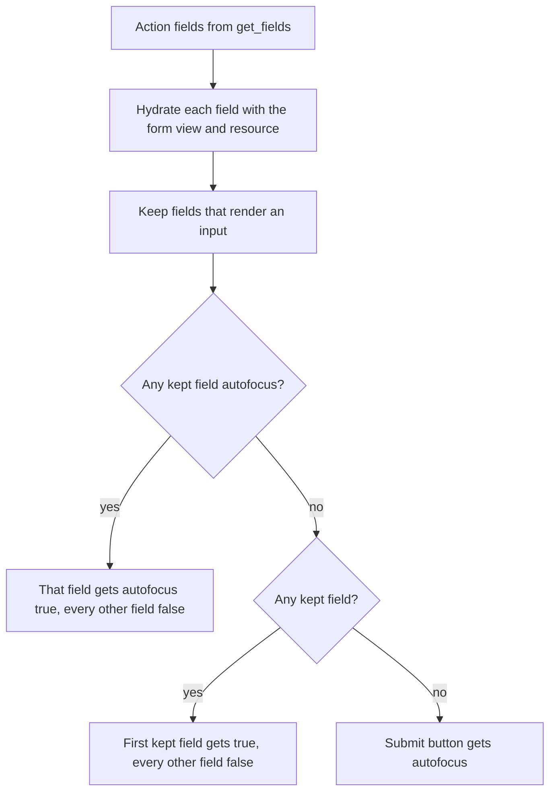

# Field autofocus option - Plan

## Goal Capsule

- **Objective:** A developer can mark the field a user should start typing in, with a literal or a lambda, and the cursor lands there on New/Edit forms and in action modals, without pulling focus anywhere else, and the option is documented for people and for agents.
- **Means:** finish PR avo-hq/avo#4853 in place: resolve the option through `Avo::ExecutionContext` (KTD1), let an explicit component argument win (KTD8), pick the action-modal target among real inputs after hydration (KTD2), cover the country and belongs_to selects (KTD3), opt the avo-ai card and avo-nested rows out (KTD9), and document it (KTD5, KTD6).
- **Authority:** R-IDs win on behavior, KTDs on mechanism. Session-settled KTDs are not reopened without evidence they cannot work.
- **Stop conditions:** stop and report if a settled decision proves infeasible, if a change would need a public PR/issue comment or an edit to #4853's description, or if CI fails for a reason outside this change.
- **Execution profile:** three repositories. Avo core changes land as new commits on `feat/field-autofocus` (fork `Shub3am/avo`, maintainer edits allowed). The docs change is its own PR on `avo-hq/docs.avohq.io`. The avo-ai and avo-nested opt-outs are one PR on `avo-hq/workspace`.
- **Finish and ship:** the running pipeline pushes the commits, opens the docs and workspace PRs, and watches all three to CI-green. Merging stays with the user.

---

## Product Contract

### Summary

Make `autofocus` behave like other Avo field options: accept `true` or a lambda, focus at most one input in an action modal, and work on the country, belongs_to, and generated custom fields. Keep it from pulling focus inside the avo-ai chat and avo-nested parent forms. Document it on the field options guide and API pages and in the `avo-fields` agent skill.

### Problem Frame

PR #4853 adds `autofocus: true` and works on the common text-like inputs. A review with real-browser tests found gaps. A lambda is always truthy, so `autofocus: -> { view.new? }` focuses on every form, and Avo options accept lambdas by convention. An action field that sets `autofocus` but renders no input, such as a badge, leaves the modal with nothing focused, where `main` focused the first input. The action view also decides the target before the fields are hydrated for the form, so a lambda that reads `view` answers differently at pick time and at render time. A component caller cannot turn the option off, so the avo-ai chat card that renders action inputs would take focus from the chat composer whenever Turbo renders the panel, and a nested resource's field would take focus on its parent's form. The country and belongs_to fields ignore the option, and the PR ships no docs.

### Requirements

**Behavior**

- R1. A field with `autofocus: true` renders its input with the `autofocus` attribute on New and Edit forms and in action modals.
- R2. `autofocus` accepts a lambda evaluated with `record`, `resource`, and `view`; a falsy result renders no attribute.
- R3. In an action modal, at most one input carries `autofocus`: the first field that sets `autofocus` and renders an input, else the first field that renders an input. With no such field, the submit button keeps it, as today. A picked field whose component ignores the attribute leaves the modal unfocused, as the same field does when it is first on `main` (KTD2).
- R4. The country select, the non-searchable belongs_to select, the polymorphic belongs_to type select, and fields generated with `bin/rails g avo:field` honor `autofocus`.
- R8. Fields a gem renders inside another page never take focus there: action inputs on the avo-ai chat card and nested records' fields in an avo-nested parent form.

**Documentation**

- R5. The docs site documents `autofocus` on the field options API page and the field options guide.
- R6. The `avo-fields` skill shipped in the avo gem lists `autofocus` in Key options.

**Delivery**

- R7. Core changes land as new commits on the existing PR branch, with no public comments and no edit to #4853's description.

### Key Decisions

- **Supported field set is the attribute-driven inputs plus country, belongs_to, and generated custom fields.** Governs R4. See KTD3, KTD4.
- **Delivery stays on the contributor's PR; docs and the gem opt-outs get their own PRs.** Governs R7. See KTD7.

### Scope Boundaries

- Field types whose input is built by JavaScript or has no single input stay unsupported: date, date_time, time, tags, trix, tiptap, key_value, radio, stars, location, checkbox_list, boolean_group, and searchable belongs_to. The docs list what is supported.
- A field inside a tab that is not open on load keeps the attribute but cannot take focus. A readonly or disabled field cannot take focus either. Both are browser behavior and are documented.

#### Deferred to Follow-Up Work

- JavaScript focus support for the editor, date picker, and tag fields.
- `autofocus` on the searchable belongs_to input, which lives in `avo-advanced_search`.
- A per-field "honors autofocus" signal, so an action modal can skip an unsupported field that sets the option and fall back to the first input (see KTD2's call-out).

---

## Planning Contract

### Key Technical Decisions

- KTD1. **Resolve `autofocus` in a `BaseField#autofocus?` method through `Avo::ExecutionContext`, replacing the attr reader.** It mirrors `is_readonly?` and `is_disabled?`, and `ExecutionContext` returns non-callable values untouched, so literals cost nothing. (session-settled: user-approved — chosen over keeping the option boolean-only and documenting it: Avo options accept lambdas unless noted, and a browser test showed a lambda returning false still focuses.)
- KTD2. **The action view hydrates every field for the form first, then picks the focus target from the fields that render an input.** It filters with the view's existing rule (not a `HiddenField`, component not `Avo::BlankFieldComponent`), takes the first field that is `autofocus?`, and falls back to the first kept field. Hydrating first gives the pick and the render the same `view` and `resource`; today `BaseAction#get_fields` hydrates with the action as resource and the origin view, and the loop re-hydrates with the form view. (session-settled: user-approved — chosen over indexing `autofocus` across all fields: a badge with `autofocus` left the modal focused on nothing.) Conflict call-out: a field that renders an input but ignores the attribute (a date field, per KTD4) can still be picked, and the modal then has no focus. This is the same outcome as that field being first on `main`; it is documented and deferred rather than solved with a per-class signal.
- KTD3. **Add `autofocus: @autofocus` to the country select, the non-searchable belongs_to select, the polymorphic type select, and the field generator's edit template.** It goes in each `select`'s HTML options hash, where country already forwards `autocomplete`; Rails drops it silently from the choices hash. For a polymorphic field the type select is the first input the user touches, and the per-type id selects sit in `<template>`s the Stimulus controller clones later, where the attribute would never fire, so they stay untouched. (session-settled: user-approved — chosen over leaving both fields unsupported: one-line changes on common first fields.) The generator line keeps new custom fields consistent with built-in ones.
- KTD4. **Leave the remaining edit components untouched and state the supported list in the docs.** (session-settled: user-approved — chosen over implementing every edit component now: several need a JavaScript focus call, and the contributor scoped the PR.)
- KTD5. **Document on both docs pages, following the guide-and-reference model and the `hide_if_blank` precedent (docs PR #776).** The API page gets an `<Option>` after `autocomplete` in "Form behavior". The guide gets a short task section with `<VersionReq version="4.2.11" />`. (session-settled: user-directed — chosen over no docs: repo rules require docs for user-facing options.) The guide section extends the directed API entry to match house precedent.
- KTD6. **Add one `autofocus:` bullet to Key options in `lib/avo/skills/avo-fields/SKILL.md`.** The skill says options take a lambda "unless noted", so the bullet shows the lambda form and names the limits. (session-settled: user-directed — chosen over skipping the skill: an agent reading a stale skill writes the option wrong.)
- KTD7. **Push to `feat/field-autofocus` on the fork; open separate docs and workspace PRs; post no comments.** (session-settled: user-directed — chosen over a replacement PR: user instruction.)
- KTD8. **`Avo::Fields::EditComponent` takes `autofocus: nil` by default, and an explicit `true` or `false` from the caller wins over the field option.** Today the default is `false` and the PR combines with `||`, so a caller cannot opt out. With this, the action view's explicit booleans leave at most one input focused (R3), and gems can pass `false` (KTD9). Resource forms pass nothing and get the field option.
- KTD9. **The avo-ai write card and the avo-nested row template pass `autofocus: false` when they render field components.** Turbo focuses the first `[autofocus]` element whenever it renders a page or frame. The avo-ai card sits above the composer, which sets `autofocus` itself; avo-nested renders a child resource's fields, whose option was meant for the child's own form, inside the parent form, and no lambda can tell the two apart. Both changes ship as one workspace PR. Against a core without KTD8 they are no-ops, so they can land in either order.

### High-Level Technical Design

Action modal focus selection (R3, KTD2, KTD8):



Option surface (R1, R2, KTD8), as directional grammar:

```text
field option     autofocus: true | false | nil | -> { truthy when the field should take focus }
                   lambda context: record, resource, view, plus the usual ExecutionContext helpers
                   applies on: new, edit, action modals; ignored on index and show
component arg    EditComponent.new(..., autofocus: nil | true | false)
                   nil   -> use the field option
                   bool  -> use the caller's value
```

### Assumptions

- The option ships in avo 4.2.11 alongside `hide_if_blank`, so the guide uses `<VersionReq version="4.2.11" />`. Adjust if the release differs.
- Every workspace gem call site builds field components through `field.component_for_view`, so the field is a `BaseField` and responds to `autofocus?`. No gem calls the removed `field.autofocus` reader. The optional external field gems (`avo-money_field` and the like) are not cloned here and were not checked.

### Sources

- `lib/avo/fields/concerns/is_readonly.rb`, `lib/avo/fields/concerns/is_disabled.rb`: the `ExecutionContext` pattern KTD1 mirrors.
- `lib/avo/base_action.rb` (`get_fields`) and `app/controllers/avo/actions_controller.rb` (`@view` is `new`): the two hydrations KTD2 reconciles.
- `app/components/avo/fields/country_field/edit_component.html.erb`: forwards `autocomplete` the way KTD3 forwards `autofocus`.
- `gems/avo-ai/app/views/avo/ai/messages/tool_results/_write_card.html.erb` and `gems/avo-ai/app/views/avo/ai/messages/_prompt_editor.html.erb`: the card and the composer KTD9 separates.
- `gems/avo-nested/app/components/avo/nested/template.html.erb`: renders each nested record's fields with no `autofocus:` argument.
- Turbo 8 `FrameRenderer#focusFirstAutofocusableElement`: focuses the first `[autofocus]` on every frame render.
- Docs: `docs/AGENTS.md` (guide + reference model) and the `hide_if_blank` commit in the docs repo.

---

## Implementation Units

### U1. Resolve `autofocus` through `ExecutionContext` and let callers override it

- **Goal:** a lambda decides per render whether the field focuses, and a component caller can force it on or off.
- **Requirements:** R1, R2; KTD1, KTD8.
- **Dependencies:** none.
- **Files:** `lib/avo/fields/base_field.rb`, `app/components/avo/fields/edit_component.rb`, `spec/components/avo/fields/edit_component_spec.rb`.
- **Approach:**
  1. Replace `attr_reader :autofocus` with an `autofocus?` method beside `placeholder`, resolved through `Avo::ExecutionContext` with `record`, `resource`, and `view`.
  2. Default `EditComponent`'s `autofocus:` to `nil`; use the caller's value when given, else `field&.autofocus?`.
- **Patterns to follow:** `Avo::Fields::Concerns::IsReadonly#is_readonly?`.
- **Test scenarios:**
  - A text field with `autofocus: -> { view.new? }` rendered on the edit view has no `autofocus` attribute. This fails on the PR as it stands.
  - A text field with `autofocus: true` rendered with an explicit `autofocus: false` component argument has no `autofocus` attribute. This fails on the PR as it stands.
  - Existing: `autofocus: true` renders the attribute, and no option renders none.
- **Verification:** the component spec passes, and both new scenarios fail without the change.

### U2. Pick the action modal focus target after hydration, among real inputs

- **Goal:** an action modal focuses exactly one real input when one exists.
- **Requirements:** R3; KTD2, KTD8.
- **Dependencies:** U1.
- **Files:** `app/views/avo/actions/show.html.erb`, `spec/requests/avo/actions_request_spec.rb`.
- **Approach:**
  1. Hydrate every field with the form resource and view before choosing, and drop the per-iteration hydration from the render loop.
  2. Choose from the fields that render an input: the first `autofocus?` one, else the first.
  3. Keep passing `autofocus: index == first_input` and the submit button's `autofocus: first_input.nil?`. Update the ERB comment to match.
- **Patterns to follow:** the existing `first_input` computation and its request specs in the same `describe`.
- **Test scenarios:**
  - An action with a badge field set to `autofocus: true` and a text field renders exactly one input with `autofocus`, the text field. This fails on the PR as it stands.
  - An action whose second text field sets `autofocus: -> { view.new? }` renders exactly one input with `autofocus`, that field. This guards the hydration order: picking before hydration focuses the first field instead, because the lambda still sees the origin view.
  - Existing: the first input is focused by default, and a later field with `autofocus: true` wins.
- **Verification:** the actions request spec passes.

### U3. Honor `autofocus` on the country, belongs_to, and generated field inputs

- **Goal:** the common select-based fields and new custom fields take focus when asked.
- **Requirements:** R4; KTD3.
- **Dependencies:** U1.
- **Files:** `app/components/avo/fields/country_field/edit_component.html.erb`, `app/components/avo/fields/belongs_to_field/edit_component.html.erb`, `lib/generators/avo/templates/field/components/edit_component.html.erb.tt`, `spec/components/avo/fields/edit_component_spec.rb` (or a request spec, see below).
- **Approach:**
  1. Country: `autofocus: @autofocus` in the select's HTML options.
  2. Belongs_to, non-polymorphic and not searchable: the same on the id select.
  3. Belongs_to, polymorphic: the same on the type select only; the per-type id selects in `<template>`s stay untouched.
  4. Generator template: add it to the generated `text_field`.
- **Test scenarios:**
  - A country field with `autofocus: true` renders its `select` with `autofocus`.
  - A non-searchable belongs_to field with `autofocus: true` renders its id `select` with `autofocus`.
  - A polymorphic belongs_to field with `autofocus: true` renders the type `select` with `autofocus`, and no id `select` inside a `template` carries it.
  - Generator template: no new scenario; `spec/features/avo/generators/field_generator_spec.rb` still proves the template generates.
- **Verification:** the scenarios pass, and a throwaway browser check shows focus landing on each select.
- **Deferred to implementation:** whether the belongs_to scenarios render in the component spec or need a request spec. The component needs the target resource's options, authorization, and create path; if the component spec cannot provide them cleanly, use a request spec on the Post and Comment new pages with stubbed fields.

### U4. Document the option in the avo-fields skill

- **Goal:** an agent writing Avo fields knows the option, its lambda form, and its limits.
- **Requirements:** R6; KTD6.
- **Dependencies:** U1, U2, U3.
- **Files:** `lib/avo/skills/avo-fields/SKILL.md`.
- **Approach:** one bullet in Key options near `placeholder:`, naming the lambda form, the action modal behavior, and the unsupported fields.
- **Test expectation:** none -- documentation. `ws audit-skills` is the gate.
- **Verification:** `ws audit-skills` reports no findings.

### U5. Document the option on the docs site

- **Goal:** users find `autofocus` where they look up field options.
- **Requirements:** R5; KTD5.
- **Dependencies:** U1, U2, U3.
- **Files (repo `avo-hq/docs.avohq.io`):** `docs/4.0/field-options-api.md`, `docs/4.0/field-options.md`.
- **Approach:**
  1. API page: an `<Option name="`autofocus`" headingSize="3">` after `autocomplete` in "Form behavior". State the behavior on New/Edit and in action modals, that the first field wins, the supported fields, and the inactive-tab and readonly limits. **Type:** Boolean or Proc. **Default:** `nil`.
  2. Guide: a short task section, "Focus a field when the form opens", with `<VersionReq version="4.2.11" />`, one example with `true` and one with `-> { view.new? }`, linking to the API entry.
- **Test expectation:** none -- documentation. The docs build is the gate.
- **Verification:** the docs site builds, `#autofocus` resolves, and the guide links to it.

### U6. Keep gem-rendered fields from taking focus

- **Goal:** the avo-ai chat composer and an avo-nested parent form keep their own focus when a gem renders field components inside them.
- **Requirements:** R8; KTD9.
- **Dependencies:** U1 for the behavior to take effect; the changes themselves are safe to land first.
- **Files (repo `avo-hq/workspace`):** `gems/avo-ai/app/views/avo/ai/messages/tool_results/_write_card.html.erb`, `gems/avo-ai/spec/views/avo/ai/messages/tool_results/_write_card.html.erb_spec.rb`, `gems/avo-nested/app/components/avo/nested/template.html.erb`, `gems/avo-nested/spec/system/avo_nested/nested_spec.rb`.
- **Approach:**
  1. avo-ai: pass `autofocus: false` where the card renders each action field's component. Extend the "renders Avo's edit components, prefilled and submitted by Run" example, which builds a real pending `Avo::Actions::ArchiveProject` write.
  2. avo-nested: pass `autofocus: false` where the template renders each nested record's field component. Extend the existing nested spec rather than adding a file.
- **Test scenarios:**
  - A pending `ArchiveProject` write whose `reason` field sets `autofocus: true` renders `fields[reason]` on the card without an `autofocus` attribute. This fails against the core branch without the change.
  - A nested record whose resource field sets `autofocus: true` renders on the parent's edit page without the attribute. This fails against the core branch without the change.
- **Verification:** both gem specs pass against the local core branch (each gem resolves avo from `external/avo`).

---

## Verification Contract

| Gate | Command or check | Proves |
| --- | --- | --- |
| Core specs | `DISABLE_SPRING=1 bundle exec rspec spec/components/avo/fields/edit_component_spec.rb spec/requests/avo/actions_request_spec.rb spec/features/avo/generators/field_generator_spec.rb` plus any spec U3 adds | U1–U3 |
| Regression proof | each new scenario fails with its unit's change reverted | U1–U3, U6 |
| Ruby lint | `bundle exec standardrb` on changed Ruby files | U1 |
| ERB lint | `bundle exec erb_lint` on changed templates; the offense at `app/views/avo/actions/show.html.erb:11` predates this PR | U2, U3, U6 |
| Gem suites | `ws ci-test --target avo-ai`, plus `avo-nested` and `avo-reactive_fields`, against the core branch; they render field edit components and core CI does not run them | U1, U2, U6 |
| Skills audit | `ws audit-skills` from the workspace root | U4 |
| Docs build | `yarn build` in the docs repo | U5 |
| Browser check | the throwaway Cuprite battle spec from the review, rerun for lambdas, the badge fallback, country, and belongs_to | R1–R4 |
| CI | the checks on avo-hq/avo#4853, the docs PR, and the workspace PR are green | all |

---

## Definition of Done

- R1–R8 hold, and every new scenario in U1–U3 and U6 passes and fails without its change.
- `ws audit-skills` is clean, the docs PR builds, and the gem suites match their `main` baseline.
- New commits are on `feat/field-autofocus`, #4853's description is unchanged, and no public comment was posted.
- No throwaway or experimental code is left in any diff; the battle specs stay in the scratchpad.
